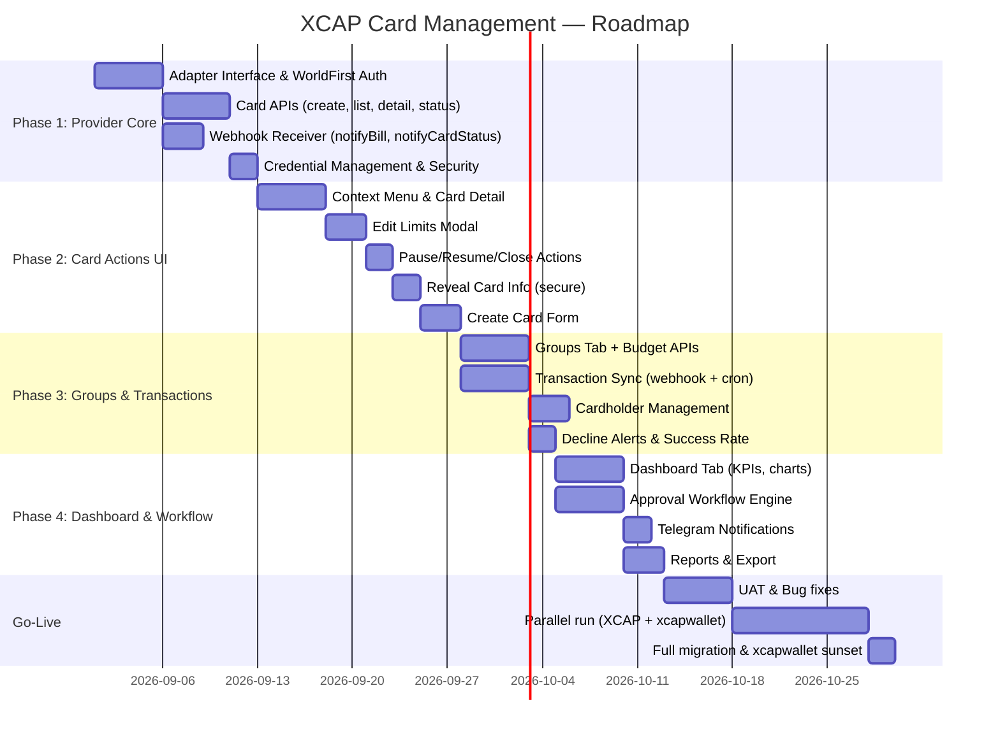

# 📋 BUSINESS REQUIREMENT DOCUMENT (BRD)
# XCAP Card Management Module — Multi-Provider Integration

| Field | Detail |
|-------|--------|
| **Dự án** | XCAP Card Management |
| **Phiên bản** | v1.0 |
| **Ngày tạo** | 24/08/2026 |
| **Trạng thái** | Draft — Chờ phê duyệt |
| **Hệ thống** | ads.xcap.vn |
| **Mã dự án** | XCAP-CARD-001 |

---

## MỤC LỤC

1. [Tóm tắt điều hành](#1-tóm-tắt-điều-hành)
2. [Bối cảnh & Vấn đề kinh doanh](#2-bối-cảnh--vấn-đề-kinh-doanh)
3. [Mục tiêu kinh doanh](#3-mục-tiêu-kinh-doanh)
4. [Các bên liên quan](#4-các-bên-liên-quan)
5. [Phạm vi dự án](#5-phạm-vi-dự-án)
6. [Hiện trạng (AS-IS)](#6-hiện-trạng-as-is)
7. [Tương lai (TO-BE)](#7-tương-lai-to-be)
8. [Yêu cầu chức năng](#8-yêu-cầu-chức-năng)
9. [User Stories & Acceptance Criteria](#9-user-stories--acceptance-criteria)
10. [Yêu cầu phi chức năng](#10-yêu-cầu-phi-chức-năng)
11. [Yêu cầu tích hợp](#11-yêu-cầu-tích-hợp)
12. [Rủi ro & Giảm thiểu](#12-rủi-ro--giảm-thiểu)
13. [Lộ trình triển khai](#13-lộ-trình-triển-khai)
14. [Tiêu chí nghiệm thu](#14-tiêu-chí-nghiệm-thu)
15. [Phụ lục](#15-phụ-lục)

---

## 1. TÓM TẮT ĐIỀU HÀNH

### 1.1 Tổng quan

Dự án XCAP Card Management xây dựng module quản lý thẻ thanh toán trực tiếp trên nền tảng ads.xcap.vn, tích hợp API từ nhiều nhà cung cấp thẻ (bắt đầu với WorldFirst/Alipay WorldFirst) để **thay thế hoàn toàn** việc sử dụng xcapwallet.com như hệ thống quản lý thẻ riêng biệt.

### 1.2 Vấn đề cốt lõi

Hiện tại, việc quản lý thẻ quảng cáo diễn ra trên **2 hệ thống tách rời**:
- **ads.xcap.vn**: Theo dõi chi tiêu, đối soát, nhưng không thể tạo/quản lý thẻ
- **xcapwallet.com**: Tạo thẻ, chỉnh hạn mức, nhưng không có context dự án/nhân viên/quảng cáo

Sự tách rời này gây ra nhiều vấn đề: thao tác thủ công, thiếu truy xuất nguồn gốc, và không có quy trình phê duyệt nội bộ.

### 1.3 Giải pháp đề xuất

Xây dựng **Provider Adapter Layer** trên XCAP backend, cho phép:
- Tất cả thao tác quản lý thẻ (tạo, chỉnh hạn mức, tạm dừng, đóng thẻ) thực hiện trực tiếp trên ads.xcap.vn qua API
- Đồng bộ giao dịch real-time qua webhook
- Hỗ trợ đa nhà cung cấp (multi-provider) với kiến trúc mở rộng
- Tích hợp quy trình phê duyệt nội bộ (approval workflow)

### 1.4 Kết quả mong đợi

| Metric | Hiện tại | Mục tiêu |
|--------|---------|----------|
| Số hệ thống sử dụng | 2 (XCAP + xcapwallet) | 1 (XCAP only) |
| Thời gian tạo thẻ mới | ~30 phút (thủ công) | < 2 phút (qua API + approval) |
| Thời gian chỉnh hạn mức | ~10 phút (login xcapwallet) | < 30 giây (click trên XCAP) |
| Độ trễ cập nhật giao dịch | 30-59 phút (cron sync) | Real-time (webhook) |
| Truy xuất: thẻ → NV → DA → TKQC | Thủ công tra cứu 2 hệ thống | Tự động, 1 click |
| Quy trình phê duyệt | Không có | Multi-level (auto → KT → TGĐ) |

---

## 2. BỐI CẢNH & VẤN ĐỀ KINH DOANH

### 2.1 Bối cảnh hoạt động

Công ty quản lý **140 thẻ thanh toán quảng cáo** (Visa virtual cards) trên nhiều nền tảng (Facebook, TikTok, Shopee, Lazada), phục vụ cho nhiều dự án (X U-TERRA PH, X UNIG PH, X OPA PH, X XDO MY...) với **tổng chi tiêu tháng ~439 triệu VNĐ ($16,500 USD)**.

Thẻ được phát hành qua **xcapwallet.com** (nền tảng WorldFirst), tổ chức thành **23 nhóm (groups)** với **130 thẻ active** và gán cho nhân viên marketing chạy quảng cáo.

### 2.2 Vấn đề hiện tại

#### ❌ P1: Phân mảnh hệ thống

```
Nhân viên Marketing             Kế toán                    Giám đốc
      │                              │                          │
      ├─ XCAP: xem chi tiêu QC      ├─ xcapwallet: tạo thẻ    ├─ XCAP: xem báo cáo
      ├─ xcapwallet: xem số dư      ├─ xcapwallet: chỉnh limit├─ ??? không có approval
      └─ Google Forms: yêu cầu nạp  └─ xcapwallet: pause thẻ  └─ ??? không biết ai yêu cầu
```

**Hệ quả:**
- Nhân viên phải nhảy qua lại 2-3 hệ thống
- Kế toán phải login xcapwallet riêng để thao tác
- Không có audit trail cho quyết định quản lý thẻ

#### ❌ P2: Thiếu quy trình phê duyệt

| Thao tác | Hiện tại | Rủi ro |
|----------|---------|--------|
| Nạp tiền thẻ | Ai cũng có thể yêu cầu qua chat/form | Không kiểm soát ngân sách |
| Tạo thẻ mới | Kế toán tự tạo trên xcapwallet | Không có approval từ cấp trên |
| Thay đổi hạn mức | Kế toán tự thay đổi | Không ghi nhận lý do |
| Tạm dừng thẻ | Kế toán tự thao tác | NV không được thông báo |

#### ❌ P3: Thiếu truy xuất nguồn gốc

Khi cần trả lời "Thẻ *6837 thuộc dự án nào, ai quản lý, chi cho TKQC nào?":
- XCAP biết: thẻ → nhân viên → dự án → TKQC
- xcapwallet biết: thẻ → group → member
- **Không hệ thống nào có bức tranh toàn diện** liên kết cả hai chiều

#### ❌ P4: Tỉ lệ giao dịch bị từ chối cao

Từ dữ liệu xcapwallet:
- **832 giao dịch bị declined** (38% tổng giao dịch)
- Tỉ lệ thành công chỉ **57%**
- **4 nhóm** có tỉ lệ từ chối cao nhưng không có cảnh báo chủ động

#### ❌ P5: Khóa nhà cung cấp (Vendor Lock-in)

- Hiện chỉ dùng xcapwallet.com (WorldFirst)
- Không có khả năng chuyển đổi hoặc sử dụng song song nhiều nhà cung cấp thẻ
- Phụ thuộc hoàn toàn vào giao diện web của 1 nhà cung cấp

### 2.3 Tác động kinh doanh

| Vấn đề | Tác động ước tính |
|--------|------------------|
| Thời gian thao tác thủ công | ~2 giờ/ngày cho kế toán |
| Declined transactions (38%) | Mất cơ hội quảng cáo, ảnh hưởng chiến dịch |
| Thiếu kiểm soát ngân sách | Rủi ro chi tiêu vượt ngân sách |
| Phân mảnh dữ liệu | Chậm ra quyết định, khó đối soát |

---

## 3. MỤC TIÊU KINH DOANH

### 3.1 Mục tiêu chiến lược

| # | Mục tiêu | Đo lường |
|---|----------|---------|
| **OBJ-01** | Hợp nhất quản lý thẻ về 1 hệ thống duy nhất (XCAP) | 100% thao tác thẻ thực hiện trên ads.xcap.vn |
| **OBJ-02** | Tự động hóa toàn bộ thao tác thẻ qua API | 0 thao tác thủ công trên xcapwallet |
| **OBJ-03** | Thiết lập quy trình phê duyệt nội bộ | 100% yêu cầu nạp tiền/tạo thẻ qua approval |
| **OBJ-04** | Giảm tỉ lệ giao dịch bị từ chối | Decline rate < 20% (từ 38%) |
| **OBJ-05** | Hỗ trợ đa nhà cung cấp thẻ | ≥ 2 providers tích hợp trong 6 tháng |

### 3.2 KPIs cụ thể

| KPI | Baseline | Target | Timeline |
|-----|---------|--------|----------|
| Thời gian tạo thẻ (end-to-end) | 30 phút | < 5 phút | Phase 2 |
| Thời gian chỉnh hạn mức | 10 phút | < 1 phút | Phase 2 |
| Số hệ thống cần truy cập | 2-3 | 1 | Phase 2 |
| Thời gian xử lý yêu cầu | Không đo | < 4 giờ (80% requests) | Phase 4 |
| Tỉ lệ giao dịch thành công | 57% | > 80% | Phase 3 |
| Audit trail coverage | 0% | 100% | Phase 1 |

---

## 4. CÁC BÊN LIÊN QUAN

### 4.1 Ma trận các bên liên quan

| Vai trò | Tên viết tắt | Trách nhiệm trong module thẻ | Mức độ tham gia |
|---------|-------------|------------------------------|-----------------|
| **Tổng Giám đốc (TGĐ)** | TGĐ | Phê duyệt tạo thẻ mới, nạp tiền > $2,000 | Approver |
| **Trưởng phòng Kế toán (TP KT)** | TP KT | Phê duyệt nạp tiền $501-$2,000; giám sát tài chính | Approver + Monitor |
| **Kế toán (KT)** | KT | Thực hiện thao tác thẻ (tạo, chỉnh limit, pause); phê duyệt ≤$500 | Primary User |
| **Giám đốc Dự án (GĐ DA)** | GĐ DA | Tạo yêu cầu nạp tiền/tạo thẻ cho dự án | Requester |
| **Nhân viên Marketing (NV)** | NV | Sử dụng thẻ chạy QC; xem số dư/giao dịch thẻ của mình | End User |
| **Group Owner** | GO | Quản lý nhóm thẻ; xem spending by group | Monitor |

### 4.2 RACI Matrix

| Hoạt động | TGĐ | TP KT | KT | GĐ DA | NV |
|-----------|:---:|:----:|:--:|:-----:|:--:|
| Tạo yêu cầu nạp tiền | — | — | C | **R** | I |
| Phê duyệt ≤ $100 | — | — | — | — | — |
| Phê duyệt $101-$500 | — | — | **A** | I | — |
| Phê duyệt $501-$2,000 | — | **A** | R | I | — |
| Phê duyệt > $2,000 | **A** | C | R | I | — |
| Tạo thẻ mới | **A** | C | **R** | I | I |
| Thay đổi hạn mức | — | C | **R** | I | I |
| Tạm dừng / Đóng thẻ | — | I | **R** | I | I |
| Xem giao dịch | — | — | R | R | R (own) |
| Xem dashboard | R | R | R | R (project) | — |
| Quản lý nhóm | — | — | **R** | I | — |

> **R** = Responsible, **A** = Accountable, **C** = Consulted, **I** = Informed

---

## 5. PHẠM VI DỰ ÁN

### 5.1 Trong phạm vi (In Scope)

| # | Module | Mô tả |
|---|--------|-------|
| M1 | **Card Registry** | Đồng bộ & quản lý danh mục thẻ: xem, tìm kiếm, lọc |
| M2 | **Card Actions** | Tạo thẻ, chỉnh hạn mức, tạm dừng, đóng thẻ, hiện thông tin nhạy cảm — qua API provider |
| M3 | **Card Groups / Budget** | Quản lý nhóm thẻ, ánh xạ sang Budget Accounts của provider, top-up/withdraw |
| M4 | **Cardholder Management** | Đăng ký nhân viên làm cardholder (KYC), quản lý danh sách |
| M5 | **Transaction Sync** | Đồng bộ giao dịch real-time (webhook) + scheduled (cron), theo dõi declined/refunded |
| M6 | **Request & Approval** | Luồng yêu cầu + phê duyệt đa cấp cho tạo thẻ, nạp tiền, thay đổi hạn mức |
| M7 | **Dashboard & Reports** | Dashboard tổng hợp, spending charts, KPIs, export CSV/Excel |

### 5.2 Ngoài phạm vi (Out of Scope)

| # | Hạng mục | Lý do |
|---|----------|-------|
| OS1 | Đối soát (Reconciliation) | Đã có sẵn trên ads.xcap.vn (trang Đối soát) |
| OS2 | Hoá đơn (Invoices) | Đã có sẵn trên ads.xcap.vn (trang Hoá đơn) |
| OS3 | Tạm giữ (Holds) | Đã có sẵn trên ads.xcap.vn (trang Tạm giữ) |
| OS4 | Tích hợp T-OPA | Dự án riêng biệt, không liên quan trực tiếp |
| OS5 | Chuyển tiền quốc tế (FX, Payout) | Phase sau, khi có nhu cầu |
| OS6 | Vay vốn (Financing/Loan) | Không thuộc scope quản lý thẻ |

### 5.3 Giả định

| # | Giả định |
|---|----------|
| A1 | ads.xcap.vn có backend API sẵn sàng mở rộng module mới |
| A2 | WorldFirst cung cấp API credentials (Client-Id, RSA keys) cho môi trường sandbox và production |
| A3 | Nhóm (Group) trong XCAP tương ứng 1:1 với Budget Account trên WorldFirst |
| A4 | NV đã có thông tin KYC đủ để đăng ký cardholder trên WorldFirst |
| A5 | Quy trình phê duyệt hiện tại (nếu có) sẽ được thay thế bằng module mới |

### 5.4 Ràng buộc

| # | Ràng buộc |
|---|-----------|
| C1 | Tuân thủ PCI DSS — không lưu full card number / CVV trong database XCAP |
| C2 | WorldFirst API giới hạn tần suất gọi (rate limit) — cần cache hợp lý |
| C3 | Webhook từ WorldFirst yêu cầu xác thực chữ ký RSA256 |
| C4 | Hệ thống phải hỗ trợ multi-currency (VND + USD) với tỉ giá cập nhật |

---

## 6. HIỆN TRẠNG (AS-IS)

### 6.1 Luồng nghiệp vụ hiện tại

```
               GĐ DA cần nạp thẻ cho NV chạy ads
                          │
                          ▼
              ┌──────────────────────┐
              │ Gửi yêu cầu qua     │
              │ chat/email/form      │ ← Không chuẩn hoá
              └──────────┬───────────┘
                         │
                         ▼
              ┌──────────────────────┐
              │ KT login xcapwallet  │
              │ .com (hệ thống khác)│ ← Chuyển hệ thống
              └──────────┬───────────┘
                         │
              ┌──────────┴───────────┐
              │                      │
              ▼                      ▼
    ┌──────────────────┐  ┌──────────────────┐
    │ Tạo thẻ mới      │  │ Chỉnh hạn mức    │
    │ (trên xcapwallet) │  │ (trên xcapwallet) │ ← Không có approval
    └──────────────────┘  └──────────────────┘
              │                      │
              └──────────┬───────────┘
                         │
                         ▼
              ┌──────────────────────┐
              │ Trả lời GĐ DA qua   │
              │ chat "Đã nạp xong"  │ ← Không có audit trail
              └──────────────────────┘
```

### 6.2 Hệ thống hiện tại

#### ads.xcap.vn — Trang Thẻ (đã có)

**Dữ liệu hiện có:**
- 140 thẻ trong hệ thống
- Tổng chi tiêu: 439,401,748 đ (tháng 8/2026)
- Filters: Platform, Dự án, Nhân viên, TKQC
- Auto-sync từ Facebook (59 phút), TikTok (1 ngày), Shopee (2 giờ)

**Cột dữ liệu hiện có:**

| Cột | Dữ liệu mẫu |
|-----|-------------|
| Thẻ | Visa ---- 6837, X U-TERRA PH - HONGTT |
| Tình trạng thẻ | active |
| Nền tảng | Facebook |
| Nhân viên | TRẦN THỊ HỒNG |
| Dự án | X U-TERRA PH |
| Nhóm | X U-TERRA PH |
| Số tài khoản | 3 |
| Đã trừ | 1,225,846 đ |
| Số lần trừ | 52 |
| Lần trừ gần nhất | 2026-08-22 |
| Hạn mức tháng | 5,500 đ |
| Còn lại | 866 đ |

**Hạn chế:** Chỉ xem (read-only), không có thao tác quản lý thẻ.

#### xcapwallet.com — Tính năng hiện có

**Dashboard:**
- Balance tổng: $2,073.50
- Biểu đồ spend trend 30 ngày
- KPIs: Active Cards (31), Paused Cards (5), Transactions (1,249), Refund (0)
- Recent Transactions (Pending/Settled status)
- Spending by Group

**Cards & Groups:**
- 130 thẻ tổ chức trong 23 nhóm
- Total Spending: $72,090
- Success Rate: 57%
- Transaction Status: Settled (1,233), Pending (14), Declined (832), Refunded (107)
- Cảnh báo decline rate cao cho 4 nhóm

**Card Actions:**
- View Details, Reveal Card Info
- Edit Limits (Period: Daily/Weekly/Monthly/No Limit + Min/Max Transaction)
- Rename, Payment Mode
- Pause Card, Close Card
- Assign to Member, Add to Group

---

## 7. TƯƠNG LAI (TO-BE)

### 7.1 Luồng nghiệp vụ mới

```
               GĐ DA cần nạp thẻ cho NV chạy ads
                          │
                          ▼
              ┌──────────────────────┐
              │ Tạo yêu cầu trên    │
              │ ads.xcap.vn          │ ← Chuẩn hoá, có form
              │ (type: topup, $500)  │
              └──────────┬───────────┘
                         │
                         ▼
              ┌──────────────────────┐
              │ Approval Engine      │
              │ $500 → KT phê duyệt │ ← Tự động phân cấp
              └──────────┬───────────┘
                         │
              ┌──────────┴───────────┐
              │ Telegram + WebSocket │ ← Thông báo tự động
              │ → KT nhận notify    │
              └──────────┬───────────┘
                         │
                         ▼
              ┌──────────────────────┐
              │ KT duyệt trên XCAP  │
              │ → Hệ thống gọi API  │ ← Tự động gọi WorldFirst
              │   updateCardLimit    │
              └──────────┬───────────┘
                         │
                         ▼
              ┌──────────────────────┐
              │ ✅ Hoàn tất          │
              │ → Notify GĐ DA + NV │ ← Audit trail đầy đủ
              │ → Ghi log thay đổi  │
              └──────────────────────┘
```

### 7.2 Kiến trúc TO-BE

```
┌────────────────────────────────────────────────────────────┐
│                   ads.xcap.vn (Single Platform)             │
│                                                             │
│  ┌─────────────────────────────────────────────────────┐   │
│  │ Frontend — Trang Thẻ (nâng cấp)                     │   │
│  │                                                      │   │
│  │  [Danh sách thẻ] + Card Actions (context menu)      │   │
│  │  [Nhóm / Budget] + Group management                 │   │
│  │  [Dashboard] + KPIs, charts, alerts                  │   │
│  │  [Yêu cầu] + Approval workflow                      │   │
│  └──────────────────────┬──────────────────────────────┘   │
│                         │                                    │
│  ┌──────────────────────┴──────────────────────────────┐   │
│  │ Backend — Provider Adapter Layer                     │   │
│  │                                                      │   │
│  │  WorldFirst ─── Adapter A ──┐                       │   │
│  │  Provider B ─── Adapter B ──┼── Unified Interface   │   │
│  │  Provider C ─── Adapter C ──┘                       │   │
│  └──────────────────────┬──────────────────────────────┘   │
│                         │                                    │
│  ┌──────────────────────┴──────────────────────────────┐   │
│  │ Webhook Receiver ← Real-time events from providers   │   │
│  └─────────────────────────────────────────────────────┘   │
└────────────────────────────────────────────────────────────┘
```

---

## 8. YÊU CẦU CHỨC NĂNG

### Module M1: Card Registry (Đồng bộ & Quản lý danh mục thẻ)

| ID | Yêu cầu | Mô tả chi tiết | Priority |
|----|----------|-----------------|----------|
| FR-M1-01 | Đồng bộ danh sách thẻ từ provider | Hệ thống gọi API `queryCardList` từ provider để lấy danh sách thẻ và đồng bộ vào database XCAP. Hỗ trợ đồng bộ lần đầu (full sync) và đồng bộ tăng dần (delta sync). | 🔴 P0 |
| FR-M1-02 | Hiển thị danh sách thẻ | Hiển thị bảng thẻ với các cột: Thẻ (name + last4), Tình trạng, Nền tảng, Nhân viên, Dự án, Nhóm, Số TKQC, Đã trừ, Hạn mức, Còn lại. Giữ nguyên UI hiện có. | 🔴 P0 |
| FR-M1-03 | Lọc và tìm kiếm thẻ | Hỗ trợ lọc theo: Provider, Nền tảng (FB/TT/Shopee/Lazada), Dự án, Nhân viên, Nhóm, Tình trạng (active/paused/closed). Tìm kiếm theo tên hoặc last4. | 🔴 P0 |
| FR-M1-04 | Phân trang | Hỗ trợ phân trang với số dòng tuỳ chỉnh (20/50/100). Hiển thị tổng số thẻ. | 🟡 P1 |
| FR-M1-05 | Multi-provider filter | Khi có > 1 provider, cho phép lọc thẻ theo provider. Hiển thị icon/badge provider cho mỗi thẻ. | 🟢 P2 |

---

### Module M2: Card Actions (Thao tác quản lý thẻ qua API)

| ID | Yêu cầu | Mô tả chi tiết | Priority |
|----|----------|-----------------|----------|
| FR-M2-01 | Context menu trên mỗi thẻ | Khi click nút ⋮ (hoặc right-click) vào dòng thẻ, hiển thị menu với 9 actions: Xem chi tiết, Hiện thông tin thẻ, Chỉnh hạn mức, Đổi tên, Chế độ thanh toán, Tạm dừng, Đóng thẻ, Gán NV, Thêm vào nhóm. | 🔴 P0 |
| FR-M2-02 | Xem chi tiết thẻ | Trang/modal hiển thị: thông tin thẻ (masked), nhân viên, dự án, nhóm, TKQC liên kết, hạn mức, số dư, lịch sử thay đổi hạn mức, giao dịch gần đây. | 🔴 P0 |
| FR-M2-03 | Hiện thông tin thẻ nhạy cảm | Gọi API `queryCardSensitiveInfo` để hiển thị full card number, CVV, ngày hết hạn trong modal bảo mật (auto-hide sau 30 giây). Yêu cầu xác thực mật khẩu trước khi hiện. | 🔴 P0 |
| FR-M2-04 | Chỉnh hạn mức (Edit Limits) | Modal cho phép cập nhật: Period (Daily/Weekly/Monthly/No Limit), Limit amount, Min Transaction, Max Transaction. Gọi API `updateCardLimit`. Ghi log LimitHistory. | 🔴 P0 |
| FR-M2-05 | Tạm dừng thẻ (Pause) | Gọi API `updateCardStatus(FREEZE)`. Hiển thị dialog xác nhận với lý do. Cập nhật status = "paused". Thông báo NV sở hữu thẻ. | 🔴 P0 |
| FR-M2-06 | Tiếp tục thẻ (Resume) | Gọi API `updateCardStatus(UNFREEZE)`. Chỉ áp dụng cho thẻ đang paused. Thông báo NV. | 🔴 P0 |
| FR-M2-07 | Đóng thẻ vĩnh viễn (Close) | Gọi API `updateCardStatus(CANCEL)`. Dialog xác nhận 2 bước (nhập lý do + confirm). Thẻ closed không thể mở lại. | 🔴 P0 |
| FR-M2-08 | Đổi tên thẻ | Cho phép đổi tên hiển thị của thẻ trên XCAP (local rename). Không gọi API provider (tên trên provider giữ nguyên). | 🟡 P1 |
| FR-M2-09 | Gán nhân viên | Modal chọn nhân viên từ danh sách XCAP. Liên kết thẻ → nhân viên. Nếu NV chưa là cardholder, tự động đăng ký. | 🔴 P0 |
| FR-M2-10 | Thêm/chuyển nhóm | Modal chọn nhóm. Di chuyển thẻ giữa các nhóm (= chuyển budget account trên provider). | 🔴 P0 |
| FR-M2-11 | Tạo thẻ mới | Form tạo thẻ: chọn provider, nhóm/budget, cardholder, currency, hạn mức ban đầu, TKQC liên kết. Gọi API `applyCard`. Yêu cầu phê duyệt từ TGĐ. | 🔴 P0 |

---

### Module M3: Card Groups / Budget Accounts

| ID | Yêu cầu | Mô tả chi tiết | Priority |
|----|----------|-----------------|----------|
| FR-M3-01 | Tab "Nhóm" trên trang Thẻ | Tab mới cạnh "Danh sách thẻ", hiển thị giao diện quản lý nhóm. | 🔴 P0 |
| FR-M3-02 | Groups Overview KPIs | Hiển thị: Tổng nhóm, Tổng thẻ, Thành viên, Tổng chi tiêu, Tỉ lệ thành công (Success Rate). | 🔴 P0 |
| FR-M3-03 | Spending by Group chart | Biểu đồ bar chart ngang hiển thị chi tiêu theo nhóm, có toggle Groups/Members. | 🟡 P1 |
| FR-M3-04 | Transaction Status donut | Biểu đồ donut hiển thị phân bổ: Settled, Pending, Declined, Refunded. | 🟡 P1 |
| FR-M3-05 | Cảnh báo decline rate | Hiển thị banner cảnh báo cho các nhóm có tỉ lệ từ chối > 30%. | 🔴 P0 |
| FR-M3-06 | Danh sách nhóm | Bảng danh sách nhóm: tên, số thẻ, số NV, chi tiêu, success rate. Tìm kiếm, sắp xếp, ẩn nhóm trống. | 🔴 P0 |
| FR-M3-07 | Tạo nhóm mới | Form tạo nhóm → gọi `createBudgetAccount` trên provider. Chọn tên, mô tả, default limits. | 🔴 P0 |
| FR-M3-08 | Nạp tiền vào nhóm (Top-up) | Modal nạp tiền → gọi `transferToBudgetAccount`. Hiển thị số dư main account và budget balance. | 🔴 P0 |
| FR-M3-09 | Rút tiền từ nhóm | Modal rút tiền → gọi `transferFromBudgetAccount`. | 🟡 P1 |
| FR-M3-10 | Chi tiết nhóm | Click vào nhóm → hiển thị danh sách thẻ trong nhóm, budget balance, spending history. | 🟡 P1 |

---

### Module M4: Cardholder Management

| ID | Yêu cầu | Mô tả chi tiết | Priority |
|----|----------|-----------------|----------|
| FR-M4-01 | Đăng ký cardholder | Form đăng ký NV làm cardholder → gọi `createCardholder` (tên, email, SĐT, loại CMND, số CMND). | 🔴 P0 |
| FR-M4-02 | Danh sách cardholders | Bảng hiển thị cardholders: tên, KYC status, số thẻ active, ngày đăng ký. | 🟡 P1 |
| FR-M4-03 | Trạng thái KYC | Hiển thị trạng thái xác thực: Pending, Approved, Rejected (+ lý do reject). Auto-update qua webhook `receiveCardholderStatusNotification`. | 🔴 P0 |
| FR-M4-04 | Xoá cardholder | Xoá NV khỏi danh sách cardholder khi không còn thẻ active → gọi `deleteCardholder`. | 🟢 P2 |

---

### Module M5: Transaction Sync

| ID | Yêu cầu | Mô tả chi tiết | Priority |
|----|----------|-----------------|----------|
| FR-M5-01 | Webhook real-time | Nhận webhook `notifyBill` từ provider khi có giao dịch mới. Xác thực chữ ký RSA256. Parse, normalize, lưu vào database. | 🔴 P0 |
| FR-M5-02 | Scheduled sync (cron) | Cron job chạy mỗi 15 phút gọi `inquiryStatementList` để sync giao dịch. Dedup theo externalId. | 🔴 P0 |
| FR-M5-03 | Transaction status tracking | Theo dõi 4 trạng thái: **Settled** (thành công), **Pending** (chờ), **Declined** (bị từ chối), **Refunded** (hoàn tiền). | 🔴 P0 |
| FR-M5-04 | Auto-link transaction → card | Tự động liên kết giao dịch → thẻ → nhân viên → dự án → TKQC thông qua cardId/last4. | 🔴 P0 |
| FR-M5-05 | Success Rate computation | Tính tỉ lệ thành công = Settled / (Settled + Declined) × 100, cập nhật per card và per group. | 🟡 P1 |
| FR-M5-06 | Decline reason tracking | Lưu lý do từ chối (từ provider) để phân tích: Insufficient funds, Card paused, Invalid merchant, v.v. | 🟡 P1 |
| FR-M5-07 | Balance sync | Webhook `notifyBalanceChange` → cập nhật số dư thẻ/nhóm real-time. | 🟡 P1 |

---

### Module M6: Request & Approval Workflow

| ID | Yêu cầu | Mô tả chi tiết | Priority |
|----|----------|-----------------|----------|
| FR-M6-01 | Tạo yêu cầu | GĐ DA tạo yêu cầu với type: Tạo thẻ mới / Nạp tiền / Thay đổi hạn mức / Tạm dừng / Đóng thẻ. Form bao gồm: thẻ (nếu có), số tiền, dự án, lý do, mức độ ưu tiên. | 🔴 P0 |
| FR-M6-02 | Approval matrix tự động | Hệ thống tự động xác định cấp phê duyệt dựa trên type và amount. Xem bảng Approval Matrix bên dưới. | 🔴 P0 |
| FR-M6-03 | Trạng thái yêu cầu | Lifecycle: Draft → Pending → Approved → Executing → Completed / Failed / Rejected. Hiển thị lịch sử chuyển trạng thái. | 🔴 P0 |
| FR-M6-04 | Trang "Yêu cầu của tôi" | GĐ DA thấy danh sách yêu cầu đã tạo, trạng thái xử lý, lịch sử. | 🔴 P0 |
| FR-M6-05 | Trang "Chờ duyệt" | KT/TP KT/TGĐ thấy danh sách yêu cầu cần phê duyệt. Badge đếm số lượng pending. | 🔴 P0 |
| FR-M6-06 | Phê duyệt / Từ chối | Approver có thể Approve (+ ghi chú) hoặc Reject (+ lý do). | 🔴 P0 |
| FR-M6-07 | Tự động gọi API sau duyệt | Khi request được approve, hệ thống tự động gọi API provider tương ứng (applyCard, updateCardLimit, updateCardStatus). | 🔴 P0 |
| FR-M6-08 | Thông báo | Gửi thông báo qua WebSocket (in-app) + Telegram cho: approvers khi có request mới, requester khi có kết quả, NV khi thẻ bị thay đổi. | 🔴 P0 |
| FR-M6-09 | Yêu cầu khẩn cấp | GĐ DA đánh dấu "Urgent" → bypass queue, push notification ngay lập tức cho tất cả approvers. | 🟡 P1 |
| FR-M6-10 | Audit trail | Lưu đầy đủ lịch sử: ai tạo, ai duyệt, ai thực hiện, thời gian, ghi chú, trạng thái trước/sau. | 🔴 P0 |

#### Approval Matrix

| Loại yêu cầu | Số tiền | Auto-approve | KT duyệt | TP KT duyệt | TGĐ duyệt |
|---------------|---------|:---:|:---:|:---:|:---:|
| Nạp tiền (Top-up) | ≤ $100 | ✅ | — | — | — |
| Nạp tiền (Top-up) | $101 – $500 | — | ✅ | — | — |
| Nạp tiền (Top-up) | $501 – $2,000 | — | ✅ | ✅ | — |
| Nạp tiền (Top-up) | > $2,000 | — | ✅ | — | ✅ |
| Thay đổi hạn mức | Bất kỳ | — | ✅ | — | — |
| Tạo thẻ mới | Bất kỳ | — | ✅ | — | ✅ |
| Tạm dừng thẻ | — | — | ✅ | — | — |
| Đóng thẻ | — | — | ✅ | — | ✅ |

---

### Module M7: Dashboard & Reports

| ID | Yêu cầu | Mô tả chi tiết | Priority |
|----|----------|-----------------|----------|
| FR-M7-01 | Tab "Dashboard" trên trang Thẻ | Tab mới hiển thị dashboard tổng quan Card Management. | 🟡 P1 |
| FR-M7-02 | Balance / Card Spend toggle | Toggle hiển thị tổng số dư (từ inquiryBalance API) hoặc tổng chi tiêu thẻ. | 🟡 P1 |
| FR-M7-03 | Spend trend chart | Biểu đồ area/line hiển thị xu hướng chi tiêu 30 ngày. | 🟡 P1 |
| FR-M7-04 | KPI cards row | 4 cards: Active Cards, Paused Cards, Transactions (30d), Refund count. | 🟡 P1 |
| FR-M7-05 | Recent Transactions panel | 5 giao dịch gần nhất: merchant, card, status badge, amount, time. | 🟡 P1 |
| FR-M7-06 | Spending by Group | Biểu đồ bar + bảng: group name, amount, % tổng. | 🟡 P1 |
| FR-M7-07 | Export CSV/Excel | Export danh sách thẻ, giao dịch, yêu cầu sang CSV hoặc Excel. | 🟢 P2 |
| FR-M7-08 | Báo cáo theo dự án | Spending breakdown theo dự án: tổng chi, số thẻ, success rate. | 🟢 P2 |
| FR-M7-09 | Báo cáo theo nhân viên | Spending breakdown theo nhân viên: tổng chi, số thẻ assigned. | 🟢 P2 |

---

## 9. USER STORIES & ACCEPTANCE CRITERIA

### Epic 1: Card Actions

#### US-01: Kế toán chỉnh hạn mức thẻ

> **Với vai trò** Kế toán, **tôi muốn** chỉnh hạn mức chi tiêu của thẻ trực tiếp trên XCAP, **để** không cần đăng nhập xcapwallet.

**Acceptance Criteria:**
- [ ] AC1: Click ⋮ trên thẻ → hiện menu → click "Chỉnh hạn mức" → hiện modal Edit Limits
- [ ] AC2: Modal hiển thị: Period dropdown (Daily/Weekly/Monthly/No Limit), Limit amount, Min Transaction, Max Transaction
- [ ] AC3: Click "Lưu" → hệ thống gọi `updateCardLimit` API → hiển thị loading → hiện kết quả success/error
- [ ] AC4: Sau khi thành công, cột "Hạn mức tháng" và "Còn lại" trong bảng thẻ cập nhật ngay
- [ ] AC5: Ghi log vào LimitHistory: thời gian, người thực hiện, hạn mức cũ → mới

#### US-02: Kế toán tạm dừng thẻ

> **Với vai trò** Kế toán, **tôi muốn** tạm dừng thẻ khi NV nghỉ phép hoặc nghi ngờ bất thường, **để** ngăn chi tiêu trái phép.

**Acceptance Criteria:**
- [ ] AC1: Click ⋮ → "Tạm dừng thẻ" → hiện dialog xác nhận với trường nhập lý do (bắt buộc)
- [ ] AC2: Click "Xác nhận" → gọi `updateCardStatus(FREEZE)` → thẻ chuyển status "paused"
- [ ] AC3: Badge tình trạng thẻ chuyển thành ⏸ paused (màu vàng)
- [ ] AC4: NV sở hữu thẻ nhận thông báo Telegram: "Thẻ *6837 đã bị tạm dừng. Lý do: ..."
- [ ] AC5: GĐ DA của dự án liên quan cũng nhận thông báo

#### US-03: Kế toán hiện thông tin thẻ nhạy cảm

> **Với vai trò** Kế toán, **tôi muốn** xem full số thẻ và CVV khi cần thiết, **để** thực hiện thanh toán hoặc liên kết TKQC.

**Acceptance Criteria:**
- [ ] AC1: Click ⋮ → "Hiện thông tin thẻ" → hiện dialog nhập mật khẩu xác thực
- [ ] AC2: Sau xác thực → gọi `queryCardSensitiveInfo` API → hiện modal chứa: Full card number, CVV, Expiry
- [ ] AC3: Thông tin tự động ẩn sau 30 giây (đếm ngược hiển thị)
- [ ] AC4: Có nút "Copy" cho từng trường (copy vào clipboard)
- [ ] AC5: Ghi audit log: ai xem, khi nào, thẻ nào

---

### Epic 2: Card Issuance & Approval

#### US-04: GĐ DA yêu cầu tạo thẻ mới

> **Với vai trò** GĐ DA, **tôi muốn** gửi yêu cầu cấp thẻ mới cho NV trong dự án, **để** NV có thẻ chạy quảng cáo.

**Acceptance Criteria:**
- [ ] AC1: Click "+ Tạo thẻ mới" → hiện form: chọn NV, dự án, nhóm, nền tảng (FB/GG/TT), hạn mức ban đầu, lý do
- [ ] AC2: Submit → tạo CardRequest (type: new_card, status: pending)
- [ ] AC3: Hệ thống tự xác định: tạo thẻ mới → cần KT + TGĐ duyệt
- [ ] AC4: KT và TGĐ nhận thông báo Telegram
- [ ] AC5: GĐ DA thấy yêu cầu trong "Yêu cầu của tôi" với status "Chờ duyệt"

#### US-05: GĐ DA yêu cầu nạp tiền

> **Với vai trò** GĐ DA, **tôi muốn** gửi yêu cầu nạp tiền vào thẻ, **để** NV có ngân sách chạy ads.

**Acceptance Criteria:**
- [ ] AC1: Click trên thẻ → "Yêu cầu nạp tiền" → form: số tiền, lý do, mức ưu tiên (Bình thường/Khẩn)
- [ ] AC2: Số tiền $300 → hệ thống xác định: KT duyệt
- [ ] AC3: Số tiền $1,500 → hệ thống xác định: KT + TP KT duyệt
- [ ] AC4: Số tiền $3,000 → hệ thống xác định: KT + TGĐ duyệt
- [ ] AC5: Khi approved → hệ thống tự động gọi API nạp tiền → update card balance → notify GĐ DA

#### US-06: TGĐ phê duyệt yêu cầu

> **Với vai trò** TGĐ, **tôi muốn** xem và duyệt/từ chối yêu cầu cấp thẻ, **để** kiểm soát ngân sách.

**Acceptance Criteria:**
- [ ] AC1: Trang "Chờ duyệt" hiển thị danh sách yêu cầu cần TGĐ xử lý
- [ ] AC2: Mỗi yêu cầu hiển thị: loại, số tiền, NV, dự án, người yêu cầu, thời gian, lý do
- [ ] AC3: Click "Duyệt" → nhập ghi chú (tuỳ chọn) → request chuyển sang "Approved"
- [ ] AC4: Click "Từ chối" → nhập lý do (bắt buộc) → request chuyển sang "Rejected"
- [ ] AC5: GĐ DA nhận thông báo kết quả

---

### Epic 3: Groups & Budget

#### US-07: KT tạo nhóm thẻ mới

> **Với vai trò** Kế toán, **tôi muốn** tạo nhóm thẻ mới tương ứng với dự án, **để** quản lý ngân sách riêng biệt.

**Acceptance Criteria:**
- [ ] AC1: Tab "Nhóm" → click "+ Tạo nhóm" → form: tên nhóm, mô tả, default limits
- [ ] AC2: Submit → gọi `createBudgetAccount` trên provider → tạo CardGroup trong XCAP
- [ ] AC3: Nhóm mới hiển thị trong danh sách với stats ban đầu: 0 thẻ, $0 chi tiêu
- [ ] AC4: Sau khi tạo, có thể nạp tiền vào budget của nhóm

#### US-08: KT nạp tiền vào nhóm

> **Với vai trò** Kế toán, **tôi muốn** nạp tiền từ tài khoản chính vào budget của nhóm, **để** các thẻ trong nhóm có nguồn chi tiêu.

**Acceptance Criteria:**
- [ ] AC1: Click vào nhóm → "Nạp tiền" → modal hiển thị: số dư main account, số dư budget hiện tại
- [ ] AC2: Nhập số tiền nạp → gọi `transferToBudgetAccount` → budget balance tăng
- [ ] AC3: Ghi log: ai nạp, bao nhiêu, khi nào

---

### Epic 4: Transaction Monitoring

#### US-09: NV xem giao dịch thẻ của mình

> **Với vai trò** NV Marketing, **tôi muốn** xem lịch sử giao dịch trên thẻ được giao, **để** theo dõi chi phí quảng cáo.

**Acceptance Criteria:**
- [ ] AC1: NV chỉ thấy giao dịch của thẻ được giao cho mình
- [ ] AC2: Mỗi giao dịch hiển thị: merchant, platform, status badge (Settled/Pending/Declined), amount, date
- [ ] AC3: Giao dịch bị declined hiện lý do từ chối

#### US-10: KT nhận cảnh báo decline rate cao

> **Với vai trò** Kế toán, **tôi muốn** nhận cảnh báo khi nhóm thẻ có tỉ lệ từ chối cao, **để** điều tra và xử lý kịp thời.

**Acceptance Criteria:**
- [ ] AC1: Khi success rate < 70% → hiển thị banner cảnh báo trên tab Nhóm
- [ ] AC2: Khi success rate < 50% → gửi thông báo Telegram cho KT
- [ ] AC3: Cảnh báo liệt kê tên các nhóm bị ảnh hưởng

---

### Epic 5: Dashboard

#### US-11: Group Owner xem dashboard tổng quan

> **Với vai trò** Group Owner, **tôi muốn** xem tổng quan tình hình thẻ, **để** nắm bắt nhanh tình hình tài chính.

**Acceptance Criteria:**
- [ ] AC1: Tab Dashboard hiển thị: số dư tổng, active/paused cards, transactions count, refund count
- [ ] AC2: Biểu đồ spend trend 30 ngày
- [ ] AC3: 5 giao dịch gần nhất với status badge
- [ ] AC4: Spending breakdown theo nhóm

---

## 10. YÊU CẦU PHI CHỨC NĂNG

### 10.1 Hiệu năng (Performance)

| ID | Yêu cầu | Metric |
|----|----------|--------|
| NFR-01 | Thời gian tải trang Thẻ | < 2 giây cho 140 thẻ |
| NFR-02 | Thời gian phản hồi API provider | < 5 giây (bao gồm network latency) |
| NFR-03 | Webhook processing | < 500ms từ khi nhận đến khi lưu DB |
| NFR-04 | Dashboard KPI queries | < 1 giây (có cache) |
| NFR-05 | Concurrent users | Hỗ trợ ≥ 50 users đồng thời |

### 10.2 Bảo mật (Security)

| ID | Yêu cầu | Chi tiết |
|----|----------|----------|
| NFR-06 | PCI DSS compliance | KHÔNG lưu full card number hoặc CVV trong database XCAP |
| NFR-07 | Sensitive data encryption | Card info hiển thị tạm thời (30s auto-hide), yêu cầu xác thực trước |
| NFR-08 | API authentication | RSA256 digital signature cho mọi request đến provider |
| NFR-09 | Webhook verification | Xác thực chữ ký RSA256 trên mọi webhook nhận được |
| NFR-10 | Credential storage | API keys / RSA keys lưu encrypted trong environment variables hoặc vault |
| NFR-11 | Audit logging | Log đầy đủ: WHO (user), WHAT (action), WHEN (timestamp), WHERE (IP), WHY (reason) |
| NFR-12 | Role-based access | Tuân thủ permission matrix — mỗi role chỉ thấy/làm được đúng quyền |

### 10.3 Khả dụng (Availability)

| ID | Yêu cầu | Metric |
|----|----------|--------|
| NFR-13 | Uptime | ≥ 99.5% trong giờ làm việc (8:00 - 22:00 GMT+7) |
| NFR-14 | Provider failover | Khi provider API down, hiển thị thông báo rõ ràng, không crash |
| NFR-15 | Webhook retry | Nếu XCAP không thể xử lý webhook, provider sẽ retry (tối đa 7 lần) |

### 10.4 Khả năng mở rộng (Scalability)

| ID | Yêu cầu | Chi tiết |
|----|----------|----------|
| NFR-16 | Multi-provider | Adapter pattern cho phép thêm provider mới mà không sửa core code |
| NFR-17 | Card volume | Hỗ trợ ≥ 500 thẻ (từ 140 hiện tại, dự kiến tăng) |
| NFR-18 | Transaction volume | Xử lý ≥ 5,000 giao dịch/tháng (từ 1,249 hiện tại) |

### 10.5 Khả năng sử dụng (Usability)

| ID | Yêu cầu | Chi tiết |
|----|----------|----------|
| NFR-19 | Responsive | Hoạt động tốt trên desktop (1280px+) |
| NFR-20 | Đa ngôn ngữ | Giao diện tiếng Việt, số tiền hỗ trợ VND + USD |
| NFR-21 | Consistent UI | Giữ đồng nhất với design system hiện có của ads.xcap.vn (dark theme) |

---

## 11. YÊU CẦU TÍCH HỢP

### 11.1 WorldFirst API (Provider chính)

| Hạng mục | Chi tiết |
|----------|----------|
| **Base URL** | `https://open-sea.worldfirst.com/amsin/api/v1/` |
| **Protocol** | HTTPS, tất cả request dùng method POST |
| **Data format** | `application/json; charset=UTF-8` |
| **Authentication** | Client-Id + RSA256 digital signature |
| **OAuth** | Access Token cho sub-account operations |
| **Sandbox** | Có môi trường sandbox để test |

#### API Endpoints cần tích hợp (Phase 1)

| Category | API | Endpoint | Mục đích |
|----------|-----|----------|---------|
| **Card** | applyCard | `/business/worldcard/applyCard` | Tạo thẻ |
| **Card** | queryCardList | `/business/worldcard/queryCardList` | Danh sách thẻ |
| **Card** | queryCardDetail | `/business/worldcard/queryCardDetail` | Chi tiết thẻ |
| **Card** | queryCardSensitiveInfo | `/business/worldcard/queryCardSensitiveInfo` | Reveal card info |
| **Card** | updateCardStatus | `/business/worldcard/updateCardStatus` | Freeze/Unfreeze/Cancel |
| **Card** | updateCardLimit | `/business/worldcard/updateCardLimit` | Chỉnh hạn mức |
| **Budget** | createBudgetAccount | `/business/worldcard/createBudgetAccount` | Tạo nhóm budget |
| **Budget** | queryBudgetAccountInfo | `/business/worldcard/queryBudgetAccountInfo` | Xem budget balance |
| **Budget** | transferToBudgetAccount | `/business/worldcard/transferToBudgetAccount` | Nạp vào budget |
| **Holder** | createCardholder | `/business/worldcard/createCardholder` | Đăng ký NV |
| **Balance** | inquiryBalance | `/business/account/inquiryBalance` | Số dư tổng |
| **Txn** | inquiryStatementList | `/business/account/inquiryStatementList` | Lịch sử giao dịch |

#### Webhooks cần xử lý

| Webhook | Xử lý |
|---------|-------|
| `notifyBill` | Nhận giao dịch real-time → save Transaction → update card stats |
| `notifyCardStatus` | Cập nhật status thẻ khi thay đổi bên ngoài |
| `notifyBalanceChange` | Cập nhật balance real-time |
| `receiveCardholderStatusNotification` | KYC result → update cardholder status |

### 11.2 Tích hợp nội bộ XCAP

| Hệ thống | Tích hợp |
|-----------|---------|
| **Employee** | Link PaymentCard → Employee (nhân viên hiện có trong XCAP) |
| **Project** | Link PaymentCard → Project (dự án hiện có) |
| **Ad Account** | Link PaymentCard → Ad Account (TKQC hiện có) |
| **Telegram Bot** | Gửi notification qua Telegram cho approval workflow |
| **WebSocket** | Real-time updates cho dashboard + notification in-app |

### 11.3 Provider Adapter Pattern

```
Khi thêm Provider B:

1. Implement CardProviderAdapter interface
2. Đăng ký trong Provider Registry (config file)
3. Cấu hình webhook endpoint: POST /api/webhooks/provider-b
4. Deploy — không cần sửa core code

Estimated effort: 1-2 tuần cho mỗi provider mới
```

---

## 12. RỦI RO & GIẢM THIỂU

| # | Rủi ro | Xác suất | Tác động | Giảm thiểu |
|---|--------|:---:|:---:|------------|
| R1 | WorldFirst API downtime → không thể tạo/sửa thẻ | Trung bình | Cao | Cache card data locally; queue requests khi API down; hiển thị status rõ ràng |
| R2 | Webhook bị miss → mất giao dịch | Thấp | Cao | Cron job backup sync mỗi 15 phút; dedup logic; WorldFirst retry tối đa 7 lần |
| R3 | Rate limit API bị vượt | Thấp | Trung bình | Implement rate limiter + request queue; batch operations where possible |
| R4 | PCI compliance violation | Thấp | Rất cao | KHÔNG lưu PAN/CVV; chỉ call API on-demand; encrypt all sensitive data |
| R5 | Migration data sai lệch | Trung bình | Trung bình | Full sync + reconciliation sau migration; chạy parallel 2 tuần trước khi tắt xcapwallet |
| R6 | User adoption thấp | Trung bình | Trung bình | Training sessions; video hướng dẫn; support channel; rollout từng phase |
| R7 | Tech stack mismatch | Thấp | Trung bình | Xác nhận tech stack trước khi code; adapter pattern giảm coupling |
| R8 | Credential bị lộ | Thấp | Rất cao | Environment variables / vault; rotate keys định kỳ; IP whitelist |

---

## 13. LỘ TRÌNH TRIỂN KHAI



| Phase | Nội dung | Timeline | Output |
|-------|---------|----------|--------|
| **Phase 1** | Provider Adapter + WorldFirst API connection | Tuần 1-3 | Backend gọi được WorldFirst API |
| **Phase 2** | Card Actions UI trên trang Thẻ | Tuần 3-5 | Quản lý thẻ đầy đủ trên ads.xcap.vn |
| **Phase 3** | Groups/Budget + Transaction Sync | Tuần 5-7 | Nhóm thẻ + giao dịch real-time |
| **Phase 4** | Dashboard + Approval Workflow | Tuần 7-9 | Dashboard + quy trình phê duyệt |
| **Go-Live** | UAT + Parallel run + Migration | Tuần 9-12 | Tắt xcapwallet, chỉ dùng XCAP |

---

## 14. TIÊU CHÍ NGHIỆM THU

### 14.1 Nghiệm thu theo Phase

#### Phase 1 ✓ khi:
- [ ] XCAP backend gọi thành công 12 WorldFirst API endpoints (sandbox)
- [ ] Webhook receiver nhận và xử lý được notifyBill + notifyCardStatus
- [ ] RSA256 signature signing + verification hoạt động đúng
- [ ] Unit tests coverage ≥ 80% cho adapter layer

#### Phase 2 ✓ khi:
- [ ] Context menu hoạt động trên mỗi card row (9 actions)
- [ ] Edit Limits → updateCardLimit thành công trên WorldFirst
- [ ] Pause/Resume/Close → updateCardStatus thành công
- [ ] Reveal Card Info hiện full card number + CVV, auto-hide 30s
- [ ] Tạo thẻ mới → applyCard thành công
- [ ] Tất cả actions có audit log

#### Phase 3 ✓ khi:
- [ ] Tab Nhóm hiển thị 23 nhóm với KPIs đúng
- [ ] Tạo nhóm mới → createBudgetAccount thành công
- [ ] Top-up budget → transferToBudgetAccount thành công
- [ ] Giao dịch mới xuất hiện real-time (< 5 giây) qua webhook
- [ ] Cron sync bổ sung giao dịch bị miss
- [ ] Success rate tính đúng: Settled / (Settled + Declined) × 100

#### Phase 4 ✓ khi:
- [ ] Dashboard hiển thị KPIs đúng (so khớp với xcapwallet)
- [ ] Approval workflow end-to-end: GĐ DA tạo → approvers duyệt → API execute → notify
- [ ] Telegram notifications gửi đúng cho đúng người
- [ ] Export CSV chứa đầy đủ dữ liệu

### 14.2 Nghiệm thu tổng thể (Go-Live)
- [ ] 100% thao tác thẻ thực hiện được trên ads.xcap.vn (không cần xcapwallet)
- [ ] Dữ liệu XCAP khớp với xcapwallet (< 1% sai lệch)
- [ ] Parallel run 2 tuần không có incident nghiêm trọng
- [ ] Training hoàn tất cho KT, GĐ DA, NV (≥ 90% attendees)
- [ ] Sign-off từ TGĐ + TP KT

---

## 15. PHỤ LỤC

### A. Thuật ngữ

| Thuật ngữ | Giải thích |
|-----------|-----------|
| **Provider** | Nhà cung cấp dịch vụ phát hành thẻ (WorldFirst, Stripe...) |
| **Adapter** | Module code trung gian chuyển đổi giữa XCAP interface và Provider API |
| **Budget Account** | Tài khoản ngân sách phụ trên provider, isolate chi tiêu theo nhóm |
| **Cardholder** | Người được đăng ký với provider để sở hữu thẻ (cần KYC) |
| **PAN** | Primary Account Number — số thẻ đầy đủ (16 chữ số) |
| **CVV** | Card Verification Value — mã bảo mật 3 chữ số |
| **RSA256** | Thuật toán mã hoá bất đối xứng dùng để ký số request/webhook |
| **Webhook** | Callback API — provider gọi ngược về XCAP khi có sự kiện |
| **Success Rate** | Tỉ lệ giao dịch thành công = Settled / (Settled + Declined) × 100% |
| **TKQC** | Tài khoản quảng cáo (Ad Account) |
| **NV** | Nhân viên Marketing |
| **KT** | Kế toán |
| **GĐ DA** | Giám đốc Dự án |
| **TGĐ** | Tổng Giám đốc |

### B. Tài liệu tham khảo

| # | Tài liệu | Nguồn |
|---|----------|-------|
| 1 | WorldFirst Enterprise API Documentation | [developers.worldfirst.com.cn](https://developers.worldfirst.com.cn/docs/alipay-worldfirst/worldfirst_enterprise_service_zh/api_list) |
| 2 | XCAP Card Management Diagram (legacy) | Conversation c89efd2b — card_management_diagram.md |
| 3 | XCAP System Overview | Conversation c89efd2b — system_overview.md |
| 4 | xcapwallet Feature Analysis | xcapwallet_feature_analysis.md (artifact hiện tại) |
| 5 | Implementation Plan | implementation_plan.md (artifact hiện tại) |

### C. Lịch sử thay đổi

| Version | Ngày | Thay đổi | Người thực hiện |
|---------|------|----------|-----------------|
| 0.1 | 24/08/2026 | Draft đầu tiên | AI Assistant |
| 1.0 | 24/08/2026 | Bổ sung WorldFirst API mapping + Multi-provider architecture | AI Assistant |
| | | Chờ review & phê duyệt | |
