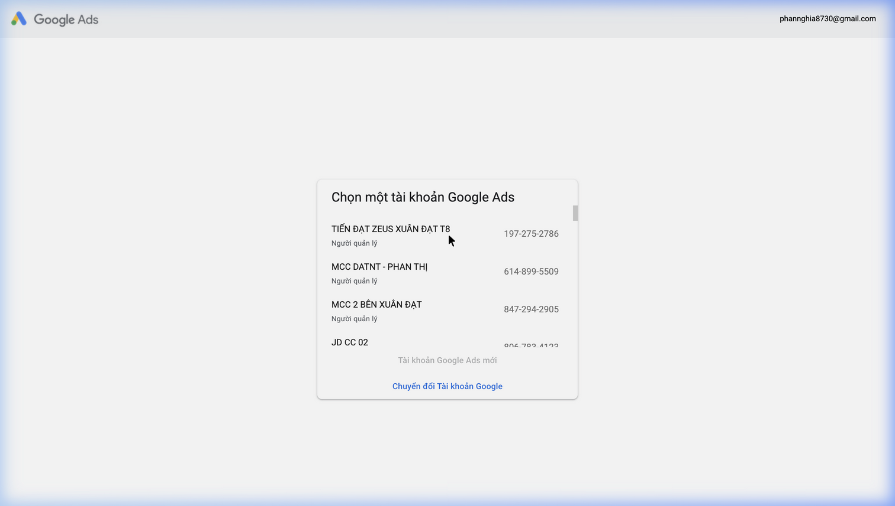
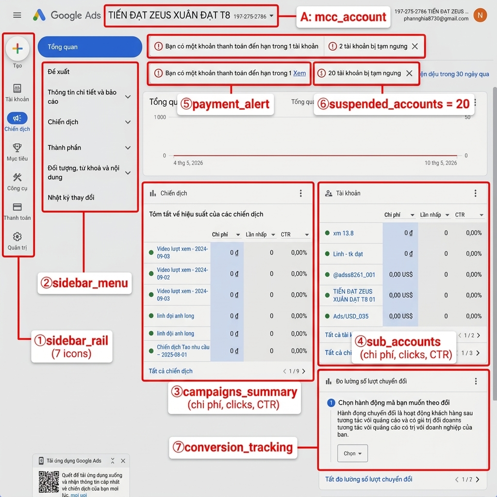
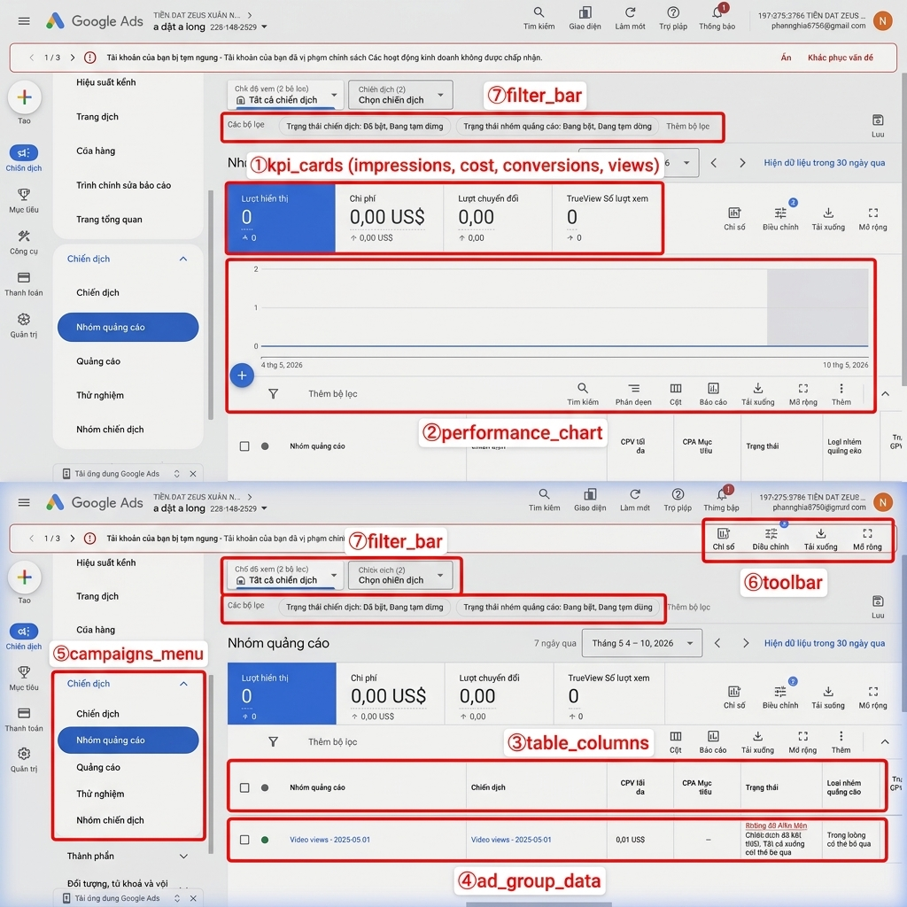
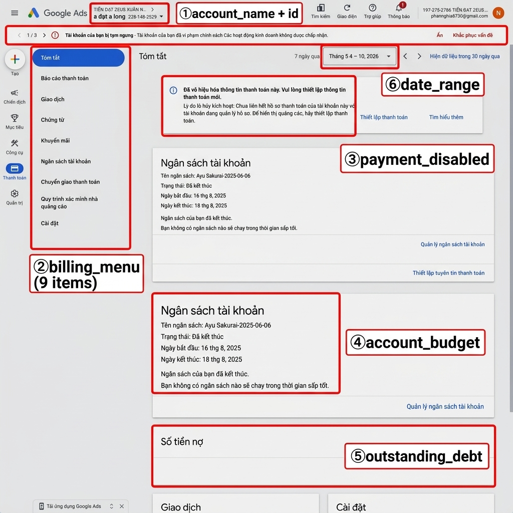

# 📋 Google Ads — Annotated Data Map

> **MCC Account:** TIẾN ĐẠT ZEUS XUÂN ĐẠT T8
> **MCC ID:** `197-275-2786`
> **Sub-Account:** a đạt a long (`228-148-2529`)
> **Email:** phannghia8730@gmail.com
> **Ngày chụp:** 11/05/2026 — Screenshots thật
> **Tổng:** 9 campaigns, 5 sub-accounts, 20 TK tạm ngưng

---

## 📌 SIDEBAR NAVIGATION

### Icon Rail (trái)
| Icon | Section | Chức năng |
|---|---|---|
| ➕ | **Tạo** | Tạo campaign mới |
| 📋 | **Tài khoản** | Quản lý sub-accounts |
| 📊 | **Chiến dịch** | Campaign management — **CHÍNH** |
| 🎯 | **Mục tiêu** | Goals & conversions |
| 🔧 | **Công cụ** | Tools & settings |
| 💳 | **Thanh toán** | Billing & payments |
| ⚙️ | **Quản trị** | Admin settings |

### Sidebar Menu (khi mở Chiến dịch)
| Menu item | Chức năng |
|---|---|
| Tổng quan | Overview dashboard |
| Đề xuất | Recommendations |
| Thông tin chi tiết và báo cáo | Insights & reports |
| **Chiến dịch** | Campaigns list |
| **Nhóm quảng cáo** | Ad groups |
| **Quảng cáo** | Ads |
| Thử nghiệm | Experiments |
| Nhóm chiến dịch | Campaign groups |
| Thành phần | Assets (extensions) |
| Đối tượng, từ khoá và nội dung | Audiences, keywords, content |
| Nhật ký thay đổi | Change history |

---

## 0️⃣ ACCOUNT SELECTOR — Chọn tài khoản



### Các tài khoản MCC

| Account Name | ID | Role |
|---|---|---|
| **TIẾN ĐẠT ZEUS XUÂN ĐẠT T8** | 197-275-2786 | Người quản lý |
| MCC DATNT - PHAN THỊ | 614-899-5509 | Người quản lý |
| MCC 2 BÊN XUÂN ĐẠT | 847-294-2905 | Người quản lý |
| JD CC 02 | 806-782-4122 | Người quản lý |

---

## 1️⃣ MCC OVERVIEW — Tổng quan



### Header
| Ô | Field | Giá trị mẫu | Ghi chú |
|---|---|---|---|
| **A** | `mcc_account_name` + `mcc_id` | "TIẾN ĐẠT ZEUS XUÂN ĐẠT T8" / 197-275-2786 | MCC account chính |

### Sidebar
| Ô | Field | Ghi chú |
|---|---|---|
| **①** | `sidebar_rail` | 7 icons: Tạo → Quản trị |
| **②** | `sidebar_menu` | Menu mở rộng khi click Chiến dịch |

### Campaigns Summary Card
| Ô | Field | Giá trị mẫu | Ghi chú |
|---|---|---|---|
| **③** | `campaigns_summary` | 6 campaigns: "Video lượt xem - 2024-09-03", "linh đội anh long"... | Bảng: Chi phí / Lần nhấp / CTR |
| **③** | `campaign_cost` | 0 đ | Chi phí mỗi campaign |
| **③** | `campaign_clicks` | 0 | Lần nhấp |
| **③** | `campaign_ctr` | 0,00% | CTR |

### Sub-Accounts Card
| Ô | Field | Giá trị mẫu | Ghi chú |
|---|---|---|---|
| **④** | `sub_accounts` | 5 accounts: "xm 13.8", "Linh - tk đạt", "@adss8261_031"... | Bảng: Chi phí / Lần nhấp / CTR |

### Alerts
| Ô | Field | Giá trị mẫu | Ghi chú |
|---|---|---|---|
| **⑤** | `payment_alert` | "Bạn có 1 khoản thanh toán đến hạn" | ⚠️ Cảnh báo thanh toán |
| **⑥** | `suspended_accounts` | **20** tài khoản bị tạm ngưng | 🔴 Accounts suspended |
| **⑦** | `conversion_tracking` | "Đo lường số lượt chuyển đổi" | Setup conversion tracking |

---

## 2️⃣ AD GROUPS — Nhóm quảng cáo



### URL
```
/aw/adgroups?ocid=228148253
```

### KPI Summary Cards

> [!IMPORTANT]
> 4 KPI chính hiển thị trên cùng, có so sánh vs kỳ trước

| Ô | Field | Giá trị mẫu | Ghi chú |
|---|---|---|---|
| **①** | `impressions` | 0 (↑ 0) | Lượt hiển thị |
| **①** | `cost` | 0,00 US$ (↑ 0,00 US$) | **Chi phí** — KPI chính |
| **①** | `conversions` | 0,00 (↑ 0,00) | Lượt chuyển đổi |
| **①** | `trueview_views` | 0 (↑ 0) | TrueView video views |

### Performance Chart
| Ô | Field | Ghi chú |
|---|---|---|
| **②** | `performance_chart` | Biểu đồ hiệu suất theo ngày (4/5 – 10/5/2026) |

### Table Columns
| Ô | Cột | Field | Giá trị mẫu | Ghi chú |
|---|---|---|---|---|
| **③** | Nhóm quảng cáo | `ad_group_name` | "Video views - 2025-05-01" | Tên nhóm QC |
| **③** | Chiến dịch | `campaign_name` | "Video views - 2025-05-01" | Campaign cha |
| **③** | CPV tối đa | `max_cpv` | 0,01 US$ | Max cost-per-view |
| **③** | CPA Mục tiêu | `target_cpa` | — | Target CPA |
| **③** | Trạng thái | `status` | "Không đủ điều kiện" | Eligible / Paused / Suspended |
| **③** | Loại nhóm QC | `ad_group_type` | "Trong luồng có thể bỏ qua" | Ad group type |

### Controls
| Ô | Field | Ghi chú |
|---|---|---|
| **⑤** | `campaigns_menu` | Chiến dịch > Nhóm QC > Quảng cáo > Thử nghiệm |
| **⑥** | `toolbar` | Chỉ số / Điều chỉnh / Tải xuống / Mở rộng |
| **⑦** | `filter_bar` | Trạng thái chiến dịch + Trạng thái nhóm QC |

---

## 3️⃣ BILLING — Thanh toán



### URL
```
/aw/billing/summary?ocid=228148253
```

### Header
| Ô | Field | Giá trị mẫu | Ghi chú |
|---|---|---|---|
| **①** | `account_name` + `account_id` | "a đạt a long" / 228-148-2529 | Sub-account đang xem |
| **⑦** | `account_suspended` | "Tài khoản bị tạm ngưng" | 🔴 Warning bar |

### Billing Sidebar (9 mục)
| Ô | Menu item | Ghi chú |
|---|---|---|
| **②** | Tóm tắt | Summary — **ĐANG XEM** |
| **②** | Báo cáo thanh toán | Payment reports |
| **②** | Giao dịch | Transactions |
| **②** | Chứng từ | Receipts / invoices |
| **②** | Khuyến mãi | Promotions / credits |
| **②** | Ngân sách tài khoản | Account budget |
| **②** | Chuyển giao thanh toán | Payment transfers |
| **②** | Quy trình xác minh nhà QC | Advertiser verification |
| **②** | Cài đặt | Settings |

### Billing Data
| Ô | Field | Giá trị mẫu | Ghi chú |
|---|---|---|---|
| **③** | `payment_disabled` | "Đã vô hiệu hóa thông tin thanh toán" | ⚠️ Cần thiết lập lại |
| **④** | `account_budget` | Tên: "Ayu Sakurai-2025-06-06", Trạng thái: "Đã kết thúc", 16-18/8/2025 | Budget đã hết hạn |
| **⑤** | `outstanding_debt` | "Số tiền nợ" | Khoản nợ chưa thanh toán |
| **⑥** | `date_range` | "Tháng 5 4 – 10, 2026" / "7 ngày qua" | Bộ lọc thời gian |

---

## 📊 TỔNG HỢP — 25 DATA FIELDS

### 🔴 Ưu tiên cao (Core KPIs)

| # | Field | Trang | Giá trị mẫu |
|---|---|---|---|
| 1 | `cost` | Ad Groups KPI / Overview | 0,00 US$ |
| 2 | `impressions` | Ad Groups KPI | 0 |
| 3 | `conversions` | Ad Groups KPI | 0,00 |
| 4 | `campaign_clicks` | Overview campaigns | 0 |
| 5 | `campaign_ctr` | Overview campaigns | 0,00% |
| 6 | `suspended_accounts` | Overview alert | 20 |
| 7 | `payment_alert` | Overview alert | 1 khoản đến hạn |

### 🟡 Ưu tiên trung bình (Campaign & Billing)

| # | Field | Trang | Giá trị mẫu |
|---|---|---|---|
| 8 | `campaign_name` | Campaigns / Ad Groups | "Video lượt xem - 2024-09-03" |
| 9 | `ad_group_name` | Ad Groups table | "Video views - 2025-05-01" |
| 10 | `max_cpv` | Ad Groups table | 0,01 US$ |
| 11 | `status` | Ad Groups table | "Không đủ điều kiện" |
| 12 | `ad_group_type` | Ad Groups table | "Trong luồng có thể bỏ qua" |
| 13 | `outstanding_debt` | Billing summary | Số tiền nợ |
| 14 | `account_budget` | Billing summary | "Đã kết thúc" |
| 15 | `payment_disabled` | Billing summary | Vô hiệu hóa |

### 🟢 Ưu tiên thấp (Account & Setup)

| # | Field | Trang | Giá trị mẫu |
|---|---|---|---|
| 16 | `mcc_account_name` | Header | "TIẾN ĐẠT ZEUS XUÂN ĐẠT T8" |
| 17 | `mcc_id` | Header | 197-275-2786 |
| 18 | `sub_account_name` | Overview / Header | "a đạt a long" |
| 19 | `sub_account_id` | Header | 228-148-2529 |
| 20 | `trueview_views` | Ad Groups KPI | 0 |
| 21 | `target_cpa` | Ad Groups table | — |

---

## 🔗 URL PATTERNS cho Extension

```
MCC Overview:   ads.google.com/aw/overview?ocid=<MCC_ID>
Campaigns:      ads.google.com/aw/campaigns?ocid=<ACCOUNT_ID>
Ad Groups:      ads.google.com/aw/adgroups?ocid=<ACCOUNT_ID>
Ads:            ads.google.com/aw/ads?ocid=<ACCOUNT_ID>
Keywords:       ads.google.com/aw/keywords?ocid=<ACCOUNT_ID>
Billing:        ads.google.com/aw/billing/summary?ocid=<ACCOUNT_ID>
Transactions:   ads.google.com/aw/billing/transactions?ocid=<ACCOUNT_ID>
```

> [!IMPORTANT]
> Google Ads sử dụng `ocid` parameter (thay vì `act=` như Facebook).
> MCC ID: `197-275-2786` → ocid = `1972752786`
> Sub-account ID: `228-148-2529` → ocid = `2281482529`

---

## 🎬 VIDEO WALKTHROUGH


