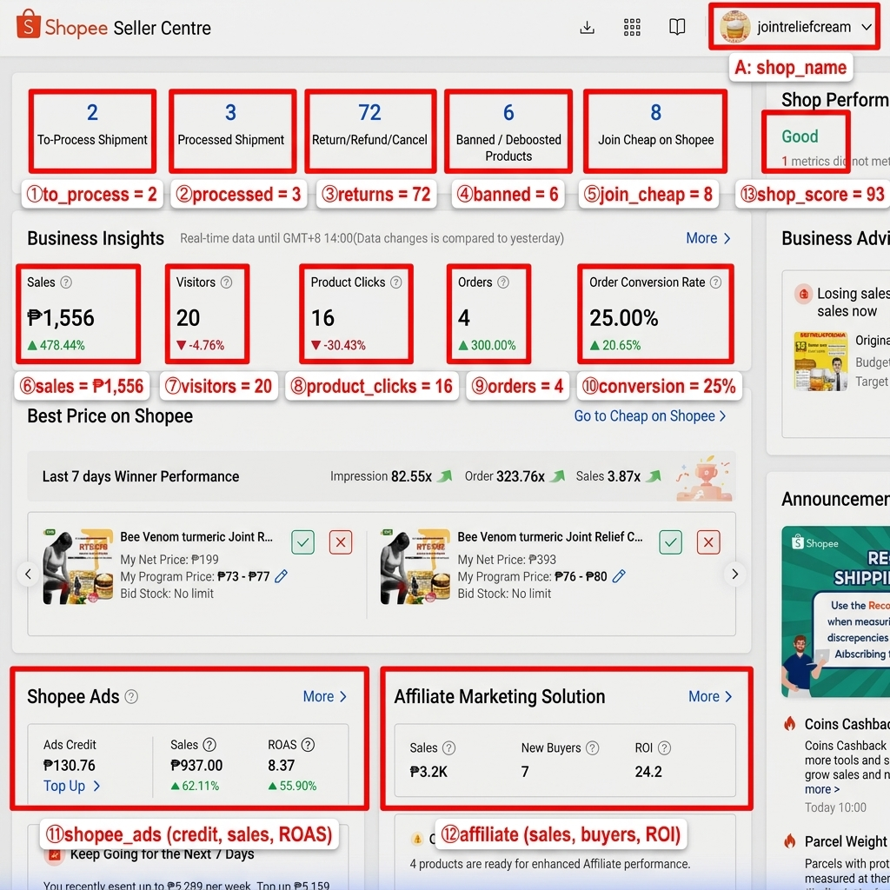
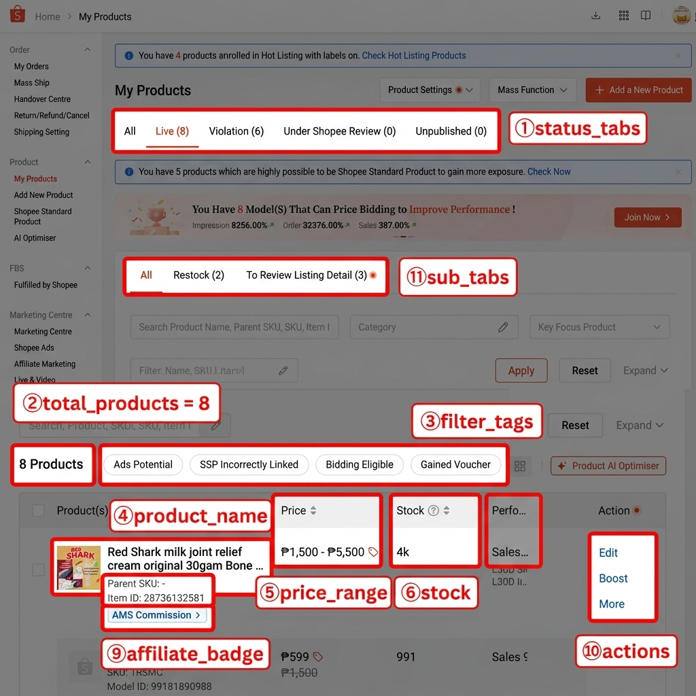
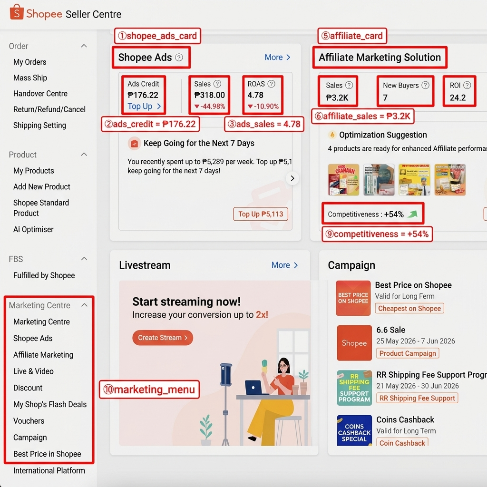

# 📋 Shopee Seller Centre — Annotated Data Map

> **Shop:** jointreliefcream
> **Market:** Philippines (seller.shopee.ph)
> **Ngày chụp:** 11/05/2026 — Screenshots thật
> **Tổng:** 8 sản phẩm, 4 đơn mới

---

## 📌 SIDEBAR NAVIGATION (Menu trái)

| Section | Menu items | URL Pattern |
|---|---|---|
| **Order** | My Orders, Mass Ship, Handover Centre, Return/Refund/Cancel, Shipping Setting | `/portal/sale/*` |
| **Product** | My Products, Add New Product, Shopee Standard Product, AI Optimiser | `/portal/product/*` |
| **FBS** | Fulfilled by Shopee | `/portal/fbs` |
| **Marketing Centre** | Marketing Centre, Shopee Ads, Affiliate Marketing, Live & Video, Discount, My Shop's Flash Deals, Vouchers, Campaign, Best Price in Shopee, International Platform | `/portal/marketing/*` |
| **Finance** | My Income, My Balance, Bank Account, Tax | `/portal/finance/*` |
| **Data** | Business Insights, My Reports | `/portal/data/*` |
| **Shop** | Shop Rating, Shop Decoration, Shop Setting | `/portal/shop/*` |
| **CS** | Customer Service | `/portal/cs/*` |

---

## 1️⃣ DASHBOARD — Tổng quan Shop



### Header
| Ô | Field | Vị trí | Giá trị mẫu |
|---|---|---|---|
| **A** | `shop_name` | Góc phải trên, avatar dropdown | "jointreliefcream" |

### Khu vực To-Do List (Hàng trên cùng)
| Ô | Field | Giá trị mẫu | Ý nghĩa |
|---|---|---|---|
| **①** | `to_process_shipment` | 2 | Đơn cần xử lý giao |
| **②** | `processed_shipment` | 3 | Đơn đã xử lý |
| **③** | `return_refund_cancel` | 72 | Đơn hoàn/hủy |
| **④** | `banned_products` | 6 | SP bị cấm/giảm boost |
| **⑤** | `join_cheap` | 8 | SP cần tham gia "Rẻ nhất Shopee" |

### Khu vực Business Insights (KPI chính)

> [!IMPORTANT]
> Dữ liệu real-time, so sánh với hôm qua. Đây là **core KPIs** cần scrape.

| Ô | Field | Giá trị mẫu | % thay đổi | Ghi chú |
|---|---|---|---|---|
| **⑥** | `sales` | ₱1,556 | ▲ 478.44% | **Doanh số** — KPI #1 |
| **⑦** | `visitors` | 20 | ▼ 4.76% | Lượt truy cập shop |
| **⑧** | `product_clicks` | 16 | ▼ 30.43% | Click vào sản phẩm |
| **⑨** | `orders` | 4 | ▲ 300.00% | Số đơn hàng |
| **⑩** | `conversion_rate` | 25.00% | ▲ 20.65% | Tỷ lệ chuyển đổi |

### Khu vực Shopee Ads & Affiliate (Cards dưới)
| Ô | Field | Giá trị mẫu | Ghi chú |
|---|---|---|---|
| **⑪** | `ads_credit` + `ads_sales` + `roas` | ₱130.76 / ₱937.00 / 8.37 | Credit còn + Doanh số ads + ROAS |
| **⑫** | `affiliate_sales` + `new_buyers` + `affiliate_roi` | ₱3.2K / 7 / 24.2 | Doanh số affiliate + Buyer mới + ROI |

### Shop Performance (Bên phải)
| Ô | Field | Giá trị mẫu | Ghi chú |
|---|---|---|---|
| **⑬** | `shop_score` | 93 (Good) | Điểm hiệu suất shop |

---

## 2️⃣ MY PRODUCTS — Sản phẩm



### URL
```
/portal/product/list/all
```

### Tabs & Filters
| Ô | Field | Giá trị mẫu | Ghi chú |
|---|---|---|---|
| **①** | `status_tabs` | All / Live (8) / Violation (6) / Under Review (0) / Unpublished (0) | Lọc theo trạng thái |
| **②** | `total_products` | 8 | Tổng SP |
| **③** | `filter_tags` | Ads Potential / SSP Incorrectly Linked / Bidding Eligible / Gained Voucher | Bộ lọc nhanh |
| **⑪** | `sub_tabs` | All / Restock (2) / To Review Listing Detail (3) | Tab phụ |

### Bảng sản phẩm
| Ô | Cột | Field | Giá trị mẫu | Ghi chú |
|---|---|---|---|---|
| **④** | Product(s) | `product_name` | "Red Shark milk joint relief cream original 30gam Bone Therapy Cream..." | Tên + thumbnail |
| **⑤** | Price | `price_range` | ₱1,500 - ₱5,500 | Range giá (nhiều SKU) |
| **⑥** | Stock | `stock` | 4k / 991 | Tồn kho |
| **⑦** | Performance | `performance` | "Sales..." | Doanh số SP (L30D) |
| **⑧** | (dưới tên SP) | `item_id` + `parent_sku` | "Item ID: 28736132581", "Parent SKU: -" | ID sản phẩm + SKU |
| **⑨** | (badge) | `affiliate_badge` | "AMS Commission >" | SP đã bật Affiliate |
| **⑩** | Action | `actions` | Edit / Boost / More | Nút thao tác |

---

## 3️⃣ MARKETING — Shopee Ads & Affiliate



### Shopee Ads Card (Dashboard)
| Ô | Field | Giá trị mẫu | Ghi chú |
|---|---|---|---|
| **①** | Card title | "Shopee Ads" | Click "More >" để vào trang Ads |
| **②** | `ads_credit` | ₱176.22 | Số dư credit quảng cáo |
| **③** | `ads_sales` | ₱318.00 (▼ 44.98%) | Doanh số từ Ads + % thay đổi |
| **④** | `roas` | 4.78 (▼ 10.90%) | Return on Ad Spend |

### Affiliate Marketing Card (Dashboard)
| Ô | Field | Giá trị mẫu | Ghi chú |
|---|---|---|---|
| **⑤** | Card title | "Affiliate Marketing Solution" | Click "More >" để vào trang Affiliate |
| **⑥** | `affiliate_sales` | ₱3.2K | Doanh số qua affiliate |
| **⑦** | `new_buyers` | 7 | Khách mới từ affiliate |
| **⑧** | `affiliate_roi` | 24.2 | ROI affiliate |

### Thêm metrics
| Ô | Field | Giá trị mẫu | Ghi chú |
|---|---|---|---|
| **⑨** | `competitiveness` | +54% ↗ | Độ cạnh tranh (từ Best Price on Shopee) |
| **⑩** | `marketing_menu` | 9 items | Menu sidebar Marketing Centre |

---

## 📊 TỔNG HỢP — 34 DATA FIELDS

### 🔴 Ưu tiên cao (Core KPIs)

| # | Field | Trang | Giá trị mẫu |
|---|---|---|---|
| 1 | `sales` | Dashboard > Business Insights | ₱1,556 |
| 2 | `orders` | Dashboard > Business Insights | 4 |
| 3 | `visitors` | Dashboard > Business Insights | 20 |
| 4 | `conversion_rate` | Dashboard > Business Insights | 25.00% |
| 5 | `ads_credit` | Dashboard > Shopee Ads card | ₱130.76 |
| 6 | `ads_sales` | Dashboard > Shopee Ads card | ₱937.00 |
| 7 | `roas` | Dashboard > Shopee Ads card | 8.37 |
| 8 | `to_process_shipment` | Dashboard > To-Do List | 2 |

### 🟡 Ưu tiên trung bình (Operations)

| # | Field | Trang | Giá trị mẫu |
|---|---|---|---|
| 9 | `product_clicks` | Dashboard > Business Insights | 16 |
| 10 | `return_refund_cancel` | Dashboard > To-Do List | 72 |
| 11 | `banned_products` | Dashboard > To-Do List | 6 |
| 12 | `shop_score` | Dashboard > Shop Performance | 93 |
| 13 | `affiliate_sales` | Dashboard > Affiliate card | ₱3.2K |
| 14 | `affiliate_roi` | Dashboard > Affiliate card | 24.2 |
| 15 | `new_buyers` | Dashboard > Affiliate card | 7 |

### 🟢 Ưu tiên thấp (Product details)

| # | Field | Trang | Giá trị mẫu |
|---|---|---|---|
| 16 | `product_name` | My Products table | "Red Shark milk..." |
| 17 | `price_range` | My Products > Price column | ₱1,500 - ₱5,500 |
| 18 | `stock` | My Products > Stock column | 4k |
| 19 | `item_id` | My Products > dưới tên SP | 28736132581 |
| 20 | `performance` | My Products > Performance | Sales L30D |

---

## 🔗 URL PATTERNS cho Extension

```
Dashboard:     seller.shopee.ph/
Orders:        seller.shopee.ph/portal/sale/order
My Products:   seller.shopee.ph/portal/product/list/all
Shopee Ads:    seller.shopee.ph/portal/marketing/pas/index
Affiliate:     seller.shopee.ph/portal/marketing/affiliate
My Income:     seller.shopee.ph/portal/finance/income
Business Data: seller.shopee.ph/portal/data/business
```

---

## 🎬 VIDEO WALKTHROUGH


