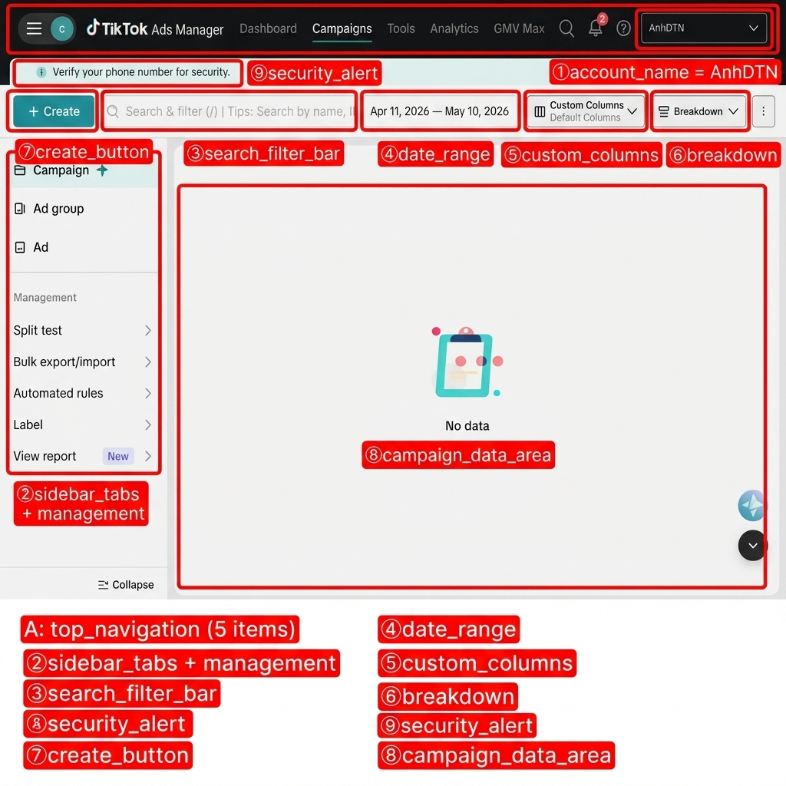
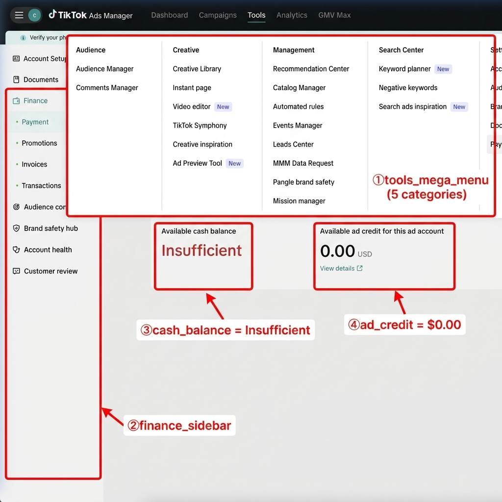

# 📋 TikTok Ads Manager — Annotated Data Map

> **Account:** AnhDTN
> **Platform:** TikTok Ads Manager (ads.tiktok.com)
> **Ngày chụp:** 11/05/2026 — Screenshots thật
> **Trạng thái:** Account mới, chưa có data (No data)

---

## 📌 TOP NAVIGATION

| Tab | URL Pattern | Chức năng |
|---|---|---|
| **Dashboard** | `/i18n/dashboard` | Tổng quan tài khoản QC |
| **Campaigns** | `/i18n/perf` | Quản lý Campaign / Ad Group / Ad |
| **Tools** | — (mega menu dropdown) | 5 nhóm: Audience, Creative, Management, Search, Settings |
| **Analytics** | `/i18n/analytics` | Custom reports & analytics |
| **GMV Max** | — | Performance Max campaigns |

---

## 1️⃣ CAMPAIGNS — Campaign / Ad Group / Ad



### URL
```
ads.tiktok.com/i18n/perf
```

### Header & Account
| Ô | Field | Giá trị mẫu | Ghi chú |
|---|---|---|---|
| **A** | `top_navigation` | Dashboard / **Campaigns** / Tools / Analytics / GMV Max | 5 tab chính |
| **①** | `account_name` | "AnhDTN" | Account selector (dropdown) |
| **⑨** | `security_alert` | "Verify your phone number" | Cảnh báo bảo mật |

### Sidebar Tabs (3 cấp)
| Ô | Tab | Ghi chú |
|---|---|---|
| **②** | **Campaign** ✨ | Cấp chiến dịch |
| **②** | **Ad group** | Cấp nhóm quảng cáo |
| **②** | **Ad** | Cấp quảng cáo đơn lẻ |

### Management Tools (sidebar dưới)
| Tool | Ghi chú |
|---|---|
| Split test | A/B testing |
| Bulk export/import | Import/export campaigns |
| Automated rules | Tự động hóa quy tắc |
| Label | Gắn nhãn campaigns |
| View report 🆕 | Xem báo cáo |

### Toolbar Controls
| Ô | Field | Giá trị mẫu | Ghi chú |
|---|---|---|---|
| **③** | `search_filter` | "Search by name, ID, settings, metrics" | Tìm kiếm + bộ lọc |
| **④** | `date_range` | "Apr 11, 2026 — May 10, 2026" | Khoảng thời gian |
| **⑤** | `custom_columns` | "Default Columns" | Tuỳ chỉnh cột hiển thị |
| **⑥** | `breakdown` | "Breakdown" | Phân tách theo: time, placement, device... |
| **⑦** | `create_button` | "+ Create" | Tạo campaign mới |

### Data Area
| Ô | Field | Ghi chú |
|---|---|---|
| **⑧** | `campaign_data` | "No data" — hiện chưa có campaign | Bảng data sẽ hiển thị khi có campaigns |

---

## 2️⃣ CAMPAIGN CREATION — Advertising Objectives

### URL
```
ads.tiktok.com/i18n/campaign/create
```

> [!IMPORTANT]
> Khi tạo campaign mới, chọn 1 trong 6 objectives dưới đây

### Objectives

| Category | Objective | Ghi chú |
|---|---|---|
| **Awareness** | Reach | Tối đa hoá lượt tiếp cận |
| **Consideration** | Traffic | Lưu lượng truy cập |
| **Consideration** | Video views | Tối đa hoá lượt xem video |
| **Consideration** | Community interaction | Tương tác cộng đồng |
| **Conversion** | App promotion | Cài đặt / tương tác app |
| **Conversion** | Lead generation | Thu thập leads |
| **Conversion** | Sales | Bán hàng (chuyển đổi) |

---

## 3️⃣ PAYMENT & FINANCE



### URL
```
ads.tiktok.com/i18n/account/payment
```

### Tools Mega Menu (5 categories)
| Ô | Category | Items | Ghi chú |
|---|---|---|---|
| **①** | **Audience** | Audience Manager, Comments Manager | Quản lý đối tượng |
| **①** | **Creative** | Creative Library, Instant page, Video editor, TikTok Symphony, Creative inspiration, Ad Preview Tool 🆕 | Công cụ sáng tạo |
| **①** | **Management** | Recommendation Center, Catalog Manager, Automated rules, Events Manager, Leads Center, MMM Data Request, Pangle brand safety, Mission manager | Quản lý |
| **①** | **Search Center** | Keyword planner 🆕, Negative keywords, Search ads inspiration 🆕 | Tìm kiếm |
| **①** | **Settings** | Account settings, Audience controls, Brand safety hub, Documents, **Payments** | Cài đặt |

### Finance Sidebar
| Ô | Menu item | Ghi chú |
|---|---|---|
| **②** | Account Setup | Thiết lập tài khoản |
| **②** | Documents | Tài liệu |
| **②** | **Finance** (expanded) | Section tài chính |
| **②** | → **Payment** | Thanh toán — **ĐANG XEM** |
| **②** | → Promotions | Khuyến mãi / credits |
| **②** | → Invoices | Hoá đơn |
| **②** | → Transactions | Lịch sử giao dịch |
| **②** | Audience controls | Kiểm soát đối tượng |
| **②** | Brand safety hub | An toàn thương hiệu |
| **②** | Account health | Sức khoẻ tài khoản |
| **②** | Customer review | Đánh giá khách hàng |

### Payment Data
| Ô | Field | Giá trị mẫu | Ghi chú |
|---|---|---|---|
| **③** | `cash_balance` | 🔴 **"Insufficient"** | Số dư không đủ |
| **④** | `ad_credit` | **0.00 USD** | Credit QC khả dụng |

---

## 4️⃣ ANALYTICS — Custom Reports

### URL
```
ads.tiktok.com/i18n/analytics/custom-report
```

| Feature | Ghi chú |
|---|---|
| Self-serve analytics | Tự tạo báo cáo tuỳ chỉnh |
| Centralized data | Tổng hợp data từ tất cả ad accounts |
| Scheduled reports | Báo cáo định kỳ: daily, weekly, monthly |
| "Create a report" button | Bắt đầu tạo custom report |

---

## 📊 TỔNG HỢP — 22 DATA FIELDS

### 🔴 Ưu tiên cao (Core KPIs — khi có campaigns)

| # | Field | Trang | Ghi chú |
|---|---|---|---|
| 1 | `cost` | Campaigns table | Chi phí (VND/USD) |
| 2 | `impressions` | Campaigns table | Lượt hiển thị |
| 3 | `clicks` | Campaigns table | Lượt click |
| 4 | `ctr` | Campaigns table | Click-through rate |
| 5 | `conversions` | Campaigns table | Lượt chuyển đổi |
| 6 | `cpc` | Campaigns table | Cost per click |
| 7 | `cash_balance` | Payment page | 🔴 "Insufficient" |
| 8 | `ad_credit` | Payment page | 0.00 USD |

### 🟡 Ưu tiên trung bình (Campaign Structure)

| # | Field | Trang | Ghi chú |
|---|---|---|---|
| 9 | `campaign_name` | Campaigns tab | Tên chiến dịch |
| 10 | `ad_group_name` | Ad Group tab | Tên nhóm QC |
| 11 | `ad_name` | Ad tab | Tên quảng cáo |
| 12 | `campaign_status` | Campaigns tab | Active / Paused / Draft |
| 13 | `budget` | Campaigns tab | Ngân sách |
| 14 | `objective` | Campaign creation | Reach / Traffic / Sales... |
| 15 | `date_range` | Toolbar | Apr 11 — May 10, 2026 |

### 🟢 Ưu tiên thấp (Account & Setup)

| # | Field | Trang | Ghi chú |
|---|---|---|---|
| 16 | `account_name` | Header | "AnhDTN" |
| 17 | `promotions` | Finance > Promotions | Credits khuyến mãi |
| 18 | `invoices` | Finance > Invoices | Hoá đơn |
| 19 | `transactions` | Finance > Transactions | Lịch sử giao dịch |
| 20 | `account_health` | Sidebar | Sức khoẻ TK |
| 21 | `breakdown` | Toolbar | Phân tách dữ liệu |
| 22 | `custom_columns` | Toolbar | Cột tuỳ chỉnh |

---

## 🔗 URL PATTERNS cho Extension

```
Dashboard:      ads.tiktok.com/i18n/dashboard
Campaigns:      ads.tiktok.com/i18n/perf
Campaign Create:ads.tiktok.com/i18n/campaign/create
Payment:        ads.tiktok.com/i18n/account/payment
Promotions:     ads.tiktok.com/i18n/account/promotion
Invoices:       ads.tiktok.com/i18n/account/invoice
Transactions:   ads.tiktok.com/i18n/account/transaction
Analytics:      ads.tiktok.com/i18n/analytics/custom-report
Creative Lib:   ads.tiktok.com/i18n/creative/library
Account Health: ads.tiktok.com/i18n/account/health
```

> [!IMPORTANT]
> TikTok Ads sử dụng URL prefix `/i18n/` cho tất cả pages.
> Account được chọn qua dropdown góc phải (không dùng URL parameter).

---

## 🎬 VIDEO WALKTHROUGH


