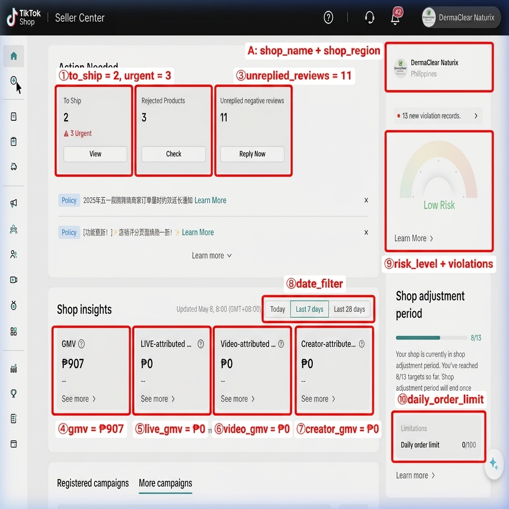
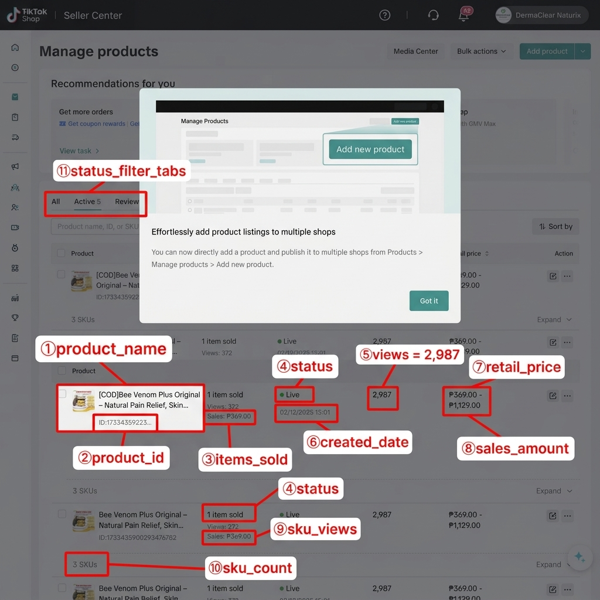
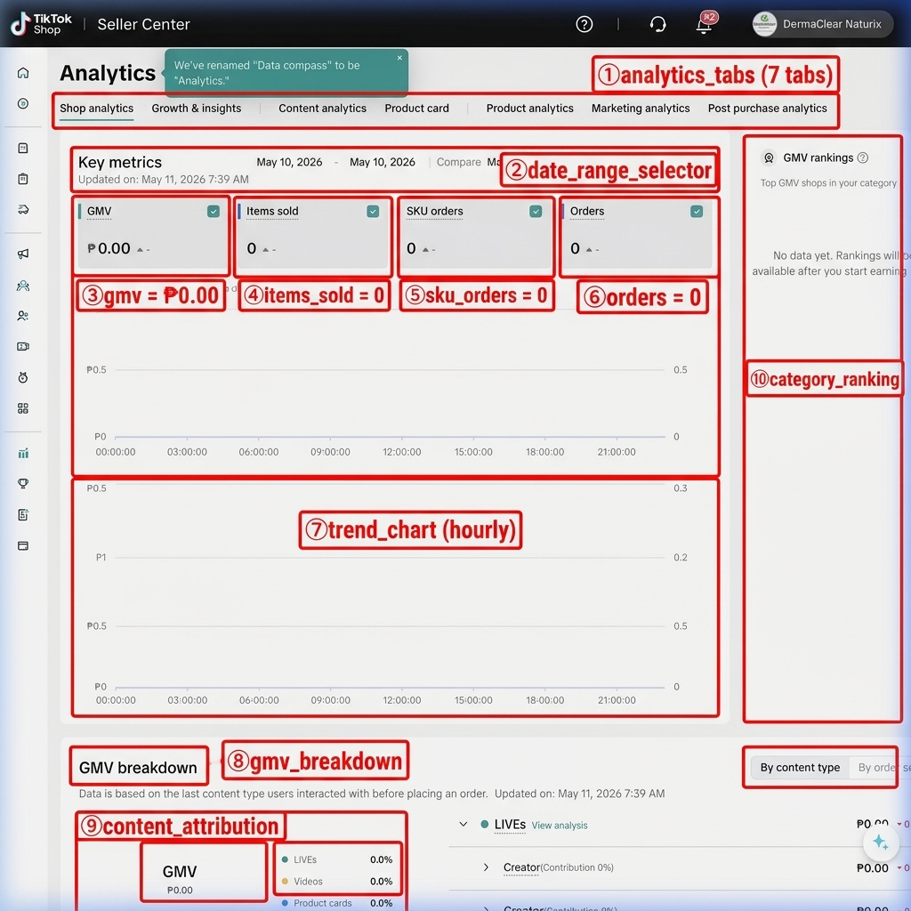
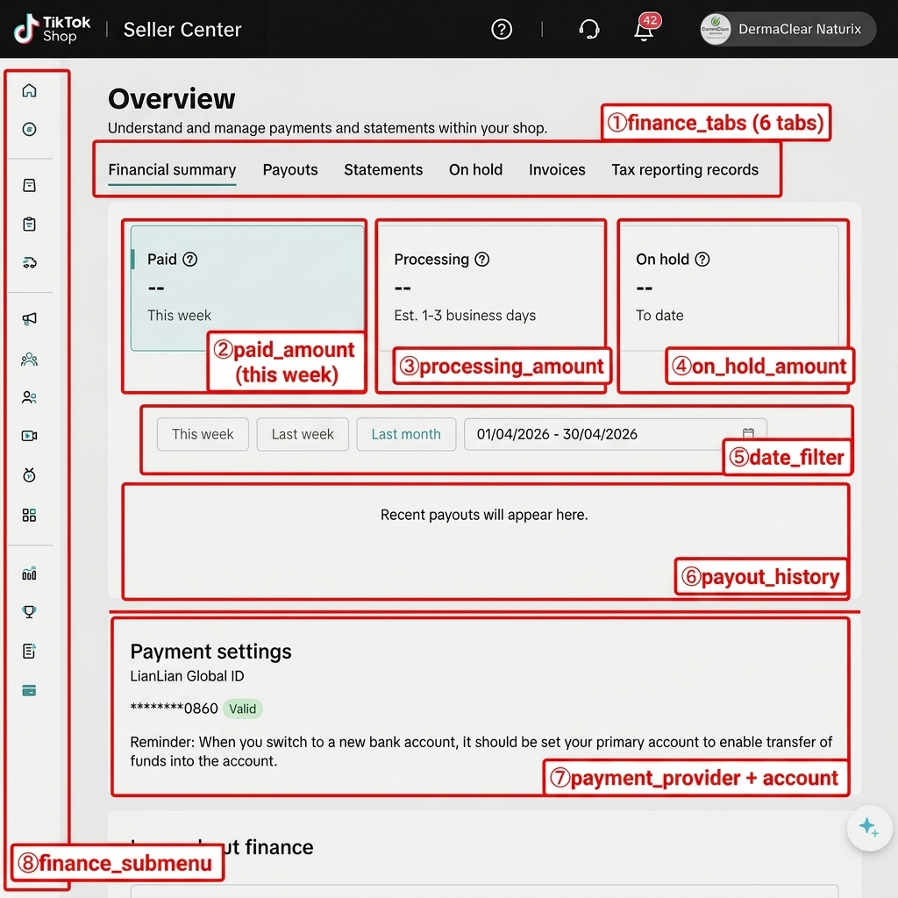
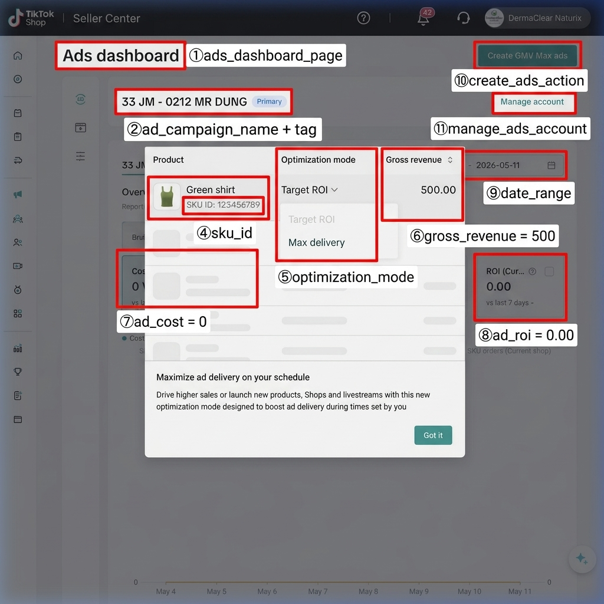

# 🏪 TikTok Shop — Hướng dẫn Lấy Dữ liệu cho XCAP NỘI SÀN

> **Mục tiêu:** Dev biết chính xác cần lấy gì từ TikTok Shop, ở đâu, API endpoint nào, fields nào map vào entity nào trong XCAP Nội sàn system.
> **Stream:** `noi_san` — On-Platform E-commerce
> **API Docs:** https://partner.tiktokshop.com/docv2
> **Auth:** OAuth 2.0

---

## 🏗️ 1. Kiến trúc Tổng quan

```
TikTok Shop Seller Center (seller-vn.tiktok.com)
├── Home Dashboard
│   ├── Action Needed (to ship, rejected products, unreplied reviews)
│   ├── Shop Insights (GMV, orders by content type)
│   ├── Risk Level & Violations
│   └── Daily Order Limit
├── Orders
│   ├── Manage Orders (all statuses)
│   ├── Returns & Refunds
│   ├── Cancellations
│   └── Shipping (logistics)
├── Products
│   ├── Manage Products
│   ├── Add Product
│   ├── Batch Tools
│   └── Product Diagnostics
├── Promotions
│   ├── Flash Deals / Discounts
│   ├── Vouchers
│   ├── Free Shipping
│   └── Affiliate Marketing (creator commissions)
├── Finance
│   ├── Financial Summary (overview)
│   ├── Payouts (settlement history)
│   ├── Statements (transaction detail)
│   ├── On Hold (frozen funds)
│   ├── Invoices
│   └── Tax
├── Analytics
│   ├── Shop Analytics (overview KPIs)
│   ├── Product Analytics
│   ├── Live Analytics (⚠️ TikTok-specific)
│   ├── Traffic Sources
│   └── Customer Analysis
├── Ads Dashboard (In-platform Ads)
│   ├── GMV Max Ads
│   ├── Product Ads
│   └── Shop Ads
└── Shop Settings
    ├── Shop Profile
    ├── Warehouse
    └── Shipping Templates
```

---

## 📦 2. XCAP Nội sàn Entities — Tham chiếu

| Entity | Mô tả | PK |
|---|---|---|
| **EcomShop** | Tài khoản Seller trên sàn | `shopId` |
| **EcomOrder** | Đơn hàng | `orderId` |
| **EcomProduct** | Sản phẩm / listing | `productId` |
| **EcomSettlement** | Thanh toán / settlement từ sàn | `settlementId` |
| **EcomMetrics** | Chỉ số KPI hàng ngày | `metricId` |

---

## 📸 Visual Data Map — Vị trí dữ liệu trên Seller Center

> Dev cần biết chính xác từng field nằm ở đâu trên giao diện TikTok Shop. Dưới đây là screenshots annotated từ account thật.

### Homepage Dashboard — 10 Data Points



| Ô | Field | Giá trị mẫu | Ghi chú |
|---|---|---|---|
| **①** | `to_ship` + `urgent` | 2 (3 Urgent) | Đơn cần giao gấp |
| **②** | `rejected_products` | 3 | SP bị TikTok từ chối |
| **③** | `unreplied_reviews` | 11 | Review tiêu cực chưa phản hồi |
| **④** | `gmv` | ₱907 | **KPI CHÍNH — Tổng GMV** |
| **⑤** | `live_gmv` | ₱0 | GMV từ livestream |
| **⑥** | `video_gmv` | ₱0 | GMV từ short video |
| **⑦** | `creator_gmv` | ₱0 | GMV từ affiliate/creator |
| **⑧** | `date_filter` | Last 7 days | Bộ lọc thời gian |
| **⑨** | `risk_level` + `violations` | "Low Risk", 13 records | Mức rủi ro shop |
| **⑩** | `daily_order_limit` | 0/100 | Giới hạn đơn/ngày |

### Products — 11 Data Points



| Ô | Field | Giá trị mẫu | Ghi chú |
|---|---|---|---|
| **①** | `product_name` | "[COD]Bee Venom Plus Original..." | Tên đầy đủ SP + thumbnail |
| **②** | `product_id` | ID:17334359223... | ID duy nhất |
| **③** | `items_sold` | "1 item sold" | Tổng đã bán |
| **④** | `status` | "● Live" | Live / Draft / Reviewing |
| **⑤** | `views` | 2,987 | Lượt xem SP |
| **⑥** | `created_date` | "02/12/2025 15:01" | Ngày tạo SP |
| **⑦** | `retail_price` | "₱369.00 - ₱1,129.00" | Range giá (nhiều SKU) |
| **⑧** | `sales_amount` | "Sales: ₱369.00" | Tổng doanh số |
| **⑨** | `sku_views` | "Views: 372" | Views per SKU |
| **⑩** | `sku_count` | "3 SKUs" | Số biến thể |
| **⑪** | `status_filter_tabs` | All / Active 5 | Lọc theo trạng thái |

### Analytics — 10 Data Points



| Ô | Field | Giá trị mẫu | Ghi chú |
|---|---|---|---|
| **①** | `analytics_tabs` | 7 tabs (Shop/Growth/Content/Card/Product/Marketing/Post-purchase) | Tab navigation |
| **②** | `date_range` | "May 10, 2026 - May 10, 2026" | Date picker + Compare |
| **③** | `gmv` | ₱0.00 | **KPI** — tick checkbox hiện chart |
| **④** | `items_sold` | 0 | Tổng SP đã bán |
| **⑤** | `sku_orders` | 0 | Đơn theo SKU |
| **⑥** | `orders` | 0 | Tổng đơn hàng |
| **⑦** | `trend_chart` | Line chart (00:00→21:00) | So sánh Yesterday |
| **⑧** | `gmv_breakdown` | By content type / By order source | Phân tích nguồn GMV |
| **⑨** | `content_attribution` | LIVEs 0.0% / Videos 0.0% | Tỉ lệ đóng góp content |
| **⑩** | `category_ranking` | Top GMV shops | Xếp hạng trong ngành |

### Finance — 8 Data Points



| Ô | Field | Giá trị mẫu | Ghi chú |
|---|---|---|---|
| **①** | `finance_tabs` | 6 tabs (Financial summary / Payouts / Statements / On hold / Invoices / Tax) | Tab navigation |
| **②** | `paid_amount` | -- | Đã thanh toán tuần này |
| **③** | `processing_amount` | -- | Đang xử lý (1-3 ngày) |
| **④** | `on_hold_amount` | -- | Tiền bị giữ |
| **⑤** | `date_filter` | 01/04/2026 - 30/04/2026 | Bộ lọc thời gian |
| **⑥** | `payout_history` | "Recent payouts will appear here" | Lịch sử thanh toán |
| **⑦** | `payment_provider` + `account` | "LianLian Global ID", "****0860" | Nhà cung cấp + số TK |

### Ads Dashboard — 11 Data Points



| Ô | Field | Giá trị mẫu | Ghi chú |
|---|---|---|---|
| **②** | `ad_campaign_name` + `tag` | "33 JM - 0212 MR DUNG", "Primary" | Tên chiến dịch |
| **③** | `product_name` | "Green shirt" | SP đang chạy ads |
| **④** | `sku_id` | "SKU ID: 123456789" | ID biến thể |
| **⑤** | `optimization_mode` | "Target ROI" / "Max delivery" | 2 chế độ tối ưu |
| **⑥** | `gross_revenue` | 500.00 | Doanh thu gộp |
| **⑦** | `ad_cost` | 0 VND | **KPI — Chi phí QC** |
| **⑧** | `ad_roi` | 0.00 | **KPI — ROI quảng cáo** |
| **⑨** | `date_range` | "2026-05-04 - 2026-05-11" | Khoảng thời gian |
| **⑩** | `create_ads_action` | "Create GMV Max ads" | Tạo QC mới |

### 🔗 URL Patterns cho Extension

```
Homepage:     seller-vn.tiktok.com/ (hoặc seller.tiktokshopglobalselling.com)
Products:     seller-vn.tiktok.com/product/manage
Orders:       seller-vn.tiktok.com/order/list
Analytics:    seller-vn.tiktok.com/analytics/overview
Finance:      seller-vn.tiktok.com/finance/overview
Ads:          seller-vn.tiktok.com/ads/dashboard
```

---

## 📋 3. API Endpoints & Data Mapping

### 3.1 Shop Data

**API:** `GET /authorization/shops`

| TikTok Field | XCAP Entity | XCAP Field | Ghi chú |
|---|---|---|---|
| `shop_id` | EcomShop | shopId | PK |
| `shop_name` | EcomShop | shopName | |
| `region` | — | — | `VN`, `PH`, `TH`, etc. |
| `shop_cipher` | — | — | Used in subsequent API calls |
| *(hardcode)* | EcomShop | platform | `"tiktok_shop"` |
| *(from project)* | EcomShop | projectCode | FK → Gán khi onboard |

**Bổ sung:** Shop rating, totalProducts, totalOrders → tính từ Product + Order API hoặc Extension scrape Analytics.

---

### 3.2 Order Data

**API:** `POST /orders/search` → tìm kiếm orders
**API:** `GET /orders/{order_id}` → chi tiết order

#### Order Level:

| TikTok Field | XCAP Entity | XCAP Field | Ghi chú |
|---|---|---|---|
| `order_id` | EcomOrder | orderId | PK |
| `order_status` | EcomOrder | status | Xem mapping bên dưới |
| `payment.total_amount` | EcomOrder | orderAmount | Tổng buyer trả |
| `payment.shipping_fee` | EcomOrder | shippingFee | |
| `payment.seller_discount` | EcomOrder | sellerDiscount | Voucher seller |
| `payment.platform_discount` | EcomOrder | platformDiscount | TikTok subsidy |
| `payment.product_tax` | — | — | Thuế (nếu có) |
| `buyer_uid` | EcomOrder | buyerUsername | Buyer user ID |
| `create_time` | EcomOrder | orderDate | Unix timestamp |
| `paid_time` | — | — | Thời điểm thanh toán |
| `rts_time` | EcomOrder | shipDate | Ready-to-ship time |
| `delivery_time` | EcomOrder | deliverDate | Thời điểm giao |
| *(hardcode)* | EcomOrder | platform | `"tiktok_shop"` |

**Tính toán:**
- `platformFee` = `payment.platform_commission` (lấy từ settlement API)
- `netRevenue` = `orderAmount` - `shippingFee` - `platformFee` - `sellerDiscount` - `platformDiscount`

**Order Statuses Mapping:**

| TikTok Status | XCAP Status | Ý nghĩa |
|---|---|---|
| `UNPAID` | `pending` | Chưa thanh toán |
| `ON_HOLD` | `pending` | Đang giữ (review) |
| `AWAITING_SHIPMENT` | `pending` | Chờ giao hàng |
| `AWAITING_COLLECTION` | `shipping` | Chờ lấy hàng |
| `IN_TRANSIT` | `shipping` | Đang vận chuyển |
| `DELIVERED` | `delivered` | Đã giao thành công |
| `COMPLETED` | `delivered` | Hoàn tất (buyer confirm) |
| `CANCELLED` | `cancelled` | Đã hủy |

**Search Parameters:**
```json
{
  "create_time_ge": 1700000000,   // Unix timestamp start
  "create_time_lt": 1701000000,   // Unix timestamp end
  "order_status": "DELIVERED",     // Optional filter
  "page_size": 50,                 // Max 50
  "sort_by": "CREATE_TIME",
  "sort_type": "DESC"
}
```

---

### 3.3 Product Data

**API:** `POST /products/search` → product list
**API:** `GET /products/{product_id}` → product detail

| TikTok Field | XCAP Entity | XCAP Field | Ghi chú |
|---|---|---|---|
| `product_id` | EcomProduct | productId | PK |
| `product_name` | EcomProduct | productName | |
| `skus[].seller_sku` | EcomProduct | sku | SKU chính |
| `skus[].price.sale_price` | EcomProduct | price | Giá bán |
| `skus[].stock_infos[].available_stock` | EcomProduct | stock | Tồn kho |
| `product_status` | EcomProduct | status | Xem mapping |
| `sales` | EcomProduct | totalSold | Tổng đã bán |
| `category_chains` | EcomProduct | category | Category path |
| `main_images[0].url` | — | — | Ảnh chính |
| `create_time` | EcomProduct | createdAt | |
| *(hardcode)* | EcomProduct | platform | `"tiktok_shop"` |

**Product Status Mapping:**

| TikTok Status | XCAP Status |
|---|---|
| `LIVE` | `active` |
| `DRAFT` | `inactive` |
| `SUSPENDED` | `banned` |
| `DELETED` | `inactive` |
| `REVIEWING` | `inactive` |

**SKU Variants:** Mỗi product có array `skus[]` — mỗi SKU có riêng: seller_sku, sale_price, original_price, stock, sales_attributes (size, color).

---

### 3.4 Finance / Settlement

**API:** `GET /finance/settlements/search` → settlement list
**API:** `GET /finance/transactions/search` → transaction details

#### Settlements:

| TikTok Field | XCAP Entity | XCAP Field | Ghi chú |
|---|---|---|---|
| `settlement_id` | EcomSettlement | settlementId | PK |
| `settlement_amount` | EcomSettlement | netSettlement | Số tiền thực nhận |
| `revenue` | EcomSettlement | grossRevenue | Doanh thu gộp |
| `platform_commission` | EcomSettlement | platformFee | Hoa hồng TikTok |
| `shipping_fee` | EcomSettlement | shippingFee | |
| `adjustment_amount` | EcomSettlement | adjustments | Refunds + penalties |
| `settlement_time` | EcomSettlement | settlementDate | |
| `status` | EcomSettlement | status | `PENDING`, `SETTLED`, `FAILED` |
| *(hardcode)* | EcomSettlement | platform | `"tiktok_shop"` |
| *(calculated)* | EcomSettlement | period | Settlement period range |

#### Transactions (line-item detail):

| Field | Mapping | Ghi chú |
|---|---|---|
| `transaction_id` | Per-transaction ID | |
| `type` | Transaction type | `ORDER_REVENUE`, `PLATFORM_FEE`, `SHIPPING_FEE`, `REFUND`, `ADJUSTMENT` |
| `amount` | Per-type amount | +/- |
| `order_id` | FK → EcomOrder | |
| `create_time` | Transaction timestamp | |

> [!IMPORTANT]
> **netSettlement** = `revenue` - `platform_commission` - `shipping_fee` - `adjustment_amount`
> Settlement cycle: TikTok Shop settles **bi-weekly** (2 tuần/lần) hoặc **weekly** tùy market.

---

### 3.5 Return / Refund

**API:** `GET /return_refunds/search` → return/refund list

| Field | Dùng cho | Ghi chú |
|---|---|---|
| `return_id` | Return tracking | PK |
| `order_id` | FK → EcomOrder | |
| `return_reason` | Analytics | Lý do trả |
| `return_type` | Type | `REFUND_ONLY`, `RETURN_AND_REFUND` |
| `status` | Return status | `PENDING`, `APPROVED`, `REJECTED`, `COMPLETED` |
| `refund_amount` | Settlement adjustments | |
| `create_time` | Timeline | |

**Tính toán:**
- `returnRate` = count(returns WHERE status=COMPLETED) / count(delivered_orders) × 100
- `cancelRate` = count(cancelled_orders) / count(all_orders) × 100
→ Lưu vào **EcomMetrics** daily.

---

### 3.6 TikTok Shop Ads (In-platform)

**API:** TikTok Shop Ads API (limited access)
**Phương án chính:** Extension scrape từ Ads Dashboard.

| Data Point | Source | XCAP Mapping |
|---|---|---|
| Campaign Name | Ads Dashboard | In-platform Ads table |
| Product | Ads Dashboard | Product link |
| Budget / Spend (Cost) | Ads Dashboard | `budget`, `spend` |
| Gross Revenue | Ads Dashboard | `gross_revenue` |
| ROI | Ads Dashboard | `roi` |
| Optimization Mode | Ads Dashboard | `Target ROI` / `Max delivery` |

**URL cần scrape:**
```
/ads/dashboard                    → Ads overview
/ads/campaign/list                → Campaign list
```

**Ad Types trên TikTok Shop:**
- **GMV Max Ads** — tối ưu doanh thu
- **Product Ads** — quảng cáo sản phẩm cụ thể
- **Shop Ads** — quảng cáo shop

---

### 3.7 Affiliate / Creator

**API:** `GET /affiliate/orders/search` → affiliate orders
**API:** `GET /affiliate/seller/settlements` → affiliate settlement

| Field | XCAP Mapping | Ghi chú |
|---|---|---|
| `order_id` | FK → EcomOrder | Order từ affiliate |
| `creator_username` | — | Creator/affiliate name |
| `commission_amount` | Part of platformFee | Hoa hồng trả creator |
| `gmv` | orderAmount | GMV attributed to creator |
| `content_type` | — | `LIVE`, `VIDEO`, `SHOWCASE` |

> [!NOTE]
> TikTok Shop có feature đặc biệt: **GMV attribution by content type** — phân biệt doanh thu từ Live, Short Video, Product Card.
> Dashboard hiển thị: `live_gmv`, `video_gmv`, `creator_gmv`.
> Cần track riêng trong EcomMetrics hoặc metadata.

---

## 🔌 4. Extension Scraping Guide — Analytics

> [!WARNING]
> TikTok Shop Analytics API **hạn chế** — nhiều metrics chỉ available qua Seller Center UI.
> Extension scrape cần thiết cho: traffic sources, live analytics, customer analysis.

### Target URLs:
```
seller-vn.tiktok.com/analytics/overview       → Shop Analytics
seller-vn.tiktok.com/analytics/product         → Product Analytics
seller-vn.tiktok.com/analytics/live            → Live Analytics
seller-vn.tiktok.com/analytics/traffic         → Traffic Sources
```

**Lưu ý:** TikTok Shop cũng dùng domain `seller.tiktokshopglobalselling.com` cho global selling.

### Metrics cần scrape → EcomMetrics:

| UI Location | Field | XCAP Field | Ghi chú |
|---|---|---|---|
| Shop Analytics > GMV | gmv | revenue | KPI #1 |
| Shop Analytics > Items Sold | items_sold | itemsSold | |
| Shop Analytics > Orders | orders | orders | Verify vs Order API |
| Shop Analytics > SKU Orders | sku_orders | — | |
| Shop Analytics > GMV Breakdown | by content type | — | LIVE / Video / Card |
| Product Analytics > Views | product_views | pageViews | Per-product |
| Product Analytics > Conversion | product_conv | conversionRate | Per-product |
| Live Analytics > GMV | live_gmv | — | TikTok-specific |
| Live Analytics > Viewers | live_viewers | — | TikTok-specific |
| Traffic Sources > Breakdown | traffic_sources | — | Organic / Paid / Affiliate |

### Content Script Flow:

```javascript
// tiktok-shop-noi-san-collector.js
const TIKTOK_SHOP_PATTERNS = [
  'seller-vn.tiktok.com',
  'seller.tiktokshopglobalselling.com'
];

// Shop Analytics page
if (location.pathname.includes('/analytics/overview')) {
  await waitForSelector('[class*="analytics"]');
  
  const metrics = {
    platform: 'tiktok_shop',
    shopId: extractShopId(),
    date: new Date().toISOString().split('T')[0],
    revenue: parseNumber(querySelector('[data-metric="gmv"]')?.textContent),
    orders: parseInt(querySelector('[data-metric="orders"]')?.textContent),
    itemsSold: parseInt(querySelector('[data-metric="items_sold"]')?.textContent),
    // GMV breakdown by content type
    liveGMV: parseNumber(querySelector('[data-content="live"]')?.textContent),
    videoGMV: parseNumber(querySelector('[data-content="video"]')?.textContent),
    cardGMV: parseNumber(querySelector('[data-content="card"]')?.textContent),
  };
  
  await fetch('/api/ecom/metrics', {
    method: 'POST',
    headers: { 'Authorization': `Bearer ${token}`, 'Content-Type': 'application/json' },
    body: JSON.stringify(metrics)
  });
}

// Home Dashboard → quick KPIs
if (location.pathname === '/' || location.pathname.includes('/dashboard')) {
  const dashboard = {
    gmv: parseNumber(querySelector('[data-insight="gmv"]')?.textContent),
    toShip: parseInt(querySelector('[data-action="to_ship"]')?.textContent),
    rejectedProducts: parseInt(querySelector('[data-action="rejected"]')?.textContent),
    riskLevel: querySelector('[data-metric="risk_level"]')?.textContent,
  };
}
```

---

## 🔄 5. Sync Strategy

```
Cron Schedule:
├── Every 15min:  Order sync (new + status changes)
│                 POST /orders/search (update_time filter)
├── Every 30min:  Product stock sync
│                 POST /products/search (inventory focus)
├── Every 6h:     Full product catalog + sales data
│                 GET /products/{id} for each product
├── Daily 1AM:    Yesterday's orders finalization
│                 POST /orders/search (create_time = yesterday)
├── Daily 3AM:    Settlement & transaction sync
│                 GET /finance/settlements/search
│                 GET /finance/transactions/search
├── Daily 4AM:    Return/refund sync
│                 GET /return_refunds/search
├── Daily 5AM:    Affiliate orders sync
│                 GET /affiliate/orders/search
├── Weekly:       Full settlement reconciliation
│                 Match settlements vs internal orders
├── Bi-weekly:    Settlement cycle verification
│                 Verify payout amounts
└── Extension:    Analytics (realtime khi NV mở)
                  Ads Dashboard (khi NV mở)
                  Live Analytics (during livestreams)
```

---

## ⚠️ 6. Rate Limits & Auth

### OAuth 2.0 Flow:
```
1. Đăng ký app trên TikTok Shop Partner Center
2. Seller authorize → redirect → auth code
3. POST /auth → access_token + refresh_token
4. Dùng access_token + shop_cipher trong API calls
5. Refresh access_token trước khi hết hạn (4h)
```

### Token Lifecycle:

| Token | TTL | Ghi chú |
|---|---|---|
| Access Token | **4 hours** | ⚠️ Rất ngắn — cần auto-refresh |
| Refresh Token | **180 days** | Dùng để renew access token |
| Auth Code | 1 use | |

### Rate Limits:

| API Category | Limit | Ghi chú |
|---|---|---|
| Order APIs | 10 req/s per shop | search, detail |
| Product APIs | 10 req/s per shop | search, detail |
| Finance APIs | 10 req/s per shop | settlements, transactions |
| General | 10 req/s per app | Across all endpoints |

### Request Format:
```
All requests include:
- Header: x-tts-access-token: {access_token}
- Query: shop_cipher={shop_cipher}
- Signature: HMAC-SHA256(app_secret, path + timestamp + body)
```

> [!IMPORTANT]
> **TikTok Shop API key differences:**
> - Access token chỉ **4 giờ** — cần implement **auto-refresh** robust
> - Dùng `shop_cipher` thay vì `shop_id` trong API calls
> - Order search max **30 ngày** range, max **50** results/page (nhỏ hơn Shopee/Lazada)
> - Timestamps dùng **Unix seconds** (không phải milliseconds)

---

## 📊 7. Dashboard Mapping — KPIs Nội sàn

| Dashboard KPI | Công thức | Data Source |
|---|---|---|
| **GMV** | SUM(orders.orderAmount) WHERE status IN (DELIVERED, COMPLETED) | Order API |
| **Orders** | COUNT(orders) WHERE date = today | Order API |
| **Conv Rate** | orders / visitors × 100 | Extension (Analytics) |
| **AOV** | GMV / Orders | Calculated |
| **Revenue** | SUM(settlements.netSettlement) | Finance API |
| **Items Sold** | SUM(order_items.quantity) | Order API |
| **Live GMV** | GMV attributed to Live | Extension (Analytics) |
| **Video GMV** | GMV attributed to Video | Extension (Analytics) |

### Charts:
- **Daily GMV by Platform** → EcomMetrics.revenue (platform = tiktok_shop)
- **GMV by Content Type** → Extension (Live / Video / Card breakdown)
- **Order Trend** → EcomMetrics.orders (7-day / 30-day)
- **Top Products by Revenue** → EcomProduct sorted by totalRevenue DESC

### TikTok-Specific Metrics (không có ở Shopee/Lazada):
- **Live GMV** — doanh thu từ livestream
- **Creator GMV** — doanh thu từ affiliate creators
- **Video GMV** — doanh thu từ short video
- **Content Attribution** — % đóng góp từng loại content

---

## 🔁 8. Settlement Reconciliation

### Flow: TikTok Settlement ↔ Bank Transfer

```
1. Order COMPLETED (buyer confirm nhận hàng)
     ↓
2. TikTok settlement period (bi-weekly):
   revenue - platform_commission - shipping_fee - adjustments = settlement_amount
     ↓
3. XCAP download settlements via Finance API
     ↓
4. Match internal data:
   SUM(order.netRevenue) for period ≈ settlement.grossRevenue
   Commission rates match expected %
   Affiliate commissions accounted for
     ↓
5. Verify settlement status = SETTLED
     ↓
6. Match bank transfer received vs settlement_amount
     ↓
7. Generate recon report
```

### Discrepancy Types:

| Loại | Ví dụ | Action |
|---|---|---|
| **Missing Order** | Order trong TikTok nhưng không trong XCAP | Re-sync orders |
| **Commission Mismatch** | Platform commission khác expected | Check TikTok fee tier |
| **Affiliate Commission** | Creator commission chưa track | Sync affiliate data |
| **Refund Adjustment** | Return refund chưa match | Sync return_refunds |
| **Settlement Delay** | Status = PENDING quá lâu | Monitor + escalate |
| **Bank Mismatch** | Bank credit ≠ settlement_amount | Escalate to finance |

---

## ✅ 9. Implementation Checklist

### Phase 1: Setup (Week 1)
- [ ] Đăng ký TikTok Shop Partner app
- [ ] Implement OAuth 2.0 + **auto-refresh** (4h cycle!)
- [ ] Setup shop authorization + get shop_cipher
- [ ] Tạo `EcomShop` records (shopId, platform=tiktok_shop)
- [ ] Test API connectivity + rate limit handling

### Phase 2: Core Data (Week 2-3)
- [ ] Order sync worker (15-min cron) + pagination handling
- [ ] Product sync worker (30min stock + 6h full sync)
- [ ] Settlement sync (daily cron)
- [ ] Transaction detail sync (daily cron)
- [ ] Return/refund sync (daily cron)
- [ ] Affiliate order sync (daily cron)
- [ ] Order status mapping (TikTok → XCAP)
- [ ] `netRevenue` calculation pipeline

### Phase 3: Extension (Week 3-4)
- [ ] Shop Analytics scraper (GMV, orders, items_sold)
- [ ] GMV content breakdown scraper (Live/Video/Card)
- [ ] Product Analytics scraper (views, conversion)
- [ ] Live Analytics scraper (viewers, GMV)
- [ ] Ads Dashboard scraper (cost, ROI)
- [ ] Extension → POST /api/ecom/metrics endpoint

### Phase 4: Dashboard & Recon (Week 4-5)
- [ ] KPI cards: GMV, Orders, Conv Rate, AOV, Revenue
- [ ] TikTok-specific: Live GMV, Video GMV, Creator GMV
- [ ] Charts: Daily GMV trend, Content Attribution pie
- [ ] Tables: Shop Performance, Product Rankings
- [ ] Settlement reconciliation (bi-weekly cycle)
- [ ] Affiliate commission tracking
- [ ] Discrepancy detection + alerting
- [ ] Cross-stream violation check (Card isolation)

---

> [!IMPORTANT]
> **TikTok Shop đặc biệt so với Shopee/Lazada:**
> - **Access token 4h** — cần auto-refresh mechanism robust (ưu tiên implement đầu)
> - **Content attribution** — GMV tách theo Live/Video/Card (unique feature)
> - **Affiliate ecosystem** — Creator commissions là phần quan trọng của platformFee
> - **shop_cipher** — dùng thay shop_id trong API, không expose shop_id
> - **Page size max 50** — nhỏ nhất trong 3 sàn, cần pagination xử lý tốt
> - **Global Selling** — domain khác cho cross-border selling
