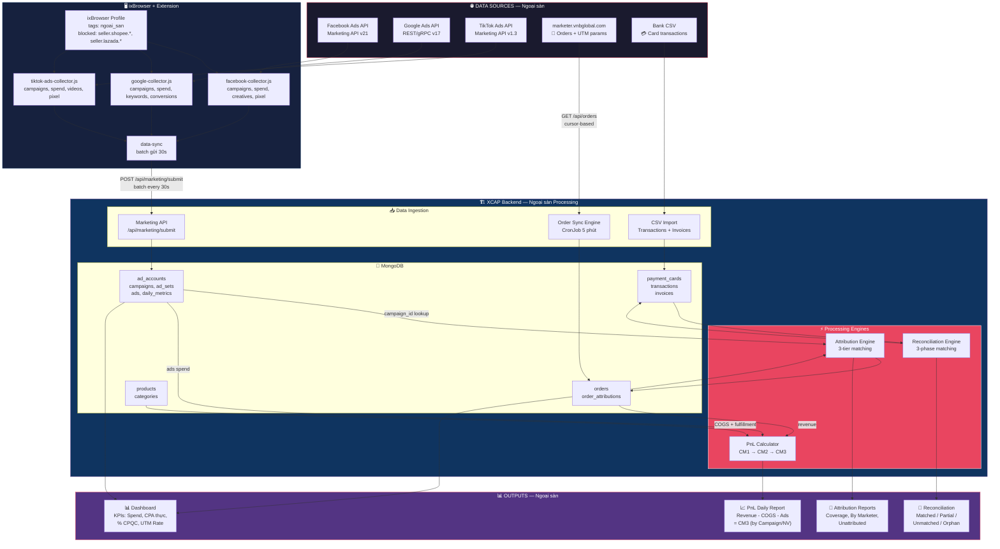
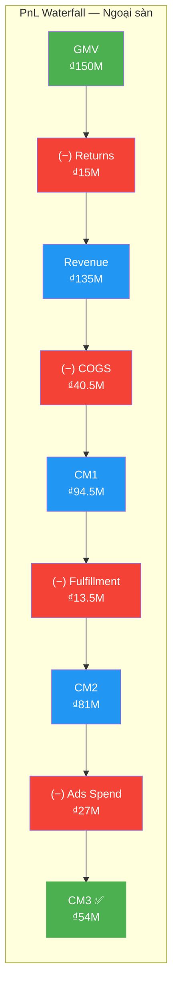
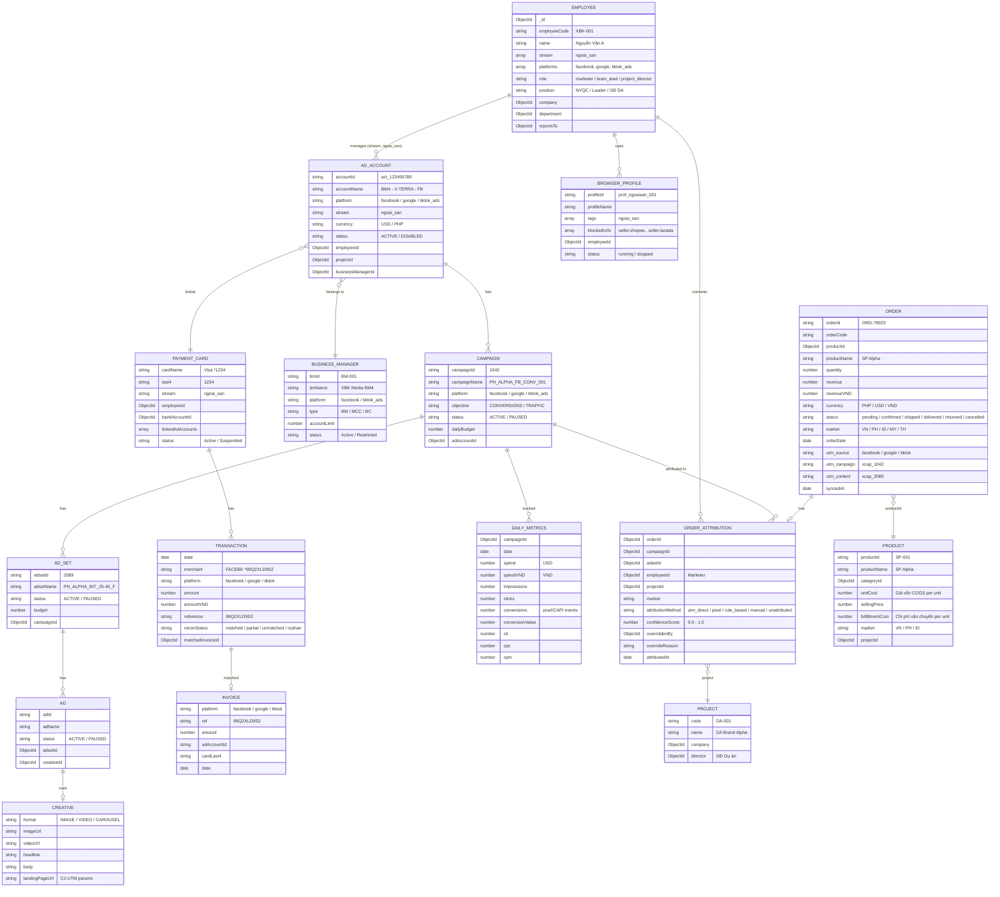
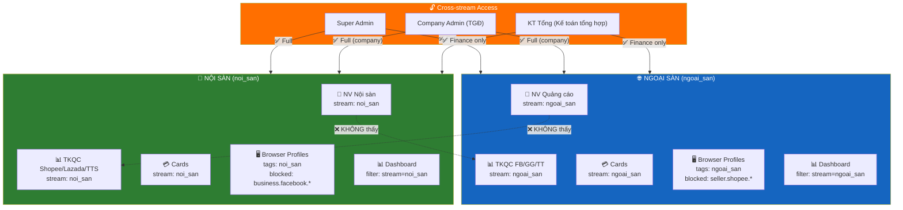

# 🌐 XCAP v3 — System Diagram: NGOẠI SÀN (Off-Platform Ads)

> **Stream:** `ngoai_san`
> **Platforms:** Facebook Ads, Google Ads, TikTok Ads
> **Tham chiếu:** [SYSTEM_DIAGRAM_V3.md](file:///Users/mac/Desktop/Antigratity/Test1/xcap-repo-temp/docs/system-diagrams/SYSTEM_DIAGRAM_V3.md)
> **Phiên bản:** 3.0 — Tích hợp Orders + Attribution + PnL Daily Report
> **Cập nhật:** 2026-06-04

---

## 1. TỔNG QUAN LUỒNG NGOẠI SÀN



### Giải thích luồng chính

| # | Giai đoạn | Mô tả | Tần suất |
|---|-----------|-------|----------|
| ① | **Ads Data Collection** | NV mở ixBrowser → Extension collectors thu thập campaigns, spend, creatives từ FB/GG/TT | Realtime (batch 30s) |
| ② | **Order Sync** | CronJob pull đơn hàng từ marketer.vnbglobal.com có UTM params | Mỗi 5 phút |
| ③ | **Attribution** | 3-tier engine map order → campaign → marketer → project | Sau mỗi sync |
| ④ | **Finance Recon** | Match bank transactions ↔ platform invoices (FB/GG/TT) | Theo batch import |
| ⑤ | **PnL Calculate** | Revenue − COGS − Fulfillment − Ads Spend = CM3 | Daily aggregate |
| ⑥ | **Dashboard** | KPIs, rankings, trends dựa trên real orders (không dựa pixel) | Realtime via WebSocket |

---

## 2. DATA FLOW CHI TIẾT

### 2.1 Ads Data Collection Flow

```
NV mở ixBrowser → Profile ngoại sàn (tags: ngoai_san)
    │
    │  Profile config:
    │    ✅ Allowed: business.facebook.com, ads.google.com, ads.tiktok.com
    │    ❌ Blocked: seller.shopee.*, seller.lazada.*, seller.tiktokshop.*
    │
    ▼
Extension kích hoạt → Detect platform → Load collector tương ứng
    │
    ├──► facebook-collector.js
    │    ├── GET /act_{id}/campaigns?fields=name,status,objective,budget
    │    ├── GET /act_{id}/insights?fields=spend,impressions,clicks,actions
    │    ├── GET /act_{id}/adcreatives?fields=title,body,image,video
    │    └── GET /act_{id}/customconversions (pixel events)
    │
    ├──► google-collector.js
    │    ├── GET customers/{id}/campaigns (campaign list)
    │    ├── GET customers/{id}/googleAds:search (metrics query)
    │    ├── GET customers/{id}/adGroupAds (ad creatives)
    │    └── GET customers/{id}/conversionActions (conversion data)
    │
    ├──► tiktok-ads-collector.js
    │    ├── GET /campaign/get/ (campaign list)
    │    ├── GET /report/integrated/get/ (spend, impressions, clicks)
    │    ├── GET /creative/get/ (ad creatives, videos)
    │    └── GET /pixel/list/ (pixel conversion events)
    │
    ▼
data-sync module
    │
    │  Batch payload (gửi mỗi 30s):
    │  {
    │    "profileId": "prof_ngoaisan_001",
    │    "platform": "facebook",
    │    "stream": "ngoai_san",
    │    "timestamp": "2026-06-04T09:30:00Z",
    │    "data": {
    │      "campaigns": [...],
    │      "metrics": [...],
    │      "creatives": [...]
    │    }
    │  }
    │
    ▼
POST /api/marketing/submit → Server xử lý
    │
    ├──► Validate JWT + check employee.stream includes "ngoai_san"
    ├──► Upsert: ad_accounts collection
    ├──► Upsert: campaigns collection
    ├──► Upsert: ad_sets collection
    ├──► Upsert: ads collection
    ├──► Insert: daily_metrics collection (Time-Series)
    ├──► WebSocket emit: "marketing:data-updated" → Dashboard
    └──► Update: employee.lastSeen, activity_sessions
```

### 2.2 Order → Attribution Flow (✨ NEW v3)

```
Marketer chạy ads trên FB/GG/TT
    │
    │  Setup: dùng UTM link từ XCAP UTM Generator
    │  https://marketer.vnbglobal.com/product/alpha
    │    ?utm_source=facebook
    │    &utm_campaign=xcap_1042       ← XCAP campaign_id = 1042
    │    &utm_content=xcap_2089        ← XCAP adset_id = 2089
    │
    ▼
Khách click quảng cáo → Landing page có UTM
    │
    ├──► marketer.vnbglobal.com capture 3 UTM params
    ├──► Khách đặt hàng → Order created với UTM metadata
    │
    ▼
XCAP Order Sync Engine (CronJob mỗi 5 phút)
    │
    │  GET marketer.vnbglobal.com/api/orders
    │    ?updated_after={last_sync_cursor}
    │    &limit=100
    │
    │  Response:
    │  {
    │    "orders": [
    │      {
    │        "order_id": "ORD-78923",
    │        "product": "SP Alpha",
    │        "quantity": 2,
    │        "revenue": 1200,
    │        "currency": "PHP",
    │        "status": "confirmed",
    │        "utm_source": "facebook",
    │        "utm_campaign": "xcap_1042",
    │        "utm_content": "xcap_2089",
    │        "order_date": "2026-06-04T08:15:00Z"
    │      }
    │    ],
    │    "cursor": "2026-06-04T09:00:00Z"
    │  }
    │
    ▼
┌──────────────────────────────────────────────────────────────────────┐
│ PROCESSING — Mỗi order mới:                                          │
│                                                                        │
│  ① Upsert vào MongoDB (collection: orders)                           │
│     - Dedup bằng orderId (unique)                                     │
│     - Convert currency → VND (currency.service.js)                   │
│                                                                        │
│  ② Attribution Engine (3 tầng — chạy tuần tự, dừng khi match):      │
│     ┌──────────────────────────────────────────────────────────┐     │
│     │                                                            │     │
│     │  ╔═══ Tầng 1: UTM Direct Match ═══════════════════════╗  │     │
│     │  ║  Input:  utm_campaign = "xcap_1042"                  ║  │     │
│     │  ║  Parse:  campaign_id = 1042                          ║  │     │
│     │  ║  Lookup: campaigns.findOne({_id: 1042})              ║  │     │
│     │  ║  Resolve: campaign → adAccount → employee → project  ║  │     │
│     │  ║  Result: confidence = 1.0 ✅                         ║  │     │
│     │  ╚══════════════════════════════════════════════════════╝  │     │
│     │                         │ not found?                        │     │
│     │                         ▼                                  │     │
│     │  ╔═══ Tầng 2: Pixel Cross-check ═════════════════════╗  │     │
│     │  ║  Input:  pixel conversions trong cùng time window   ║  │     │
│     │  ║  Match:  pixel events ↔ orders (product + time)     ║  │     │
│     │  ║  Method: proportional matching nếu nhiều campaigns  ║  │     │
│     │  ║  Result: confidence = 0.7 – 0.9 ⚠️                 ║  │     │
│     │  ╚══════════════════════════════════════════════════════╝  │     │
│     │                         │ not found?                        │     │
│     │                         ▼                                  │     │
│     │  ╔═══ Tầng 3: Rule-based Fallback ═══════════════════╗  │     │
│     │  ║  Input:  product → project mapping                   ║  │     │
│     │  ║  Logic:  find campaigns thuộc project đó              ║  │     │
│     │  ║  Split:  proportional by ads spend trong ngày        ║  │     │
│     │  ║  Result: confidence = 0.3 – 0.5 ❌                  ║  │     │
│     │  ╚══════════════════════════════════════════════════════╝  │     │
│     │                                                            │     │
│     └──────────────────────────────────────────────────────────┘     │
│                                                                        │
│  ③ Lưu order_attribution record:                                     │
│     {                                                                  │
│       orderId, campaignId, adsetId, employeeId,                       │
│       projectId, market,                                              │
│       attributionMethod: "utm_direct",                                │
│       confidenceScore: 1.0,                                          │
│       attributedAt: Date                                              │
│     }                                                                  │
│                                                                        │
│  ④ Emit socket: "orders:synced" → Dashboard realtime update          │
│                                                                        │
│  ⑤ Check alert rules:                                                │
│     • UTM rate < 80% → ⚠️ warning notification                      │
│     • CPA thực > 2× target → 🔴 critical alert                      │
│     • Sync failure → 🔴 Telegram alert                               │
│                                                                        │
└──────────────────────────────────────────────────────────────────────┘
    │
    ▼
Data chảy vào 4 outputs:
    │
    ├──► 🔧 Vận hành > Đơn hàng (Overview, Quản lý ĐH, Báo cáo Tỉ lệ Hoàn)
    ├──► 🔗 Vận hành > Attribution (Coverage, By Marketer, Unattributed)
    ├──► 📊 Marketing > Dashboard (CPA thực, % CPQC, Orders KPIs)
    └──► 📈 Tài chính > PnL Daily Report (Revenue cho waterfall CM1→CM3)
```

### 2.3 Finance Flow — Ngoại sàn

```
Bank Account (VCB / TPBank)
    │
    ├──► Payment Card *1234 (stream: ngoai_san)
    │    Linked to: Facebook Ads account act_123456
    │
    ├──► Payment Card *5678 (stream: ngoai_san)
    │    Linked to: Google Ads account 456-789-0123
    │
    └──► Payment Card *9012 (stream: ngoai_san)
         Linked to: TikTok Ads account tt_ads_789
    │
    ▼
Cards thanh toán ads → Transactions xuất hiện
    │
    │  Ví dụ transaction:
    │  {
    │    "date": "2026-06-03",
    │    "merchant": "FACEBK *99Q2XLD9S2",
    │    "platform": "facebook",
    │    "amount": 50.00,
    │    "currency": "USD",
    │    "amountVND": 1_250_000,
    │    "cardLast4": "1234",
    │    "reference": "99Q2XLD9S2"
    │  }
    │
    ▼
Admin import CSV giao dịch → POST /api/finance/transactions/import
Admin import hóa đơn FB/GG/TT → POST /api/finance/invoices/import
    │
    │  Invoice ví dụ:
    │  {
    │    "platform": "facebook",
    │    "ref": "99Q2XLD9S2",
    │    "amount": 50.00,
    │    "adAccountId": "act_123456",
    │    "cardLast4": "1234",
    │    "date": "2026-06-03"
    │  }
    │
    ▼
┌──────────────────────────────────────────────────────────────────┐
│ RECONCILIATION ENGINE — 3-Phase Matching                          │
│                                                                    │
│  ╔═══ Phase 1: Reference Match (Exact) ═══════════════════════╗  │
│  ║  transaction.reference ←→ invoice.ref                        ║  │
│  ║  "99Q2XLD9S2" === "99Q2XLD9S2" → ✅ MATCHED                ║  │
│  ║  Confidence: 100%                                            ║  │
│  ╚══════════════════════════════════════════════════════════════╝  │
│                         │ not matched?                              │
│                         ▼                                          │
│  ╔═══ Phase 2: Fuzzy Match ═══════════════════════════════════╗  │
│  ║  Criteria:                                                    ║  │
│  ║    • card.last4 match                                        ║  │
│  ║    • amount ±5% tolerance                                    ║  │
│  ║    • date ±2 ngày window                                     ║  │
│  ║  "Card *1234, $48.50, Jun 2" ≈ "Card *1234, $50, Jun 3"    ║  │
│  ║  → ⚠️ PARTIAL MATCH (cần review)                           ║  │
│  ╚══════════════════════════════════════════════════════════════╝  │
│                         │ not matched?                              │
│                         ▼                                          │
│  ╔═══ Phase 3: Orphan Detection ═════════════════════════════╗   │
│  ║  Transactions không match invoice nào → 👻 ORPHAN           ║  │
│  ║  Invoices không match transaction nào → ❌ UNMATCHED        ║  │
│  ║  → Flag cho accountant review manual                        ║  │
│  ╚══════════════════════════════════════════════════════════════╝  │
│                                                                    │
│  OUTPUT STATISTICS (typical ngoại sàn):                            │
│    ✅ Matched:    ~85%                                             │
│    ⚠️ Partial:    ~8%                                              │
│    ❌ Unmatched:  ~5%                                              │
│    👻 Orphan:     ~2%                                              │
└──────────────────────────────────────────────────────────────────┘
```

### 2.4 PnL Daily Report Flow (✨ NEW v3)

```
                      DATA INPUTS (Ngoại sàn only)
    ┌──────────────────┬──────────────────┬──────────────────┐
    │                  │                  │                  │
    ▼                  ▼                  ▼                  ▼
┌────────────┐  ┌────────────┐  ┌──────────────┐  ┌────────────┐
│ Orders     │  │ Products   │  │ Daily Metrics │  │ Orders     │
│ (revenue)  │  │ (unitCost) │  │ (ads spend)   │  │ (returned) │
│ stream:    │  │ (fulfill   │  │ stream:       │  │ status=    │
│ ngoai_san  │  │  Cost)     │  │ ngoai_san     │  │ returned   │
└─────┬──────┘  └──────┬─────┘  └───────┬───────┘  └─────┬──────┘
      │                │                │                 │
      ▼                ▼                ▼                 ▼
┌──────────────────────────────────────────────────────────────┐
│                   PnL CALCULATOR ENGINE                        │
│                                                                │
│  GMV           = SUM(orders.revenue)          = ₫ 150,000,000 │
│  (−) Returns   = SUM(orders WHERE returned)   = ₫  15,000,000 │
│  ─────────────────────────────────────────────────────────     │
│  = Revenue     = GMV − Returns                = ₫ 135,000,000 │
│                                                                │
│  (−) COGS      = SUM(product.unitCost × qty)  = ₫  40,500,000 │
│  ─────────────────────────────────────────────────────────     │
│  = CM1         = Revenue − COGS               = ₫  94,500,000 │
│                                                                │
│  (−) Fulfill   = SUM(product.fulfillCost×qty) = ₫  13,500,000 │
│  ─────────────────────────────────────────────────────────     │
│  = CM2         = CM1 − Fulfillment            = ₫  81,000,000 │
│                                                                │
│  (−) Ads Spend = SUM(daily_metrics.spend)      = ₫  27,000,000 │
│  ─────────────────────────────────────────────────────────     │
│  = CM3 ✅      = CM2 − Ads Spend              = ₫  54,000,000 │
│                                                                │
│  % CPQC        = Ads Spend / Revenue × 100    =          20.0% │
│  CPA thực      = Ads Spend / Orders           = ₫     270,000  │
│                                                                │
│  ═══════════════════════════════════════════════════════════   │
│  Groupable by:                                                  │
│    📢 Campaign  │  👤 Marketer  │  📁 Project                  │
│    🌏 Market    │  📅 Date      │  🏢 Company                  │
└──────────────────────────────────────────────────────────────┘
```



---

## 3. ENTITY MODEL — Ngoại sàn



---

## 4. SIDEBAR MAPPING — Ngoại sàn

Các mục sidebar liên quan đến stream `ngoai_san`:

```
📣 MARKETING                      ← 100% ngoại sàn
│
├── 📦 Tài sản                     ← Quản lý assets ngoại sàn
│   ├── Overview                   (Tổng quan TKQC FB/GG/TT, BM/MCC/BC)
│   ├── Profiles                   (ixBrowser profiles tags: ngoai_san)
│   ├── TKQC                       (Ad Accounts — platform: facebook/google/tiktok_ads)
│   ├── BM / MCC / BC              (Business Managers / MCCs / Business Centers)
│   └── Fanpages                   (Facebook Fanpages liên kết)
│
├── 📢 Chiến dịch                  ← Campaigns trên FB/GG/TT
│   ├── Overview                   (Tổng quan campaigns active)
│   ├── Accounts                   (TKQC → drill down campaigns)
│   ├── Campaigns                  (Tất cả campaigns ngoại sàn)
│   ├── Ad Sets                    (Nhóm quảng cáo)
│   ├── Ads                        (Quảng cáo đơn lẻ)
│   ├── Posts                      (Facebook Posts)
│   └── Performance                (So sánh hiệu quả campaigns)
│
├── 🎨 Content                     ← Creatives cho ads
│   ├── Overview                   (Tổng quan content library)
│   └── Media Library              (Images, Videos, Carousel assets)
│
└── 📊 Dashboard                   ← KPIs ngoại sàn tổng hợp
    ├── KPIs: Ads Spend, Orders (real), Revenue, CPA thực, % CPQC, UTM Rate
    ├── NV Performance Rankings    (sort by CPA, Revenue, % CPQC)
    └── Trends: Spend + Revenue timeline

─────────────────────────────────────────────────────────────────

🔧 VẬN HÀNH                       ← Đơn hàng liên quan ngoại sàn
│
├── 📦 Danh mục SP                 ← Products quảng cáo qua ngoại sàn
│   ├── Overview                   (Tổng quan sản phẩm)
│   ├── Sản phẩm                   (CRUD products — unitCost, fulfillmentCost)
│   └── Danh mục                   (Categories: Skincare, Supplement, Fashion)
│
├── 🛒 Đơn hàng                    ← Orders attributed to ngoại sàn campaigns
│   ├── Overview                   (Tổng quan đơn hàng)
│   ├── Quản lý đơn hàng           (Danh sách ĐH, filter by status/market/marketer)
│   └── Báo cáo Tỉ lệ Hoàn       (Return rate by product/market/campaign)
│
└── 🔗 Attribution                 ← UTM/Pixel matching kết quả
    ├── Overview                   (Coverage: 92% UTM, 5% Pixel, 3% Rule)
    ├── By Marketer                (Attribution breakdown per NV)
    └── Unattributed               (Đơn chưa map — cần manual assign)

─────────────────────────────────────────────────────────────────

💰 TÀI CHÍNH                      ← Finance ngoại sàn
│
├── 💳 Cards                       ← Cards stream: ngoai_san
│   (Visa/Mastercard dùng thanh toán FB/GG/TT ads)
│
├── 💵 Top-up                      ← Nạp tiền cho card ads
│   (Nạp tiền vào cards để chạy ads)
│
├── 🧾 Invoices                    ← FB/GG/TT invoices
│   (Import invoices từ Facebook, Google, TikTok billing)
│
├── 🔄 Reconciliation             ← Card txn ↔ Ad invoices
│   ├── Overview                   (Match rate: 85% ✅ / 8% ⚠️ / 5% ❌ / 2% 👻)
│   ├── Bank Transactions          (Danh sách giao dịch bank — stream: ngoai_san)
│   └── Matching                   (Manual review partial/unmatched)
│
└── 📈 PnL Daily Report           ← Revenue − COGS − Ads Spend = CM3
    (Waterfall chart: GMV → Revenue → CM1 → CM2 → CM3)
    (Group by: Campaign / Marketer / Project / Market / Date)

─────────────────────────────────────────────────────────────────

⚙️ HỆ THỐNG                       ← Quản trị liên quan ngoại sàn
│
├── 👥 Nhân sự                     ← NV stream: ngoai_san
│   ├── Employees                  (NV quảng cáo ngoại sàn)
│   └── Custom Roles               (Role NVQC, Leader, GĐ DA)
│
├── 📁 Dự án                       ← Projects có chiến dịch ngoại sàn
│
├── 🔗 UTM Tracking  ✨            ← Quản lý UTM links cho campaigns
│   ├── Tạo link                   (Generate UTM link: utm_source + utm_campaign=xcap_{id})
│   ├── Quản lý                    (Danh sách UTM links đã tạo, trạng thái, campaign ref)
│   └── Thống kê                   (UTM rate, click-through, attribution coverage)
│
├── 🔔 Notifications               ← Alert rules: CPA, UTM rate, sync
│
└── 🔄 Data Sync                   ← Sync status ngoại sàn collectors
```

---

## 5. PHÂN QUYỀN — Ngoại sàn

### 5.1 Ma trận quyền theo Role

| Role | Code | 📣 Marketing | 🔧 Vận hành | 💰 Tài chính | ⚙️ Hệ thống |
|------|------|-------------|-------------|-------------|-------------|
| **Super Admin** | `super_admin` | Full access | Full access | Full access | Full access |
| **TGĐ Company** | `company_admin` | Full (company) | Full (company) | Full (company) | Full (company) |
| **GĐ Dự án** | `project_director` | TKQC + Campaigns (DA mình) | Orders + Attribution (DA mình) | PnL (DA mình) | NV thuộc DA |
| **Leader** | `team_lead` | Team TKQC + Campaigns | Team Orders (view) | — | — |
| **NV Quảng cáo** | `marketer` | Self TKQC only | Self orders (attributed) | — | — |
| **KT Ads** | `accountant` | — | — | Recon + Cards (stream) | — |
| **Finance Manager** | `finance_manager` | View Dashboard | View Orders | Full (company) | — |

### 5.2 Asset Permission Modes

Quản lý quyền truy cập tài sản (TKQC, Cards, Profiles) theo 4 chế độ:

| Mode | Code | Mô tả | Ví dụ |
|------|------|-------|-------|
| **All** | `all` | Xem tất cả assets trong stream | Super Admin: xem mọi TKQC ngoại sàn |
| **Exclude** | `exclude` | Xem tất cả, trừ danh sách loại trừ | GĐ DA: xem tất cả trừ DA khác |
| **List** | `list` | Chỉ xem danh sách được chỉ định | Marketer: chỉ TKQC được gán |
| **Tag** | `tag` | Xem assets có tag nhất định | Leader: xem TKQC có tag "team_a" |

### 5.3 Ví dụ cụ thể

```
┌─────────────────────────────────────────────────────────────────────────────┐
│ CASE: NV Quảng cáo — Nguyễn Văn A (marketer)                                │
│                                                                               │
│ employee.stream = ["ngoai_san"]                                              │
│ employee.platforms = ["facebook", "tiktok_ads"]                              │
│                                                                               │
│ 📣 Marketing:                                                                │
│   ├── Tài sản: Chỉ thấy TKQC mình quản lý (mode: list)                    │
│   ├── Chiến dịch: Chỉ campaigns thuộc TKQC mình                            │
│   ├── Content: Creatives mình tạo                                           │
│   └── Dashboard: KPIs chính mình                                            │
│                                                                               │
│ 🔧 Vận hành:                                                                │
│   ├── Orders: Đơn attributed cho mình                                       │
│   └── Attribution: Coverage chính mình                                       │
│                                                                               │
│ 💰 Tài chính: ❌ Không truy cập                                             │
│ ⚙️ Hệ thống: ❌ Không truy cập                                              │
└─────────────────────────────────────────────────────────────────────────────┘

┌─────────────────────────────────────────────────────────────────────────────┐
│ CASE: GĐ Dự án — Trần Thị B (project_director)                              │
│                                                                               │
│ employee.stream = ["ngoai_san"]                                              │
│ employee.role = "project_director"                                           │
│ project = "DA Brand Alpha" (DA-001)                                          │
│                                                                               │
│ 📣 Marketing:                                                                │
│   ├── Tài sản: Tất cả TKQC thuộc DA-001                                    │
│   ├── Chiến dịch: Campaigns thuộc DA-001                                    │
│   ├── Content: Creatives của DA-001                                          │
│   └── Dashboard: KPIs DA-001 (tổng hợp NV trong DA)                        │
│                                                                               │
│ 🔧 Vận hành:                                                                │
│   ├── Orders: Đơn attributed cho DA-001                                     │
│   └── Attribution: Coverage DA-001                                           │
│                                                                               │
│ 💰 Tài chính:                                                               │
│   └── PnL: PnL Report của DA-001 (view only)                               │
│                                                                               │
│ ⚙️ Hệ thống:                                                                │
│   └── Nhân sự: Members thuộc DA-001                                         │
└─────────────────────────────────────────────────────────────────────────────┘
```

---

## 6. STREAM ISOLATION

### 6.1 Quy tắc cách ly Ngoại sàn ↔ Nội sàn



### 6.2 Bảng quy tắc cách ly

| Entity | Field | Giá trị ngoại sàn | Quy tắc |
|--------|-------|-------------------|---------|
| `employee` | `stream` | `["ngoai_san"]` | NV chỉ thấy data thuộc stream mình |
| `ad_account` | `stream` | `"ngoai_san"` | TKQC FB/GG/TT thuộc ngoại sàn |
| `payment_card` | `stream` | `"ngoai_san"` | Cards thanh toán ads FB/GG/TT |
| `browser_profile` | `tags` | `["ngoai_san"]` | Profile chỉ cho platforms ngoại sàn |
| `browser_profile` | `blockedUrls` | `["seller.shopee.*", "seller.lazada.*", "seller.tiktokshop.*"]` | Chặn truy cập nội sàn |
| `campaign` | (via adAccount) | Inherit từ ad_account.stream | Campaigns tự động thuộc stream |
| `order` | (via attribution) | Inherit từ campaign stream | Orders attributed cho ngoại sàn |
| `dashboard` | `filter` | `stream=ngoai_san` | Dashboard chỉ hiển thị data ngoại sàn |

### 6.3 Ngoại lệ Cross-stream

| Role | Quyền cross-stream | Lý do |
|------|---------------------|-------|
| `super_admin` | Full access cả 2 stream | Quản trị toàn hệ thống |
| `company_admin` (TGĐ) | Full access company (cả 2 stream) | Quản lý tổng công ty |
| `KT tổng` (Kế toán tổng hợp) | Finance module cả 2 stream | Đối soát tài chính tổng |

### 6.4 Middleware enforcement

```
// auth.middleware.js — requireStream
function requireStream(allowedStreams) {
    return (req, res, next) => {
        const user = req.user;

        // Cross-stream exceptions
        if (['super_admin', 'company_admin'].includes(user.role)) {
            return next();
        }

        // Check stream overlap
        const hasAccess = user.stream.some(s => allowedStreams.includes(s));
        if (!hasAccess) {
            return res.status(403).json({ error: 'Stream access denied' });
        }

        // Inject stream filter into query
        req.streamFilter = { stream: { $in: user.stream } };
        next();
    };
}
```

---

## 7. API ENDPOINTS — Ngoại sàn

### 7.1 Marketing APIs

| Method | Endpoint | Mô tả | Auth |
|--------|----------|-------|------|
| `POST` | `/api/marketing/submit` | Extension gửi data (campaigns, metrics, creatives) | JWT + stream |
| `GET` | `/api/marketing/dashboard` | Dashboard KPIs tổng hợp (spend, CPA thực, % CPQC) | JWT + stream |
| `GET` | `/api/marketing/dashboard/rankings` | NV rankings (sort by CPA, Revenue) | JWT + role ≥ team_lead |
| `GET` | `/api/ad-accounts` | Danh sách TKQC (filter: stream=ngoai_san) | JWT + stream |
| `GET` | `/api/ad-accounts/:id` | Chi tiết TKQC | JWT + ownership |
| `GET` | `/api/campaigns` | Danh sách campaigns | JWT + stream |
| `GET` | `/api/campaigns/:id/metrics` | Daily metrics cho campaign | JWT + ownership |
| `POST` | `/api/campaigns/:id/utm-link` | ✨ v3: Generate UTM link cho campaign | JWT + ownership |
| `GET` | `/api/creatives` | Creative library | JWT + stream |

### 7.2 Operations APIs (✨ NEW v3)

| Method | Endpoint | Mô tả | Auth |
|--------|----------|-------|------|
| `GET` | `/api/products` | Danh sách sản phẩm | JWT |
| `POST` | `/api/products` | Tạo sản phẩm mới (unitCost, fulfillmentCost) | JWT + role ≥ project_director |
| `PUT` | `/api/products/:id` | Cập nhật sản phẩm | JWT + role ≥ project_director |
| `GET` | `/api/product-categories` | Danh mục sản phẩm | JWT |
| `GET` | `/api/orders?stream=ngoai_san` | Đơn hàng ngoại sàn (filter stream) | JWT + stream |
| `GET` | `/api/orders/stats` | Aggregated order stats | JWT + stream |
| `GET` | `/api/orders/:id` | Chi tiết đơn + attribution | JWT + ownership |
| `POST` | `/api/orders/sync` | Manual trigger sync từ marketer.vnbglobal.com | JWT + role ≥ team_lead |
| `PUT` | `/api/orders/:id/attribute` | Manual override attribution | JWT + role ≥ team_lead |
| `GET` | `/api/attribution/overview` | Coverage stats (% UTM, Pixel, Rule) | JWT + stream |
| `GET` | `/api/attribution/by-marketer` | Attribution breakdown per NV | JWT + role ≥ team_lead |
| `GET` | `/api/attribution/unattributed` | Đơn chưa map — cần manual assign | JWT + role ≥ team_lead |

### 7.3 Finance APIs

| Method | Endpoint | Mô tả | Auth |
|--------|----------|-------|------|
| `GET` | `/api/finance/cards?stream=ngoai_san` | Cards ngoại sàn | JWT + role: accountant/admin |
| `POST` | `/api/finance/topup` | Nạp tiền card | JWT + role ≥ finance_manager |
| `POST` | `/api/finance/invoices/import` | Import invoices FB/GG/TT | JWT + role: accountant/admin |
| `POST` | `/api/finance/transactions/import` | Import bank CSV | JWT + role: accountant/admin |
| `POST` | `/api/finance/reconcile` | Trigger 3-phase matching engine | JWT + role: accountant/admin |
| `GET` | `/api/finance/reconciliation` | Kết quả reconciliation | JWT + role ≥ accountant |
| `GET` | `/api/finance/pnl?stream=ngoai_san` | ✨ v3: PnL Daily Report | JWT + role ≥ project_director |
| `GET` | `/api/finance/pnl/waterfall` | ✨ v3: Waterfall chart data | JWT + role ≥ project_director |
| `GET` | `/api/finance/pnl/by-marketer` | ✨ v3: PnL breakdown per NV | JWT + role ≥ team_lead |
| `GET` | `/api/finance/pnl/by-campaign` | ✨ v3: PnL per campaign | JWT + role ≥ team_lead |

### 7.4 System APIs

| Method | Endpoint | Mô tả | Auth |
|--------|----------|-------|------|
| `GET` | `/api/employees?stream=ngoai_san` | NV ngoại sàn | JWT + role ≥ team_lead |
| `POST` | `/api/employees/invite` | Mời NV mới (stream: ngoai_san) | JWT + role ≥ project_director |
| `GET` | `/api/system/sync-status` | Trạng thái sync (Extension + Order Sync) | JWT + role ≥ team_lead |
| `GET` | `/api/system/approvals` | Approval requests | JWT |

---

## 8. KEY METRICS — Dashboard Ngoại sàn

### 8.1 Dashboard Wireframe

```
┌──────────────────────────────────────────────────────────────────────────────────────┐
│  📊 Dashboard Ngoại sàn                   Filters: [All Markets ▼] [7 ngày ▼] [All] │
├──────────────────────────────────────────────────────────────────────────────────────┤
│                                                                                      │
│  ┌─────────────┐ ┌─────────────┐ ┌─────────────┐ ┌─────────────┐ ┌──────────────┐  │
│  │ 💰 ADS SPEND │ │ 🛒 ORDERS   │ │ 💵 REVENUE  │ │ 📊 CPA THỰC │ │ 📈 % CPQC    │  │
│  │              │ │  (Real)     │ │             │ │             │ │              │  │
│  │  ₫ 847.2M   │ │   3,142     │ │  ₫ 4.23B   │ │  ₫ 269.6K  │ │   20.0%      │  │
│  │  ↑ 12.3%    │ │   ↑ 8.7%   │ │  ↑ 15.2%   │ │  ↓ 3.1%    │ │   ↓ 2.5%    │  │
│  └─────────────┘ └─────────────┘ └─────────────┘ └─────────────┘ └──────────────┘  │
│                                                                                      │
│  ┌─────────────┐                                                                     │
│  │ 🔗 UTM RATE │                                                                     │
│  │             │                                                                     │
│  │   91.3%     │                                                                     │
│  │   ↑ 2.1%   │                                                                     │
│  └─────────────┘                                                                     │
│                                                                                      │
├──────────────────────────────────────────────────────────────────────────────────────┤
│                                                                                      │
│  📈 SPEND vs REVENUE TREND (7 ngày)                                                 │
│  ┌──────────────────────────────────────────────────────────────────────────────┐    │
│  │    ₫                                                                         │    │
│  │ 800M ┤                                                           ■──■       │    │
│  │      │                                               ■──■──■──■             │    │
│  │ 600M ┤                                    ■──■──■──■                        │    │
│  │      │                         ■──■──■──■              Revenue ■            │    │
│  │ 400M ┤              ■──■──■──■                                              │    │
│  │      │   ●──●──●──●──●──●──●──●──●──●──●──●──●──●    Spend ●              │    │
│  │ 200M ┤                                                                      │    │
│  │      │                                                                      │    │
│  │    0 ┼───┬───┬───┬───┬───┬───┬───────────────────                           │    │
│  │      29/5 30/5 31/5 1/6  2/6  3/6  4/6                                      │    │
│  └──────────────────────────────────────────────────────────────────────────────┘    │
│                                                                                      │
├──────────────────────────────────────────────────────────────────────────────────────┤
│                                                                                      │
│  👤 NV PERFORMANCE RANKING                                     [Export CSV ↓]        │
│  ┌──────────────────────────────────────────────────────────────────────────────┐    │
│  │ #  │ Nhân viên          │ Spend       │ Orders │ Revenue     │ CPA thực   │    │
│  │────│────────────────────│─────────────│────────│─────────────│────────────│    │
│  │ 1  │ 🏆 Nguyễn Văn A    │ ₫ 125.3M   │   487  │ ₫ 682.1M   │ ₫ 257.3K  │    │
│  │ 2  │ 🥈 Trần Thị B      │ ₫ 98.7M    │   412  │ ₫ 534.8M   │ ₫ 239.6K  │    │
│  │ 3  │ 🥉 Lê Văn C        │ ₫ 112.4M   │   389  │ ₫ 498.2M   │ ₫ 289.0K  │    │
│  │ 4  │    Phạm Thị D      │ ₫ 87.1M    │   298  │ ₫ 401.5M   │ ₫ 292.3K  │    │
│  │ 5  │    Hoàng Văn E     │ ₫ 76.5M    │   245  │ ₫ 312.7M   │ ₫ 312.2K  │    │
│  │────│────────────────────│─────────────│────────│─────────────│────────────│    │
│  │    │                    │             │        │             │            │    │
│  │ #  │ Nhân viên          │ % CPQC      │ UTM %  │ CM3         │ ROI       │    │
│  │────│────────────────────│─────────────│────────│─────────────│────────────│    │
│  │ 1  │ 🏆 Nguyễn Văn A    │ 18.4%       │ 95.2%  │ ₫ 198.4M   │ 1.58x     │    │
│  │ 2  │ 🥈 Trần Thị B      │ 18.5%       │ 92.7%  │ ₫ 157.2M   │ 1.59x     │    │
│  │ 3  │ 🥉 Lê Văn C        │ 22.6%       │ 88.1%  │ ₫ 105.8M   │ 0.94x     │    │
│  │ 4  │    Phạm Thị D      │ 21.7%       │ 90.3%  │ ₫ 98.7M    │ 1.13x     │    │
│  │ 5  │    Hoàng Văn E     │ 24.5%       │ 87.6%  │ ₫ 62.1M    │ 0.81x     │    │
│  └──────────────────────────────────────────────────────────────────────────────┘    │
│                                                                                      │
├──────────────────────────────────────────────────────────────────────────────────────┤
│                                                                                      │
│  📢 CAMPAIGN PERFORMANCE                        [Facebook ▼] [All Projects ▼]       │
│  ┌──────────────────────────────────────────────────────────────────────────────┐    │
│  │ Campaign               │ Platform │ Spend     │ Orders │ CPA     │ CM3     │    │
│  │────────────────────────│──────────│───────────│────────│─────────│─────────│    │
│  │ PH_ALPHA_FB_CONV_001   │ 📘 FB    │ ₫ 45.2M  │   178  │ ₫ 254K │ ₫ 67.1M│    │
│  │ PH_BETA_GG_SEARCH_001  │ 🔴 GG    │ ₫ 38.7M  │   142  │ ₫ 273K │ ₫ 48.3M│    │
│  │ VN_GAMMA_TT_VIDEO_001  │ 🎵 TT    │ ₫ 32.1M  │   125  │ ₫ 257K │ ₫ 42.8M│    │
│  │ ID_DELTA_FB_TRAF_001   │ 📘 FB    │ ₫ 28.9M  │    98  │ ₫ 295K │ ₫ 28.7M│    │
│  │ MY_EPSILON_GG_DISP_001 │ 🔴 GG    │ ₫ 22.4M  │    76  │ ₫ 295K │ ₫ 21.2M│    │
│  └──────────────────────────────────────────────────────────────────────────────┘    │
│                                                                                      │
│  🔗 ATTRIBUTION COVERAGE                                                            │
│  ┌──────────────────────────────────────────────────┐                                │
│  │  ████████████████████████████████████░░░░ 91.3%  │ UTM Direct (confidence 1.0)   │
│  │  ██████░░░░░░░░░░░░░░░░░░░░░░░░░░░░░░░░  5.2%   │ Pixel Match (conf. 0.7-0.9)  │
│  │  ███░░░░░░░░░░░░░░░░░░░░░░░░░░░░░░░░░░  2.1%   │ Rule-based (conf. 0.3-0.5)   │
│  │  █░░░░░░░░░░░░░░░░░░░░░░░░░░░░░░░░░░░░  1.4%   │ Unattributed ❌               │
│  └──────────────────────────────────────────────────┘                                │
│                                                                                      │
└──────────────────────────────────────────────────────────────────────────────────────┘
```

### 8.2 Giải thích KPIs

| KPI | Công thức | Ý nghĩa |
|-----|-----------|---------|
| **Ads Spend** | `SUM(daily_metrics.spend)` | Tổng chi phí quảng cáo FB/GG/TT |
| **Orders (Real)** | `COUNT(orders WHERE status IN confirmed,shipped,delivered)` | Đơn hàng thực (không phải pixel) |
| **Revenue** | `SUM(orders.revenue) - SUM(returned orders)` | Doanh thu thực sau trừ hoàn |
| **CPA thực** | `Ads Spend / Orders` | Chi phí thực per đơn hàng thực |
| **% CPQC** | `Ads Spend / Revenue × 100` | Tỷ lệ chi phí quảng cáo / doanh thu |
| **UTM Rate** | `Orders có UTM / Total Orders × 100` | Tỷ lệ đơn có UTM tracking |
| **CM3** | `Revenue - COGS - Fulfillment - Ads Spend` | Contribution Margin 3 (lợi nhuận sau quảng cáo) |
| **ROI** | `CM3 / Ads Spend` | Return on Investment quảng cáo |

---

## 9. TECH STACK — Ngoại sàn

### 9.1 Extension Layer

| Component | File | Chức năng |
|-----------|------|-----------|
| Facebook Collector | `facebook-collector.js` | Thu thập campaigns, spend, creatives, pixel events từ Facebook Ads Manager |
| Google Collector | `google-collector.js` | Thu thập campaigns, spend, keywords, conversion data từ Google Ads |
| TikTok Ads Collector | `tiktok-ads-collector.js` | Thu thập campaigns, spend, videos, pixel events từ TikTok Ads Manager |
| Browser Tracker | `browser-tracker.js` | Ghi nhận browsing history, activity sessions, domain tracking |
| Data Sync | `data-sync.js` | Batch gửi data về server mỗi 30s, offline buffer, retry logic |

### 9.2 Backend Layer

| Module | Thành phần | Chức năng |
|--------|-----------|-----------|
| **Marketing** | `ad-accounts/`, `campaigns/`, `creatives/`, `metrics/`, `dashboard/` | CRUD tài sản, chiến dịch, KPIs |
| **Operations** | `products/`, `orders/`, `attribution/` | Quản lý sản phẩm, đơn hàng, attribution |
| **Finance** | `cards/`, `transactions/`, `invoices/`, `reconciliation/`, `pnl/` | Cards, reconciliation, PnL report |
| **Core** | `auth/`, `employees/`, `browser-tracking/`, `notifications/` | Auth, nhân sự, tracking, alerts |

### 9.3 Processing Engines

| Engine | Schedule | Input | Output |
|--------|----------|-------|--------|
| **Order Sync Engine** | CronJob mỗi 5 phút | marketer.vnbglobal.com API | `orders` collection (upsert) |
| **Attribution Engine** | Triggered after sync | orders + campaigns + products | `order_attributions` collection |
| **Reconciliation Engine** | Manual trigger (batch) | transactions + invoices | Match results (matched/partial/unmatched/orphan) |
| **PnL Calculator** | On-demand + daily cache | orders + products + daily_metrics | `pnl_snapshots` collection |

### 9.4 External APIs

| API | URL / Service | Phương pháp | Data |
|-----|--------------|-------------|------|
| **Facebook Marketing API** | `graph.facebook.com/v21.0` | Extension overlay + API calls | Campaigns, spend, creatives, pixel |
| **Google Ads API** | `googleads.googleapis.com/v17` | Extension overlay + gRPC/REST | Campaigns, spend, keywords, conversions |
| **TikTok Marketing API** | `business-api.tiktok.com/open_api/v1.3` | Extension overlay + API calls | Campaigns, spend, videos, pixel |
| **Marketer Orders API** | `marketer.vnbglobal.com/api` | CronJob REST calls | Orders, UTM params, revenue |
| **ixBrowser Local API** | `localhost:53300` | REST (local) | Profile management, status |

### 9.5 Infrastructure

```
┌─────────────────────────────────────────────────────────────────┐
│                    TECH STACK — Ngoại sàn                        │
│                                                                   │
│  Layer            Công nghệ                  Vai trò             │
│  ─────────────    ──────────────────────     ─────────────────   │
│  Browser          ixBrowser (anti-detect)    Profile isolation    │
│  Extension        Chrome Manifest V3, JS     3 collectors + sync │
│  Backend API      Node.js + Express          REST API (modular)  │
│  Realtime         Socket.IO                  Push: orders:synced │
│  Database         MongoDB (Time-Series)      Lưu trữ chính       │
│  Cache/Queue      Redis + BullMQ            CronJobs, pub/sub   │
│  Dashboard        React + Vite + Recharts   Admin UI             │
│  Auth             JWT + bcrypt + RBAC        Multi-role, stream  │
│  Currency         currency.service.js        Multi-currency VND  │
│  Alerts           Telegram Bot API           CPA, UTM, sync      │
│  External         marketer.vnbglobal.com     Order sync source   │
│  Charts           Recharts + WaterfallChart  PnL waterfall        │
└─────────────────────────────────────────────────────────────────┘
```

### 9.6 Database Collections — Ngoại sàn

```
MongoDB Collections sử dụng cho stream ngoai_san:

CORE:
  ├── employees              (stream: ["ngoai_san"])
  ├── departments            (stream: "ngoai_san")
  ├── browser_profiles       (tags: ["ngoai_san"])
  ├── browsing_history       (Time-Series — filtered by profile.tags)
  ├── activity_sessions      (Time-Series — filtered by employee.stream)
  └── notifications          (Alert rules: CPA, UTM rate)

MARKETING:
  ├── ad_accounts            (stream: "ngoai_san", platform: facebook/google/tiktok_ads)
  ├── business_managers      (platform: facebook/tiktok_ads)
  ├── campaigns              (via adAccount → stream: ngoai_san)
  ├── ad_sets                (via campaign → stream)
  ├── ads                    (via adset → stream)
  ├── creatives              (images, videos, carousel assets)
  ├── daily_metrics          (Time-Series — spend, impressions, clicks, conversions)
  └── utm_links              (✨ v3 — generated UTM tracking links)

OPERATIONS (✨ v3):
  ├── product_categories     (Skincare, Supplement, Fashion)
  ├── products               (unitCost, fulfillmentCost, market)
  ├── orders                 (utm_source, utm_campaign, utm_content)
  ├── order_attributions     (method, confidence, campaignId, employeeId)
  └── order_sync_logs        (Sync cursor, status, errors)

FINANCE:
  ├── bank_accounts          (VCB, TPBank)
  ├── payment_cards          (stream: "ngoai_san")
  ├── payment_transactions   (merchant: FACEBK/GOOGLE/TIKTOK)
  ├── platform_invoices      (platform: facebook/google/tiktok)
  ├── hold_tracking          (FB/GG/TT hold amounts)
  └── pnl_snapshots          (✨ v3 — cached daily PnL data)
```

---

> **Ghi chú:**
> - Document này là sub-diagram của [SYSTEM_DIAGRAM_V3.md](file:///Users/mac/Desktop/Antigratity/Test1/xcap-repo-temp/docs/system-diagrams/SYSTEM_DIAGRAM_V3.md), tập trung vào stream `ngoai_san`
> - Các entity, flow, và API chung giữa 2 stream được mô tả đầy đủ trong SYSTEM_DIAGRAM_V3.md
> - Xem thêm: [account_system_diagram.md](file:///Users/mac/Desktop/Antigratity/Test1/xcap-repo-temp/docs/system-diagrams/account_system_diagram.md) · [invoice_recon_diagram.md](file:///Users/mac/Desktop/Antigratity/Test1/xcap-repo-temp/docs/system-diagrams/invoice_recon_diagram.md) · [order_attribution_design.md](file:///Users/mac/Desktop/Antigratity/Test1/xcap-repo-temp/docs/system-diagrams/order_attribution_design.md)
