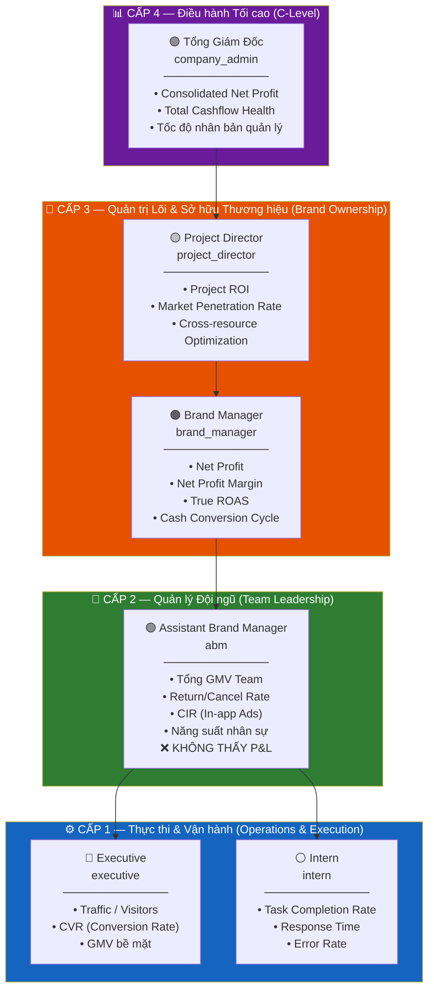
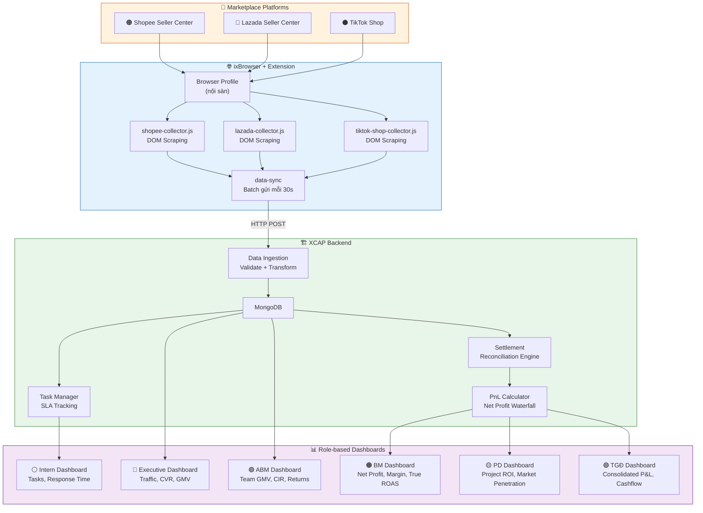
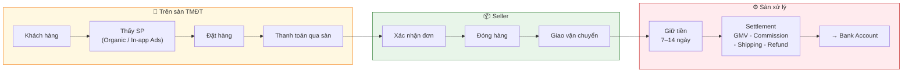
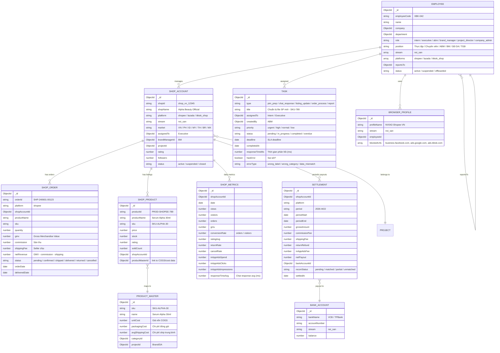

# 🏪 XCAP v3 — System Diagram: NỘI SÀN (On-Platform E-commerce)

> **Stream:** noi_san
> **Platforms:** Shopee, Lazada, TikTok Shop
> **Tham chiếu:** [SYSTEM_DIAGRAM_V3.md](file:///Users/mac/Desktop/Antigratity/Test1/xcap-repo-temp/docs/system-diagrams/SYSTEM_DIAGRAM_V3.md)
> **Version:** 3.1 — Redesign theo 4 cấp Metrics & Role Hierarchy
> **Cập nhật:** 2026-06-05

---

## 1. ROLE HIERARCHY & METRICS FRAMEWORK

### 1.1 Tổ chức 4 cấp



### 1.2 Nguyên tắc giới hạn dữ liệu

```
╔══════════════════════════════════════════════════════════════════════════════╗
║  NGUYÊN TẮC DATA ACCESS — Nội sàn                                          ║
╠══════════════════════════════════════════════════════════════════════════════╣
║                                                                              ║
║  🔴 RULE 1: ABM KHÔNG THẤY P&L                                             ║
║     ABM chỉ thấy GMV, orders, return rate, CIR                              ║
║     KHÔNG thấy: Net Profit, Net Profit Margin, COGS, True ROAS             ║
║     → Tập trung vào vận hành, không quan tâm tài chính vĩ mô              ║
║                                                                              ║
║  🔴 RULE 2: BM LÀM CHỦ TÀI CHÍNH THƯƠNG HIỆU                             ║
║     BM thấy đầy đủ P&L: Net Profit, Margin, True ROAS, Cash Cycle         ║
║     Chịu trách nhiệm trực tiếp dòng tiền brand trên mọi quốc gia         ║
║                                                                              ║
║  🔴 RULE 3: EXEC + INTERN chỉ thấy metrics vận hành                       ║
║     Traffic, CVR, GMV bề mặt, tasks, response time                          ║
║     KHÔNG thấy: GMV team, return rate chi tiết, CIR, P&L                  ║
║                                                                              ║
║  🔴 RULE 4: PD + TGĐ thấy cross-brand, cross-market                       ║
║     Consolidated view, so sánh brands, ROI dự án                            ║
║                                                                              ║
╚══════════════════════════════════════════════════════════════════════════════╝
```

### 1.3 Ma trận Metrics × Role

| Metric | Intern | Executive | ABM | BM | PD | TGĐ |
|--------|:------:|:---------:|:---:|:--:|:--:|:---:|
| Task Completion Rate | ✅ | — | 👁️ team | — | — | — |
| Response Time | ✅ | — | 👁️ team | — | — | — |
| Error Rate | ✅ | — | 👁️ team | — | — | — |
| Traffic / Visitors | — | ✅ | 👁️ team | 👁️ brand | 👁️ project | 👁️ all |
| CVR (Conversion Rate) | — | ✅ | 👁️ team | 👁️ brand | 👁️ project | 👁️ all |
| GMV (bề mặt) | — | ✅ self | ✅ team | ✅ brand | ✅ project | ✅ all |
| Return / Cancel Rate | — | — | ✅ team | ✅ brand | ✅ project | ✅ all |
| CIR (In-app Ads) | — | — | ✅ team | ✅ brand | ✅ project | ✅ all |
| Năng suất nhân sự | — | — | ✅ team | — | 👁️ project | 👁️ all |
| **Net Profit** | ❌ | ❌ | ❌ | ✅ brand | ✅ project | ✅ all |
| **Net Profit Margin** | ❌ | ❌ | ❌ | ✅ brand | ✅ project | ✅ all |
| **True ROAS** | ❌ | ❌ | ❌ | ✅ brand | ✅ project | ✅ all |
| **Cash Conversion Cycle** | ❌ | ❌ | ❌ | ✅ brand | ✅ project | ✅ all |
| Project ROI | ❌ | ❌ | ❌ | — | ✅ project | ✅ all |
| Market Penetration | ❌ | ❌ | ❌ | — | ✅ project | ✅ all |
| Cross-resource Optim. | ❌ | ❌ | ❌ | — | ✅ project | ✅ all |
| Consolidated Net Profit | ❌ | ❌ | ❌ | ❌ | ❌ | ✅ |
| Total Cashflow Health | ❌ | ❌ | ❌ | ❌ | ❌ | ✅ |
| Tốc độ nhân bản QL | ❌ | ❌ | ❌ | ❌ | ❌ | ✅ |

---

## 2. TỔNG QUAN LUỒNG NỘI SÀN



---

## 3. DATA FLOW CHI TIẾT

### 3.1 E-commerce Data Collection Flow

```
NV mở ixBrowser → Chọn Profile nội sàn → Extension kích hoạt
    │
    ├──► Auth: JWT verify (employee.stream includes "noi_san")
    ├──► Blocked URLs: business.facebook.com, ads.google.com, ads.tiktok.com
    │
    ▼
NV mở Shopee/Lazada/TikTok Shop Seller Center
    │
    ├──► Collector kích hoạt theo domain (DOM scraping):
    │       ┌─────────────────────────────────────────────────────┐
    │       │  📦 Shop info:     tên shop, rating, followers       │
    │       │  🛒 Orders:        orderId, sản phẩm, SL, GMV       │
    │       │  👀 Traffic:       views, visitors, sessions         │
    │       │  📊 Conversion:    CVR, add-to-cart rate             │
    │       │  ⭐ Ratings:       đánh giá, phản hồi               │
    │       │  📦 Products:      listing, stock, giá, sold count   │
    │       │  🚚 Shipping:      trạng thái vận chuyển             │
    │       │  📢 In-app Ads:    Shopee Ads / Lazada Sponsored     │
    │       │  💰 Settlement:    báo cáo thanh toán sàn            │
    │       │  💬 Chat:          response time metrics              │
    │       └─────────────────────────────────────────────────────┘
    │
    ├──► data-sync: batch gửi server mỗi 30s
    │
    ▼
Server nhận + phân phối metrics theo role
    │
    ├──► Intern metrics:    tasks, response_time → Task Manager
    ├──► Executive metrics: traffic, CVR, GMV → shop_metrics
    ├──► ABM metrics:       team aggregation, CIR → aggregated_metrics
    ├──► BM metrics:        P&L calculation → PnL Engine (🔒 restricted)
    └──► Alert check:       SLA breach, settlement anomaly, rating drop
```

### 3.2 Order Flow — Nội sàn



### 3.3 PnL Waterfall — Nội sàn (chỉ BM+ thấy)

```
┌──────────────────────────────────────────────────────────────────┐
│  PnL WATERFALL — NỘI SÀN                    🔒 BM / PD / TGĐ  │
│                                                                    │
│  GMV              = SUM(shop_orders.gmv)            = ₫ 245.6M  │
│  (−) Returns      = SUM(orders WHERE returned)      = ₫  12.3M  │
│  (−) Commission   = SUM(orders.commission) ~4%      = ₫   9.8M  │
│  (−) In-app Ads   = SUM(shop_metrics.inAppAdsSpend) = ₫   5.2M  │
│  ─────────────────────────────────────────────────────────────   │
│  = Gross Margin   = GMV − Returns − Commission − Ads = ₫ 218.3M │
│                                                                    │
│  (−) COGS         = SUM(product.unitCost × qty)     = ₫  65.0M  │
│  (−) Shipping     = SUM(orders.shippingFee)         = ₫  18.5M  │
│  (−) Packaging    = SUM(fulfillment costs)          = ₫   8.2M  │
│  ─────────────────────────────────────────────────────────────   │
│  = Net Profit ✅  = Gross Margin − COGS − Ship − Pack = ₫ 126.6M│
│                                                                    │
│  Net Profit Margin = Net Profit / GMV × 100          =    51.6% │
│  True ROAS        = (GMV − Commission) / InApp Ads   =    45.1x │
│  Cash Cycle       = Avg days: Purchase → Settlement   =  22 days │
│                                                                    │
│  ══════════════════════════════════════════════════════════════   │
│  Net Profit = GMV − Returns − Commission − InAppAds             │
│               − COGS − Shipping − Packaging                      │
│                                                                    │
│  Groupable by: Brand / Shop / Market / NV / Date                 │
└──────────────────────────────────────────────────────────────────┘
```

---

## 4. ENTITY MODEL — Nội sàn



### MongoDB Collections

```
NỘI SÀN COLLECTIONS:
  ├── shop_accounts
  ├── shop_orders
  ├── shop_products
  ├── product_master          ← COGS data (🔒 BM+ access only)
  ├── shop_metrics            (Time-Series)
  ├── tasks                   ← ✨ NEW: SLA tracking cho Intern/Executive
  ├── settlements
  ├── settlement_recon_logs
  └── noi_san_pnl_snapshots   (🔒 BM+ access only)

SHARED:
  ├── employees
  ├── browser_profiles
  ├── bank_accounts
  └── activity_sessions
```

---

## 5. SIDEBAR MAPPING — 4 Module × 6 Roles

> **Nguyên tắc:** Metrics 4 cấp nằm BÊN TRONG 4 module chính.
> Role quyết định **thấy gì** trong mỗi module, không phải dashboard riêng.

### 5.1 Cấu trúc Sidebar — Nội sàn

```
📣 MARKETING                        ← Tài sản & Chiến dịch nội sàn
│
├── 📦 Tài sản
│   ├── Shop Accounts                (Shopee / Lazada / TikTok Shop shops)
│   └── Browser Profiles             (Profiles nội sàn)
│
├── 📢 Chiến dịch
│   ├── In-app Ads                   (Shopee Ads / Lazada Sponsored / TT Promote)
│   └── Performance                  (CIR, in-app ads ROI)
│
├── 🎨 Content
│   ├── Product Images               (Ảnh SP cho listing)
│   └── Shop Banners                 (Banner cửa hàng)
│
└── 📊 Dashboard                     ← KPIs role-based (chi tiết bên dưới)
    ├── KPI Cards                    (Metrics thay đổi theo role)
    ├── Rankings                     (NV/Shop/Brand tùy role)
    └── Trends                       (Traffic, Orders, Revenue)

─────────────────────────────────────────────────────────────────

🔧 VẬN HÀNH                         ← Đơn hàng, SP, Tasks
│
├── 📋 Tác vụ ✨                     ← MỚI: SLA tracking Intern/Executive
│   ├── Danh sách tác vụ             (PIM prep, chat, listing update, label)
│   ├── SLA Monitor                  (Response Time, Completion Rate)
│   └── Error Log                    (Sai sót cần xử lý)
│
├── 📦 Danh mục SP
│   ├── Products                     (Listing trên marketplace)
│   ├── Categories                   (Danh mục sản phẩm)
│   └── Inventory                    (Tồn kho theo shop)
│
├── 🛒 Đơn hàng
│   ├── Overview                     (Tổng quan đơn hàng)
│   ├── Quản lý đơn hàng            (Orders từ Shopee/Lazada/TTS)
│   └── Báo cáo Tỉ lệ Hoàn         (Return/Cancel rate analysis)
│
└── 🔗 Attribution
    └── In-app Ads ROI               (Track in-app ads → revenue)

─────────────────────────────────────────────────────────────────

💰 TÀI CHÍNH                        ← 🔒 BM+ mới thấy P&L
│
├── 💳 Cards                         (Ít dùng — top-up in-app ads)
├── 💵 Top-up                        (Nạp tiền Shopee Ads, etc.)
├── 🧾 Invoices                      (Settlement reports từ sàn)
├── 🔄 Reconciliation               (Settlement ↔ Bank deposit)
│   ├── Overview                     (Match rate %)
│   ├── Bank Transactions            (Bank deposits)
│   └── Matching                     (Manual review)
│
├── 📈 PnL Daily Report  🔒 BM+     ← ABM KHÔNG THẤY mục này
│   ├── Waterfall                    (GMV → Net Profit)
│   ├── By Market                    (P&L per country)
│   ├── By Shop                      (P&L per shop)
│   ├── By Product                   (P&L per SKU/sản phẩm)
│   └── By NV                        (P&L per seller)
│
└── 🔄 Cash Cycle  🔒 BM+           ← ABM KHÔNG THẤY mục này
    ├── Cash Conversion Timeline     (Purchase → Settlement)
    └── Cashflow Position            (A/R, Inventory, Available Cash)

─────────────────────────────────────────────────────────────────

⚙️ HỆ THỐNG                         ← Quản trị nhân sự, dự án
│
├── 👥 Nhân sự
│   ├── Employees                    (NV nội sàn)
│   ├── Invites
│   └── Custom Roles                 (Intern/Executive/ABM/BM/PD)
│
├── 📁 Dự án                         (Brands/DA)
├── 🔔 Notifications                 (SLA breach, settlement, rating drop)
├── 🔄 Data Sync                     (Extension sync status per shop)
├── ✅ Approvals                     (Shop account requests)
│
└── 🚀 Nhân bản Quản lý  🔒 TGĐ    ← Chỉ TGĐ thấy
    ├── ABM Pipeline                 (Candidates → BM promotion)
    └── Criteria Tracking            (8 tiêu chí thăng cấp)
```

### 5.2 Sidebar Visibility — Ma trận Role × Module

```
                    📣 MARKETING        🔧 VẬN HÀNH          💰 TÀI CHÍNH         ⚙️ HỆ THỐNG
                    ─────────────       ──────────────       ──────────────        ──────────────
⚪ Intern           📦 Assigned shop    📋 Tasks (self)       ❌ Ẩn                ❌ Ẩn
                    📊 Dashboard:       🛒 Đơn hàng (view)
                    — chỉ thấy Traffic
                    — KHÔNG CÓ GMV

🔵 Executive       📦 Assigned shops   📋 Tasks (self)       ❌ Ẩn                ❌ Ẩn
                    📢 In-app ads        📦 SP (view)
                    📊 Dashboard:       🛒 Đơn hàng (self)
                    — Traffic, CVR
                    — GMV bề mặt

🟢 ABM             📦 Team shops       📋 Tasks (team) ✅    ❌ P&L ẨN            👥 NV (team)
                    📢 CIR team         📦 SP (edit)          💳 Cards (view)
                    📊 Dashboard:       🛒 Đơn hàng (team)   🧾 Settlement (view)
                    — Team GMV          🔄 Returns (team)
                    — Return Rate       📊 Năng suất NV
                    — CIR

🟠 BM              📦 Brand shops      📦 SP (manage)       ✅ P&L ĐẦY ĐỦ       👥 NV (brand)
                    📢 CIR brand        🛒 Đơn hàng (brand)  📈 Net Profit        📁 DA (brand)
                    📊 Dashboard:       🔄 Returns (brand)    📈 Margin
                    — GMV, CVR                                📈 True ROAS
                    — Net Profit                              🔄 Cash Cycle
                    — Margin                                  🔄 Reconciliation

🟡 PD              📦 Project shops    📦 SP (manage)       ✅ P&L + Cross-brand  👥 NV (project)
                    📊 Dashboard:       🛒 Đơn hàng (project) 📈 Project ROI       📁 DA (manage)
                    — Brand comparison                        🌍 Market Penetration
                    — Project ROI                             ⚡ Cross-resource

🟣 TGĐ             📦 All shops        📦 SP (all)          ✅ Consolidated       ✅ Full
                    📊 Dashboard:       🛒 Đơn hàng (all)    📈 All projects P&L   🚀 Nhân bản QL
                    — All metrics                             🏦 Cashflow Health
```

### 5.3 Metrics → Module Mapping

| Metric (từ bộ 4 cấp) | Nằm ở Module | Sub-page cụ thể |
|----------------------|--------------|------------------|
| Task Completion Rate | 🔧 Vận hành | 📋 Tác vụ → SLA Monitor |
| Response Time | 🔧 Vận hành | 📋 Tác vụ → SLA Monitor |
| Error Rate | 🔧 Vận hành | 📋 Tác vụ → Error Log |
| Traffic / Visitors | 📣 Marketing | 📊 Dashboard → KPI Cards |
| CVR (Conversion Rate) | 📣 Marketing | 📊 Dashboard → KPI Cards |
| GMV (bề mặt) | 📣 Marketing | 📊 Dashboard → KPI Cards |
| Tổng GMV Team | 📣 Marketing | 📊 Dashboard → Team KPIs |
| Return/Cancel Rate | 🔧 Vận hành | 🛒 Đơn hàng → Báo cáo Tỉ lệ Hoàn |
| CIR (In-app Ads) | 📣 Marketing | 📢 Chiến dịch → Performance |
| Năng suất NV | 🔧 Vận hành | 📊 (Dashboard) → Rankings |
| **Net Profit** 🔒 | 💰 Tài chính | 📈 PnL Daily Report → Waterfall |
| **Net Profit Margin** 🔒 | 💰 Tài chính | 📈 PnL Daily Report → Overview |
| **True ROAS** 🔒 | 💰 Tài chính | 📈 PnL Daily Report → Overview |
| **Cash Conversion Cycle** 🔒 | 💰 Tài chính | 🔄 Cash Cycle |
| **Project ROI** 🔒 | 💰 Tài chính | 📈 PnL Daily Report → Project view |
| **Market Penetration** 🔒 | 📣 Marketing | 📊 Dashboard → Market Growth |
| **Consolidated Net Profit** 🔒🔒 | 💰 Tài chính | 📈 PnL Daily Report → Consolidated |
| **Cashflow Health** 🔒🔒 | 💰 Tài chính | 🔄 Cash Cycle → Company |
| **Tốc độ nhân bản QL** 🔒🔒 | ⚙️ Hệ thống | 🚀 Nhân bản Quản lý |

---

## 6. DASHBOARD WIREFRAMES — Theo cấp

### 6.1 ⚪ Intern Dashboard

```
┌──────────────────────────────────────────────────────────────────┐
│  ⚪ DASHBOARD — Intern                          [Hôm nay ▼]     │
├──────────────────────────────────────────────────────────────────┤
│                                                                    │
│  ┌────────────┐ ┌────────────┐ ┌────────────┐                    │
│  │ ✅ Hoàn     │ │ ⏱️ Response │ │ ❌ Sai sót  │                    │
│  │  thành     │ │   Time     │ │   Rate     │                    │
│  │   92%      │ │  8.5 phút  │ │   1.2%     │                    │
│  │  ↑ 3% ✅   │ │  ↓ SLA ≤15'│ │  ↓ 0.5%   │                    │
│  └────────────┘ └────────────┘ └────────────┘                    │
│                                                                    │
│  📋 TASK LIST                                                     │
│  ┌──────────────────────────┬──────────┬──────────┬────────────┐ │
│  │ Task                     │ Loại     │ Deadline │ Status     │ │
│  ├──────────────────────────┼──────────┼──────────┼────────────┤ │
│  │ Chuẩn bị file SP-789    │ 📦 PIM   │ 11:00    │ ✅ Done    │ │
│  │ Trực chat Shopee VN     │ 💬 Chat  │ 17:00    │ 🔄 Active │ │
│  │ Đăng bài TikTok Shop    │ 📝 Post  │ 15:00    │ ⏳ Pending│ │
│  │ Dán nhãn đơn 45 orders  │ 📦 Label │ 14:00    │ ⏳ Pending│ │
│  └──────────────────────────┴──────────┴──────────┴────────────┘ │
│                                                                    │
│  ❌ Không thấy: GMV, Revenue, P&L, CIR                           │
└──────────────────────────────────────────────────────────────────┘
```

### 6.2 🔵 Executive Dashboard

```
┌──────────────────────────────────────────────────────────────────┐
│  🔵 DASHBOARD — Executive                  [Shop: Alpha VN ▼]   │
├──────────────────────────────────────────────────────────────────┤
│                                                                    │
│  ┌────────────┐ ┌────────────┐ ┌────────────┐                    │
│  │ 👀 Traffic  │ │ 📈 CVR     │ │ 💰 GMV     │                    │
│  │  (Visitors) │ │(Conversion)│ │ (bề mặt)   │                    │
│  │  12,450     │ │   3.42%    │ │  ₫ 42.6M  │                    │
│  │  ↑ 8.1%    │ │  ↑ 0.3%   │ │  ↑ 12.3%  │                    │
│  └────────────┘ └────────────┘ └────────────┘                    │
│                                                                    │
│  📊 TRAFFIC vs ORDERS TREND (7 ngày)                              │
│  ┌──────────────────────────────────────────────────────────┐    │
│  │ 15K ┤                              ■──■                   │    │
│  │     │                    ■──■──■──■                       │    │
│  │ 10K ┤         ■──■──■──■              Visitors ■          │    │
│  │     │  ●──●──●──●──●──●──●──●──●      Orders ●           │    │
│  │  5K ┤                                                     │    │
│  │   0 ┼───┬───┬───┬───┬───┬───┬──                          │    │
│  │     29/5 30/5 31/5 1/6  2/6  3/6                          │    │
│  └──────────────────────────────────────────────────────────┘    │
│                                                                    │
│  CVR = Total_Orders / Total_Visitors                               │
│  GMV = Doanh số tạo ra (không trừ phí sàn hay giá vốn)          │
│                                                                    │
│  ❌ Không thấy: Team GMV, Return Rate, CIR, P&L                  │
└──────────────────────────────────────────────────────────────────┘
```

### 6.3 🟢 ABM Dashboard (❌ KHÔNG CÓ P&L)

```
┌──────────────────────────────────────────────────────────────────┐
│  🟢 DASHBOARD — ABM (Asst. Brand Manager)   [Tháng 06/2026 ▼]  │
├──────────────────────────────────────────────────────────────────┤
│                                                                    │
│  ┌────────────┐ ┌────────────┐ ┌────────────┐ ┌────────────┐    │
│  │ 💰 GMV Team│ │ 🔄 Return  │ │ 📢 CIR     │ │ 👥 Năng suất│    │
│  │            │ │    Rate    │ │(In-app Ads)│ │  NV/đơn    │    │
│  │  ₫ 245.6M │ │   2.8%     │ │   2.1%     │ │  12.3 đơn  │    │
│  │  vs Target │ │  ↓ 0.5% ✅│ │  ≤ 3% ✅   │ │  /NV/ngày  │    │
│  │  92% 🟡    │ │            │ │            │ │  ↑ 1.2     │    │
│  └────────────┘ └────────────┘ └────────────┘ └────────────┘    │
│                                                                    │
│  📊 GMV TEAM vs TARGET                                            │
│  ┌──────────────────────────────────────────────────────────┐    │
│  │  Target tháng: ₫ 267M                                     │    │
│  │  ████████████████████████████████████░░░░░  92% (₫245.6M) │    │
│  │  Còn lại: ₫ 21.4M — 26 ngày                              │    │
│  └──────────────────────────────────────────────────────────┘    │
│                                                                    │
│  CIR = InApp_Ads_Spend / GMV × 100                                │
│  ┌──────────────────────────────────────────────────────────┐    │
│  │  Shopee Ads:  ₫ 3.2M / ₫ 156M = 2.05%  ✅ (trần 3%)    │    │
│  │  Lazada Ads:  ₫ 1.1M / ₫  52M = 2.12%  ✅              │    │
│  │  TT Promote:  ₫ 0.9M / ₫  38M = 2.37%  ✅              │    │
│  └──────────────────────────────────────────────────────────┘    │
│                                                                    │
│  👥 NĂNG SUẤT NHÂN SỰ (đơn/NV/ngày)                              │
│  ┌──────────────────────────────────────────────────────────┐    │
│  │ NV              │ Shop         │ Đơn/ngày │ CVR   │ GMV  │    │
│  ├─────────────────┼──────────────┼──────────┼───────┼──────┤    │
│  │ 🏆 Exec Minh    │ Alpha VN     │   18.2   │ 4.1%  │ 42M │    │
│  │ 🥈 Exec Hà      │ Alpha ID     │   15.7   │ 3.8%  │ 35M │    │
│  │ 🥉 Exec Phương  │ Alpha PH     │   12.3   │ 3.2%  │ 28M │    │
│  │    Intern Lan   │ Alpha VN     │    8.5   │  —    │  —  │    │
│  └──────────────────────────────────────────────────────────┘    │
│                                                                    │
│  🔴 RETURN/CANCEL BREAKDOWN                                       │
│  ┌──────────────────────────────────────────────────────────┐    │
│  │  Hoàn hàng:    1.8%  ████░░░░░░  → Chất lượng SP       │    │
│  │  Hủy đơn:      0.7%  ██░░░░░░░░  → Khách boom          │    │
│  │  Đơn ảo:       0.3%  █░░░░░░░░░  → Bot/fake order      │    │
│  │  ──────────────────                                       │    │
│  │  Tổng:         2.8%  ✅ (trần 5%)                        │    │
│  └──────────────────────────────────────────────────────────┘    │
│                                                                    │
│  ╔════════════════════════════════════════════════════════════╗   │
│  ║  ❌ P&L SECTION — KHÔNG HIỂN THỊ                          ║   │
│  ║  ABM không thấy: Net Profit, Margin, COGS, True ROAS     ║   │
│  ║  → Liên hệ BM để xem báo cáo tài chính brand            ║   │
│  ╚════════════════════════════════════════════════════════════╝   │
└──────────────────────────────────────────────────────────────────┘
```

### 6.4 🟠 BM Dashboard (✅ ĐẦY ĐỦ P&L)

```
┌──────────────────────────────────────────────────────────────────┐
│  🟠 DASHBOARD — BM (Brand Manager)    [Brand: Alpha ▼] [Q2 ▼]  │
├──────────────────────────────────────────────────────────────────┤
│                                                                    │
│  ┌────────────┐ ┌────────────┐ ┌────────────┐ ┌────────────┐    │
│  │ 💎 Net     │ │ 📊 Net     │ │ 📈 True    │ │ 🔄 Cash    │    │
│  │  Profit    │ │  Margin    │ │  ROAS      │ │  Cycle     │    │
│  │            │ │            │ │            │ │            │    │
│  │ ₫ 126.6M  │ │  51.6%     │ │  45.1x     │ │  22 ngày   │    │
│  │ ↑ 8.2%    │ │  ↑ 2.1%   │ │  ↑ 3.4x   │ │  ↓ 3 ngày  │    │
│  └────────────┘ └────────────┘ └────────────┘ └────────────┘    │
│                                                                    │
│  📉 PnL WATERFALL — Brand Alpha (tháng 06)                       │
│  ┌──────────────────────────────────────────────────────────┐    │
│  │  GMV          ████████████████████████████  ₫ 245.6M     │    │
│  │  (−) Returns  █                             ₫ −12.3M     │    │
│  │  (−) Commiss. █                             ₫  −9.8M     │    │
│  │  (−) In-app   █                             ₫  −5.2M     │    │
│  │  (−) COGS     ██████                        ₫ −65.0M     │    │
│  │  (−) Shipping ██                            ₫ −18.5M     │    │
│  │  (−) Packing  █                             ₫  −8.2M     │    │
│  │  ─────────────────────────────────────────────────────   │    │
│  │  Net Profit ✅████████████████               ₫ 126.6M     │    │
│  └──────────────────────────────────────────────────────────┘    │
│                                                                    │
│  🌍 NET PROFIT BY MARKET                                          │
│  ┌────────────┬────────┬──────────┬──────────┬─────────────┐    │
│  │ Market     │ GMV    │ Net Profit│ Margin   │ True ROAS   │    │
│  ├────────────┼────────┼──────────┼──────────┼─────────────┤    │
│  │ 🇻🇳 VN      │ 98.2M  │  52.1M   │  53.1%   │  48.2x      │    │
│  │ 🇮🇩 ID      │ 52.1M  │  25.8M   │  49.5%   │  42.1x      │    │
│  │ 🇵🇭 PH      │ 45.8M  │  24.3M   │  53.1%   │  46.8x      │    │
│  │ 🇹🇭 TH      │ 34.2M  │  17.1M   │  50.0%   │  38.9x      │    │
│  │ 🇲🇾 MY      │ 15.3M  │   7.3M   │  47.7%   │  35.2x      │    │
│  └────────────┴────────┴──────────┴──────────┴─────────────┘    │
│                                                                    │
│  🔄 CASH CONVERSION CYCLE                                         │
│  ┌──────────────────────────────────────────────────────────┐    │
│  │  Nhập hàng ──── 5d ────→ Xuất kho ──── 3d ────→ Giao    │    │
│  │  Giao hàng ──── 4d ────→ Delivered ──── 10d ───→ Settle  │    │
│  │  ─────────────────────────────────────────────────────   │    │
│  │  Total Cycle: 22 ngày (Target: ≤ 25 ngày) ✅             │    │
│  │                                                           │    │
│  │  Vốn đọng trên sàn: ₫ 67.2M (pending settlement)       │    │
│  │  Hàng tồn kho:      ₫ 45.8M                             │    │
│  │  Tiền mặt khả dụng: ₫ 128.5M                            │    │
│  └──────────────────────────────────────────────────────────┘    │
└──────────────────────────────────────────────────────────────────┘
```

### 6.5 🟡 Project Director Dashboard

```
┌──────────────────────────────────────────────────────────────────┐
│  🟡 DASHBOARD — Project Director            [DA Alpha Group ▼]  │
├──────────────────────────────────────────────────────────────────┤
│                                                                    │
│  ┌────────────┐ ┌────────────┐ ┌────────────┐                    │
│  │ 📈 Project │ │ 🌍 Market  │ │ ⚡ Cross-  │                    │
│  │   ROI      │ │ Penetration│ │  Resource  │                    │
│  │            │ │            │ │  Optim.    │                    │
│  │  3.42x     │ │ ID: +127%  │ │  ↑ 15.3%  │                    │
│  │  ↑ 0.28x   │ │ BR: +45%   │ │  vs Q1    │                    │
│  └────────────┘ └────────────┘ └────────────┘                    │
│                                                                    │
│  📊 BRAND COMPARISON (DA Alpha Group — 3 brands)                  │
│  ┌──────────────┬────────┬──────────┬──────────┬──────────┐      │
│  │ Brand        │ GMV    │Net Profit│ Margin   │ Status   │      │
│  ├──────────────┼────────┼──────────┼──────────┼──────────┤      │
│  │ Alpha Beauty │ 245.6M │ 126.6M   │  51.6%   │ 🟢 Good │      │
│  │ Beta Lifestyle│ 87.3M │  38.2M   │  43.8%   │ 🟡 Watch│      │
│  │ Gamma Health │ 42.1M  │  12.7M   │  30.2%   │ 🔴 Risk │      │
│  ├──────────────┼────────┼──────────┼──────────┼──────────┤      │
│  │ TOTAL PROJECT│ 375.0M │ 177.5M   │  47.3%   │          │      │
│  └──────────────┴────────┴──────────┴──────────┴──────────┘      │
│                                                                    │
│  🌍 THỊ TRƯỜNG MỚI — Penetration Rate                            │
│  ┌──────────────────────────────────────────────────────────┐    │
│  │  🇮🇩 Indonesia:  Tháng 1: 120 đơn → Tháng 6: 412 đơn    │    │
│  │                  Growth: +243%  ████████████████████ ✅   │    │
│  │  🇧🇷 Brazil:     Tháng 3: 0 đơn  → Tháng 6: 45 đơn     │    │
│  │                  Growth: New     ████░░░░░░░░░░░░░░ 🟡   │    │
│  │  🇲🇽 Mexico:     Tháng 5: 0 đơn  → Tháng 6: 12 đơn     │    │
│  │                  Growth: New     █░░░░░░░░░░░░░░░░░ ⏳   │    │
│  └──────────────────────────────────────────────────────────┘    │
│                                                                    │
│  ⚡ CROSS-RESOURCE OPTIMIZATION                                   │
│  ┌──────────────────────────────────────────────────────────┐    │
│  │  Budget realloc: Alpha → Gamma (₫ 15M ads budget)       │    │
│  │  Inventory swap: Beta excess → Gamma ID launch           │    │
│  │  Staff flex:     2 Execs Alpha → Gamma (temp 2 weeks)   │    │
│  │  Net impact:     +₫ 8.3M projected Net Profit           │    │
│  └──────────────────────────────────────────────────────────┘    │
└──────────────────────────────────────────────────────────────────┘
```

### 6.6 🟣 TGĐ Dashboard

```
┌──────────────────────────────────────────────────────────────────┐
│  🟣 DASHBOARD — TGĐ (Company Admin)       [Toàn công ty] [Q2]  │
├──────────────────────────────────────────────────────────────────┤
│                                                                    │
│  ┌──────────────┐ ┌──────────────┐ ┌──────────────┐              │
│  │ 💎 Consolidated│ │ 🏦 Cashflow  │ │ 🚀 Nhân bản  │              │
│  │  Net Profit   │ │   Health     │ │  quản lý     │              │
│  │               │ │              │ │              │              │
│  │  ₫ 1.24 tỷ   │ │  Score: 78   │ │  ABM→BM: 2   │              │
│  │  ↑ 18.2%     │ │  🟢 Healthy  │ │  /6 tháng    │              │
│  └──────────────┘ └──────────────┘ └──────────────┘              │
│                                                                    │
│  📊 CONSOLIDATED P&L — Tất cả dự án                               │
│  ┌──────────────┬─────────┬──────────┬──────────┬──────────┐     │
│  │ Dự án        │ GMV     │Net Profit│ Margin   │ ROI      │     │
│  ├──────────────┼─────────┼──────────┼──────────┼──────────┤     │
│  │ DA Alpha     │ 375.0M  │ 177.5M   │  47.3%   │  3.42x   │     │
│  │ DA Beta      │ 298.7M  │ 142.1M   │  47.6%   │  3.18x   │     │
│  │ DA Gamma     │ 187.2M  │  78.4M   │  41.9%   │  2.87x   │     │
│  │ DA Delta     │ 145.6M  │  52.3M   │  35.9%   │  2.45x   │     │
│  ├──────────────┼─────────┼──────────┼──────────┼──────────┤     │
│  │ TỔNG         │ 1.006 tỷ│  450.3M  │  44.8%   │  3.01x   │     │
│  └──────────────┴─────────┴──────────┴──────────┴──────────┘     │
│                                                                    │
│  🏦 CASHFLOW HEALTH                                               │
│  ┌──────────────────────────────────────────────────────────┐    │
│  │  Tiền mặt khả dụng:          ₫ 845.2M    ████████████   │    │
│  │  Vốn đọng trên sàn (A/R):   ₫ 312.7M    ████████       │    │
│  │  Hàng tồn kho:               ₫ 287.5M    ███████        │    │
│  │  Đang nhập hàng (in-transit): ₫ 125.8M   ███            │    │
│  │  ─────────────────────────────────────────────────────   │    │
│  │  Working Capital Ratio:       1.32x  ✅ (target ≥ 1.2x) │    │
│  └──────────────────────────────────────────────────────────┘    │
│                                                                    │
│  🚀 TỐC ĐỘ NHÂN BẢN QUẢN LÝ                                     │
│  ┌──────────────────────────────────────────────────────────┐    │
│  │  ABM đủ tiêu chuẩn lên BM:  4/12 (33%)                  │    │
│  │  BM thăng cấp thành công:   2/4  (50%)                  │    │
│  │  Tốc độ: 2 BM mới / 6 tháng                             │    │
│  │                                                           │    │
│  │  Pipeline:                                                │    │
│  │    🟢 ABM Minh (Alpha):  Ready → promote Q3              │    │
│  │    🟡 ABM Hà (Beta):     6/8 criteria met                │    │
│  │    🔴 ABM Phương (Gamma): 3/8 criteria — needs coaching  │    │
│  └──────────────────────────────────────────────────────────┘    │
└──────────────────────────────────────────────────────────────────┘
```

---

## 7. METRIC DEFINITIONS — Công thức

### Cấp 1: Thực thi & Vận hành

| Metric | Công thức | Role | SLA |
|--------|-----------|------|-----|
| **Task Completion Rate** | `Tasks completed on-time / Total tasks × 100` | Intern | ≥ 90% |
| **Response Time** | `AVG(first_response_time) per chat session` | Intern | ≤ 15 phút |
| **Error Rate** | `Tasks with errors / Total tasks × 100` | Intern | ≤ 3% |
| **Traffic (Visitors)** | `SUM(shop_metrics.visitors)` | Executive | — |
| **CVR** | `Total_Orders / Total_Visitors × 100` | Executive | ≥ 3% |
| **GMV (bề mặt)** | `SUM(shop_orders.gmv) WHERE shops assigned to exec` | Executive | — |

### Cấp 2: Quản lý Đội ngũ

| Metric | Công thức | Role | Trần |
|--------|-----------|------|------|
| **Tổng GMV Team** | `SUM(shop_orders.gmv) WHERE team_members` | ABM | vs Target |
| **Return/Cancel Rate** | `(Returned + Cancelled) / Total_Orders × 100` | ABM | ≤ 5% |
| **CIR (Cost to Income)** | `InApp_Ads_Spend / GMV × 100` | ABM | ≤ 3% |
| **Năng suất NV** | `Delivered_Orders / COUNT(active_team_members) / days` | ABM | — |

### Cấp 3: Quản trị Lõi (🔒 BM+)

| Metric | Công thức | Role |
|--------|-----------|------|
| **Net Profit** | `GMV − Returns − Commission − InAppAds − COGS − Shipping − Packaging` | BM |
| **Net Profit Margin** | `Net Profit / GMV × 100` | BM |
| **True ROAS** | `(GMV − Commission) / InApp_Ads_Spend` | BM |
| **Cash Conversion Cycle** | `Avg days: Purchase Order → Settlement received` | BM |
| **Project ROI** | `Total Net Profit (all brands) / Total Investment` | PD |
| **Market Penetration** | `New market orders growth MoM %` | PD |
| **Cross-resource Optim.** | `Net Profit delta after resource reallocation` | PD |

### Cấp 4: C-Level (🔒 TGĐ only)

| Metric | Công thức | Role |
|--------|-----------|------|
| **Consolidated Net Profit** | `SUM(Net Profit) across all projects + markets` | TGĐ |
| **Total Cashflow Health** | `Available Cash / (A/R + Inventory + In-transit)` | TGĐ |
| **Tốc độ nhân bản QL** | `ABMs promoted to BM / Total ABMs eligible` | TGĐ |

---

## 8. PHÂN QUYỀN — Data Access Matrix

### 7.1 Sidebar Visibility per Role

| Sidebar Item | Intern | Executive | ABM | BM | PD | TGĐ |
|-------------|:------:|:---------:|:---:|:--:|:--:|:---:|
| 📋 Tasks (Tác vụ) | ✅ self | — | 👁️ team | — | — | — |
| 📦 Shop Accounts | — | ✅ assigned | 👁️ team | ✅ brand | ✅ project | ✅ all |
| 📊 Traffic/CVR | — | ✅ self shops | 👁️ team | 👁️ brand | 👁️ project | 👁️ all |
| 🛒 Đơn hàng | — | ✅ self shops | ✅ team | ✅ brand | ✅ project | ✅ all |
| 📦 Danh mục SP | — | 👁️ view | ✅ edit | ✅ manage | ✅ manage | ✅ all |
| 🔄 Return/Cancel | — | — | ✅ team | ✅ brand | ✅ project | ✅ all |
| 📢 CIR (In-app Ads) | — | — | ✅ team | ✅ brand | ✅ project | ✅ all |
| 💰 **P&L / Net Profit** | ❌ | ❌ | ❌ | ✅ brand | ✅ project | ✅ all |
| 💰 **COGS / Costs** | ❌ | ❌ | ❌ | ✅ brand | ✅ project | ✅ all |
| 📈 **True ROAS** | ❌ | ❌ | ❌ | ✅ brand | ✅ project | ✅ all |
| 🔄 **Cash Cycle** | ❌ | ❌ | ❌ | ✅ brand | ✅ project | ✅ all |
| 🌍 Market Penetration | ❌ | ❌ | ❌ | — | ✅ project | ✅ all |
| 🏦 Cashflow Health | ❌ | ❌ | ❌ | ❌ | ❌ | ✅ |
| 🚀 Nhân bản QL | ❌ | ❌ | ❌ | ❌ | ❌ | ✅ |
| 💳 Settlement Recon | ❌ | ❌ | ❌ | ✅ brand | ✅ project | ✅ all |
| ⚙️ Nhân sự / Dự án | ❌ | ❌ | 👁️ team | 👁️ brand | ✅ project | ✅ all |

### 7.2 API Scope Middleware

```javascript
// server/shared/role-scope.middleware.js

const METRIC_ACCESS = {
  // P&L metrics — restricted to BM+
  'net_profit':         ['brand_manager', 'project_director', 'company_admin'],
  'net_profit_margin':  ['brand_manager', 'project_director', 'company_admin'],
  'true_roas':          ['brand_manager', 'project_director', 'company_admin'],
  'cash_cycle':         ['brand_manager', 'project_director', 'company_admin'],
  'cogs':               ['brand_manager', 'project_director', 'company_admin'],

  // Team metrics — ABM+
  'team_gmv':           ['abm', 'brand_manager', 'project_director', 'company_admin'],
  'return_rate':        ['abm', 'brand_manager', 'project_director', 'company_admin'],
  'cir':                ['abm', 'brand_manager', 'project_director', 'company_admin'],
  'staff_productivity': ['abm', 'brand_manager', 'project_director', 'company_admin'],

  // Operational metrics — Executive+
  'traffic':            ['executive', 'abm', 'brand_manager', 'project_director', 'company_admin'],
  'cvr':                ['executive', 'abm', 'brand_manager', 'project_director', 'company_admin'],
  'gmv_surface':        ['executive', 'abm', 'brand_manager', 'project_director', 'company_admin'],

  // Task metrics — Intern+ABM
  'task_completion':    ['intern', 'abm'],
  'response_time':      ['intern', 'abm'],
  'error_rate':         ['intern', 'abm'],

  // C-Level only
  'consolidated_pnl':   ['company_admin'],
  'cashflow_health':    ['company_admin'],
  'mgmt_replication':   ['company_admin'],
};

function metricGuard(metricKey) {
  return (req, res, next) => {
    const allowedRoles = METRIC_ACCESS[metricKey];
    if (!allowedRoles || !allowedRoles.includes(req.user.role)) {
      return res.status(403).json({
        error: 'METRIC_ACCESS_DENIED',
        message: `Role "${req.user.role}" không có quyền xem metric "${metricKey}"`,
      });
    }
    next();
  };
}
```

---

## 9. API ENDPOINTS — Nội sàn (Role-gated)

### 8.1 Task Management (Intern + ABM)

| Method | Endpoint | Mô tả | Min Role |
|--------|----------|-------|----------|
| `GET` | `/api/tasks` | Danh sách tasks (scoped) | intern |
| `POST` | `/api/tasks` | Tạo task mới | abm |
| `PUT` | `/api/tasks/:id/complete` | Hoàn thành task | intern |
| `GET` | `/api/tasks/stats` | Task Completion Rate, Error Rate | intern |
| `GET` | `/api/tasks/response-time` | Avg response time | intern |

### 8.2 Shop Operations (Executive+)

| Method | Endpoint | Mô tả | Min Role |
|--------|----------|-------|----------|
| `GET` | `/api/shops` | Danh sách shop (scoped) | executive |
| `GET` | `/api/shops/:id/traffic` | Visitors, views | executive |
| `GET` | `/api/shops/:id/cvr` | Conversion rate | executive |
| `GET` | `/api/shop-orders` | Đơn hàng (scoped by shop assignment) | executive |
| `GET` | `/api/shop-orders/stats` | GMV bề mặt | executive |

### 8.3 Team Management (ABM+)

| Method | Endpoint | Mô tả | Min Role |
|--------|----------|-------|----------|
| `GET` | `/api/team/gmv` | Tổng GMV team | abm |
| `GET` | `/api/team/returns` | Return/Cancel Rate | abm |
| `GET` | `/api/team/cir` | CIR (InApp Ads / GMV) | abm |
| `GET` | `/api/team/productivity` | Đơn/NV/ngày | abm |
| `GET` | `/api/team/members` | Team member performance | abm |

### 8.4 Brand Finance (🔒 BM+)

| Method | Endpoint | Mô tả | Min Role |
|--------|----------|-------|----------|
| `GET` | `/api/brand/pnl` | Net Profit waterfall | brand_manager |
| `GET` | `/api/brand/pnl/by-market` | P&L per market | brand_manager |
| `GET` | `/api/brand/pnl/by-shop` | P&L per shop | brand_manager |
| `GET` | `/api/brand/margin` | Net Profit Margin | brand_manager |
| `GET` | `/api/brand/true-roas` | True ROAS | brand_manager |
| `GET` | `/api/brand/cash-cycle` | Cash Conversion Cycle | brand_manager |
| `GET` | `/api/settlements` | Settlement history | brand_manager |
| `POST` | `/api/settlements/:id/reconcile` | Match with bank | brand_manager |

### 8.5 Project Analytics (🔒 PD+)

| Method | Endpoint | Mô tả | Min Role |
|--------|----------|-------|----------|
| `GET` | `/api/project/roi` | Project ROI across brands | project_director |
| `GET` | `/api/project/brands` | Brand comparison | project_director |
| `GET` | `/api/project/market-penetration` | New market growth | project_director |
| `GET` | `/api/project/cross-optimization` | Resource allocation impact | project_director |

### 8.6 C-Level (🔒 TGĐ only)

| Method | Endpoint | Mô tả | Min Role |
|--------|----------|-------|----------|
| `GET` | `/api/executive/consolidated-pnl` | All projects P&L | company_admin |
| `GET` | `/api/executive/cashflow-health` | A/R, Inventory, Cash | company_admin |
| `GET` | `/api/executive/mgmt-pipeline` | ABM→BM promotion stats | company_admin |

---

## 10. KHÁC BIỆT NGOẠI SÀN vs NỘI SÀN

| Tiêu chí | 🌐 Ngoại sàn | 🏪 Nội sàn |
|----------|---------------|-------------|
| **Platforms** | FB Ads / Google Ads / TikTok Ads | Shopee / Lazada / TikTok Shop |
| **Data collection** | API + Extension | Extension (DOM scraping) |
| **Tài sản** | TKQC (Ad Account) | Shop Account |
| **Order source** | marketer.vnbglobal.com | Trong sàn |
| **Attribution** | UTM / Pixel / Rule-based | Sàn tự track |
| **Revenue** | Khách trả Marketer trực tiếp | Settlement từ sàn (sau trừ fees) |
| **Thanh toán** | Card → Ad Platform → Invoice | Sàn deduct commission → Settlement |
| **Reconciliation** | Card txn ↔ Ad invoice | Settlement ↔ Bank deposit |
| **PnL** | Revenue − COGS − Fulfill − Ads Spend | GMV − Returns − Commission − InApp − COGS − Ship |
| **Role hierarchy** | Marketer → Leader → GĐ DA | Intern → Executive → ABM → BM → PD → TGĐ |
| **P&L visibility** | Marketer thấy CPA, % CPQC | ABM **KHÔNG** thấy P&L, chỉ BM+ thấy |
| **In-app Ads** | — | Shopee Ads, Lazada Sponsored, TT Promote |
| **Commission** | — | 3–5% sàn thu |
| **Cash Cycle** | Immediate (khách trả) | 7–14 ngày (settlement hold) |
| **Task system** | — | SLA tracking cho Intern/Executive |

---

## 11. TECH STACK — Nội sàn

```
Layer            Công nghệ                    Vai trò
─────────────    ──────────────────────────    ──────────────────────────────
Extension        shopee-collector.js           DOM scraping Shopee Seller
                 lazada-collector.js           DOM scraping Lazada Seller
                 tiktok-shop-collector.js      DOM scraping TikTok Shop
Backend          Node.js + Express             REST API (role-gated)
                 BullMQ                        Task queue, SLA monitoring
                 CronJob                       Settlement check, alert rules
Database         MongoDB (Time-Series)         shop_metrics, tasks
Dashboard        React + Vite + Recharts       Role-based dashboards (6 views)
Auth             JWT + RBAC + metricGuard      Metric-level access control
Alerts           Telegram Bot API              SLA breach, settlement anomaly
```

### MongoDB Collections

```
NỘI SÀN:
  ├── shop_accounts
  ├── shop_orders
  ├── shop_products
  ├── product_master         (🔒 BM+: COGS data)
  ├── shop_metrics           (Time-Series)
  ├── tasks                  (Intern/Executive SLA tracking)
  ├── settlements
  ├── settlement_recon_logs
  ├── noi_san_pnl_snapshots  (🔒 BM+: cached daily)
  ├── cashflow_snapshots     (🔒 TGĐ only)
  └── mgmt_pipeline          (🔒 TGĐ only: ABM→BM tracking)
```
