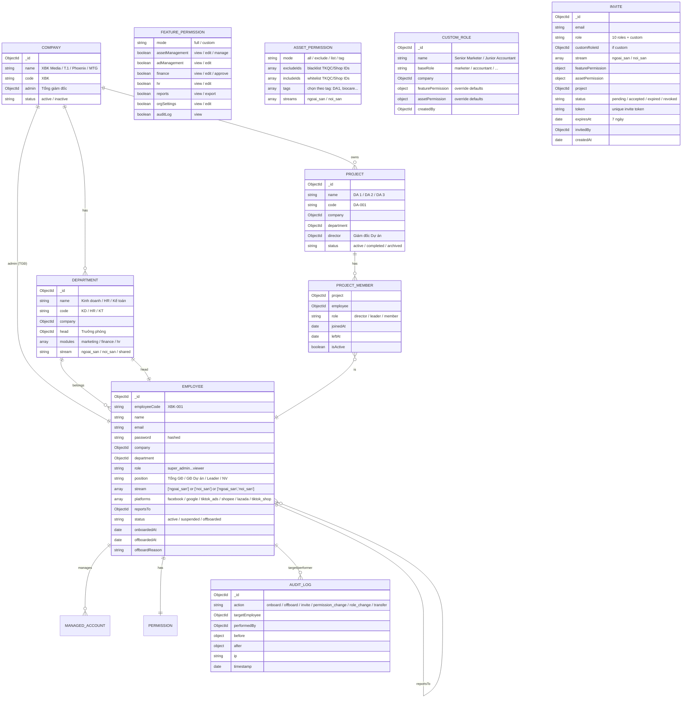
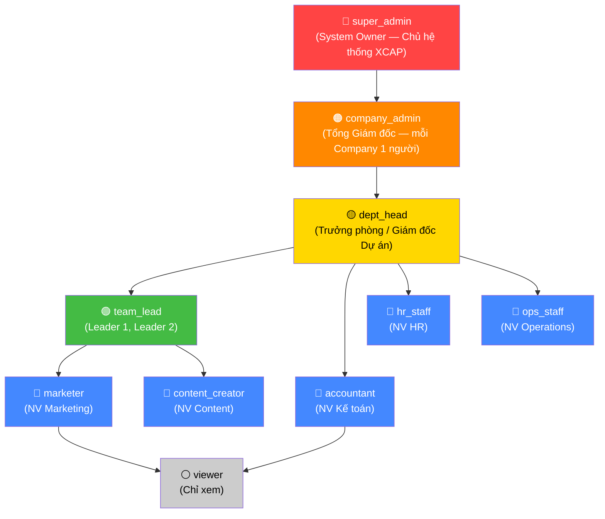
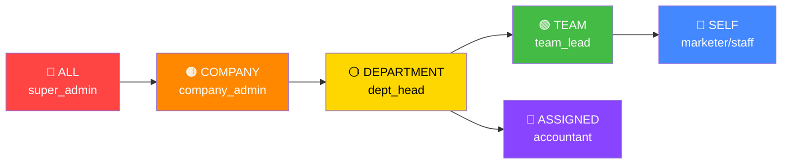
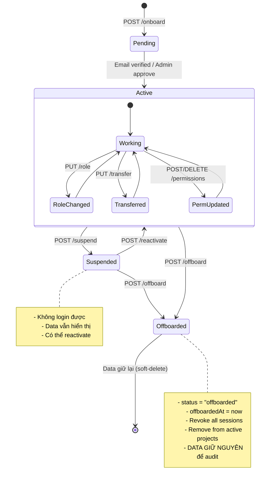
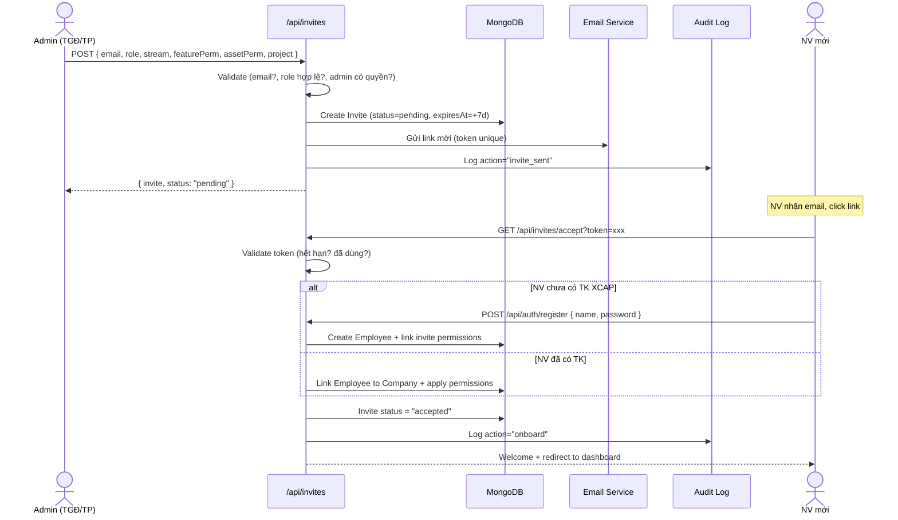
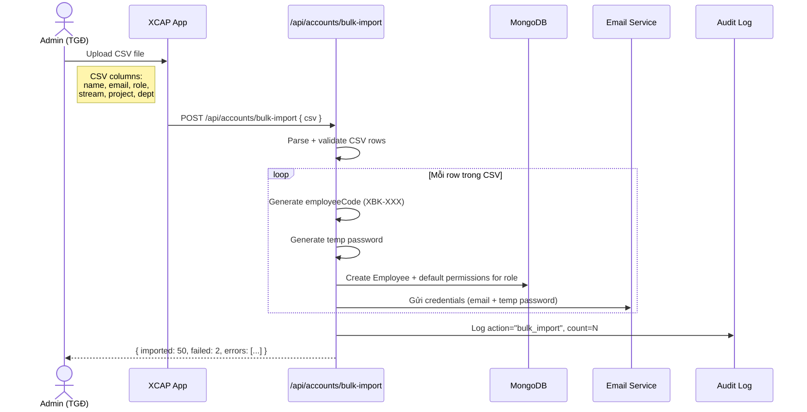
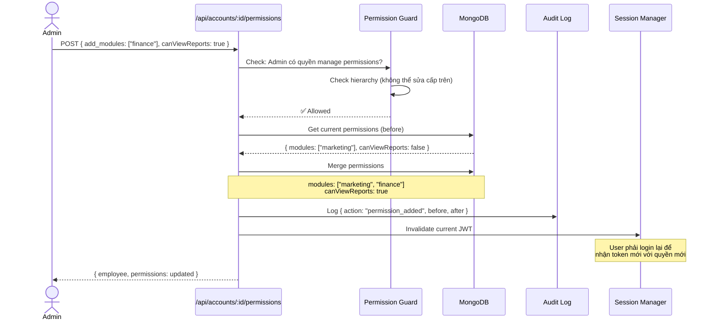
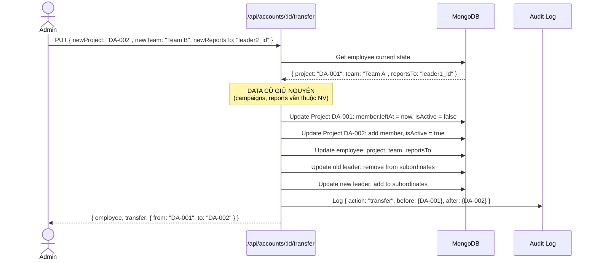
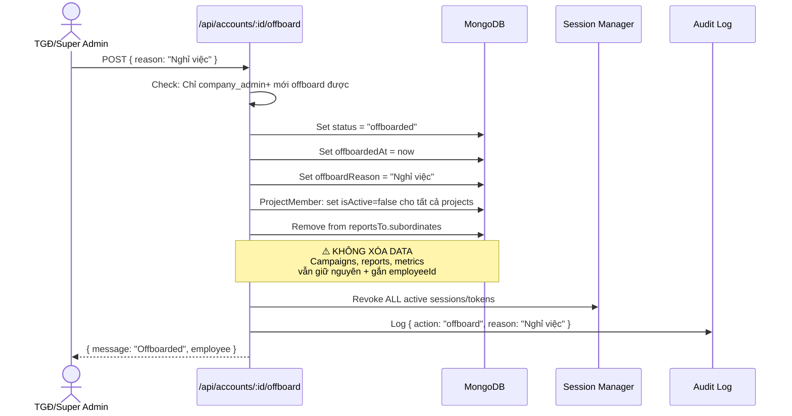
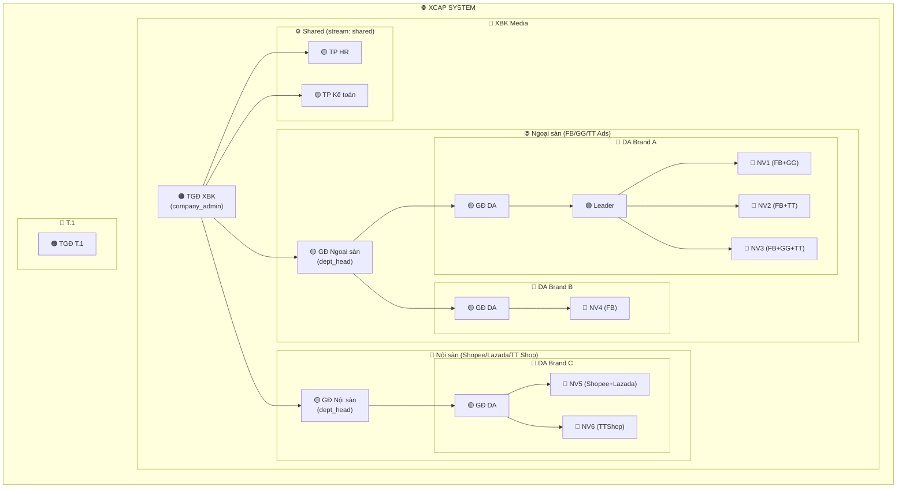

# 🏗️ XCAP — Account & Permission Management System Diagram

> **Dựa trên:** Sơ đồ tổ chức XBK Media (multi-company)
> **Quy tắc:**
> - Mỗi Company có **1 admin riêng** (Tổng giám đốc)
> - NV chuyển dự án → **giữ lại data cũ**
> - Offboard → **soft-delete** (giữ data để audit)

---

## 1. ENTITY RELATIONSHIP DIAGRAM



---

## 2. ROLE HIERARCHY (Phân cấp quyền)



### Ai tạo được ai?

| Người tạo | Có thể tạo roles | Phạm vi |
|---|---|---|
| `super_admin` | Tất cả roles + custom | Toàn system |
| `company_admin` | `dept_head`, `team_lead`, tất cả staff, `viewer`, custom | Chỉ trong company mình |
| `dept_head` | `team_lead`, staff roles, `viewer` | Chỉ trong department mình |
| `team_lead` | Không tạo được | — |

### Custom Role Builder

```
┌──────────────────────────────────────────────────────────────┐
│                TẠO CUSTOM ROLE                               │
├──────────────────────────────────────────────────────────────┤
│                                                              │
│  Bước 1: Đặt tên role                                        │
│  ┌────────────────────────────────────────────────────┐    │
│  │ Tên: [ Senior Media Buyer                    ]    │    │
│  │ Kế thừa từ: [ marketer ▼ ]                        │    │
│  └────────────────────────────────────────────────────┘    │
│                                                              │
│  Bước 2: Tùy chỉnh Feature Permission                        │
│  ┌────────────────────────────────────────────────────┐    │
│  │ [x] Quản lý tài sản         (view / edit / manage) │    │
│  │ [x] Quản lý quảng cáo      (view / edit)          │    │
│  │ [ ] Tài chính              (view / edit / approve)│    │
│  │ [ ] Nhân sự                (view / edit)          │    │
│  │ [x] Báo cáo               (view / export)        │    │
│  │ [ ] Cài đặt tổ chức       (view / edit)          │    │
│  │ [ ] Audit log             (view)                 │    │
│  └────────────────────────────────────────────────────┘    │
│                                                              │
│  Bước 3: Tùy chỉnh Asset Permission                          │
│  ┌────────────────────────────────────────────────────┐    │
│  │ (o) Toàn bộ tài sản                                │    │
│  │ ( ) Toàn bộ ngoại trừ: [act_xxx, shop_yyy]       │    │
│  │ ( ) Chọn theo danh sách: [act_001, act_002]     │    │
│  │ ( ) Chọn theo tag: [DA1] [biocare]               │    │
│  │                                                    │    │
│  │ Stream: [🌐 Ngoại sàn] [🏪 Nội sàn] [Cả 2]      │    │
│  └────────────────────────────────────────────────────┘    │
│                                                              │
│  [ Lưu Custom Role ]                                         │
└──────────────────────────────────────────────────────────────┘
```

Ví dụ Custom Roles:

| Custom Role | Base | Feature Override | Asset Override |
|---|---|---|---|
| Senior Media Buyer | marketer | +reports(export), +assetMgmt(manage) | Tag: [DA1, DA2] |
| Junior Accountant | accountant | finance(view only) | Stream: noi_san |
| Content Lead | content_creator | +adMgmt(edit), +reports | All TKQC |
| Shop Manager | ops_staff | +assetMgmt, +finance(view) | Tag: [shopee, lazada] |

---

## 3. PERMISSION MATRIX

### 3.1 Feature Permission Defaults (10 roles mặc định)

| Feature | super_admin | company_admin | dept_head | team_lead | marketer | accountant | hr_staff | ops_staff | content | viewer |
|---|:---:|:---:|:---:|:---:|:---:|:---:|:---:|:---:|:---:|:---:|
| Quản lý tài sản | ✅ | ✅ | ✅ | ✅ | edit | ❌ | ❌ | edit | ❌ | 👁️ |
| Quản lý QC | ✅ | ✅ | ✅ | ✅ | edit | ❌ | ❌ | ❌ | ❌ | 👁️ |
| Tài chính | ✅ | ✅ | ✅ | ❌ | ❌ | ✅ | ❌ | ❌ | ❌ | ❌ |
| Nhân sự | ✅ | ✅ | ✅ | ❌ | ❌ | ❌ | ✅ | ❌ | ❌ | ❌ |
| Báo cáo | ✅ | ✅ | ✅ | view | view | view | ❌ | view | ❌ | 👁️ |
| Cài đặt tổ chức | ✅ | ✅ | ❌ | ❌ | ❌ | ❌ | ❌ | ❌ | ❌ | ❌ |
| Audit log | ✅ | ✅ | view | ❌ | ❌ | ❌ | ❌ | ❌ | ❌ | ❌ |

> **Custom Role** kế thừa defaults từ base role, rồi override bằng Feature Permission tùy chỉnh.

### 3.2 Asset Permission — 4 chế độ gán (từ SMIT)

| Mode | Mô tả | Use case |
|---|---|---|
| `all` | Toàn bộ TKQC + Shop | TGĐ, GĐ Dept |
| `exclude` | Tất cả **ngoại trừ** list cụ thể | GĐ DA quản hầu hết, trừ vài TK nhạy cảm |
| `list` | Chỉ danh sách TKQC/Shop được chọn | NV chỉ quản 3-5 TKQC cụ thể |
| `tag` | Chọn theo tag (DA1, biocare, shopee_vn...) | Gán theo dự án / brand / platform |

> Kết hợp với **Stream filter**: `streams: ["ngoai_san"]` → chỉ thấy tài sản Ngoại sàn.

### 3.3 Data Scope (Phạm vi dữ liệu)



### 3.4 Action Permissions

| Action | super_admin | company_admin | dept_head | team_lead | staff |
|---|:---:|:---:|:---:|:---:|:---:|
| Email invite NV | ✅ | ✅ | ✅ (dept) | ❌ | ❌ |
| Bulk import CSV | ✅ | ✅ | ❌ | ❌ | ❌ |
| Offboard NV | ✅ | ✅ (company) | ❌ | ❌ | ❌ |
| Đổi role | ✅ | ✅ (≤ dept_head) | ❌ | ❌ | ❌ |
| Tạo custom role | ✅ | ✅ | ❌ | ❌ | ❌ |
| Gán feature perm | ✅ | ✅ | ✅ (team) | ❌ | ❌ |
| Gán asset perm | ✅ | ✅ | ✅ (team) | ❌ | ❌ |
| Chuyển dự án | ✅ | ✅ | ✅ | ❌ | ❌ |
| Suspend TK | ✅ | ✅ | ❌ | ❌ | ❌ |
| Xem audit log | ✅ | ✅ | ✅ (dept) | ❌ | ❌ |
| Manage assets | ✅ | ✅ | ✅ | ✅ | Per perm |
| View reports | ✅ | ✅ | ✅ | ✅ | Per perm |

---

## 4. ACCOUNT LIFECYCLE STATE MACHINE



---

## 5. ONBOARDING FLOW (2 chế độ: Email Invite + Bulk CSV)

### 5.1 Email Invite Flow



### 5.2 Bulk Import CSV Flow



---

## 6. PERMISSION CHANGE FLOW



---

## 7. TRANSFER FLOW (Chuyển dự án)



---

## 8. OFFBOARDING FLOW



---

## 9. MULTI-COMPANY ARCHITECTURE (Ngoại sàn / Nội sàn)



### Isolation Rules (Cách ly dữ liệu)

| Quy tắc | Mô tả |
|---|---|
| **Company Isolation** | TGĐ XBK **KHÔNG** thấy data T.1/Phoenix/MTG |
| **Stream Isolation** | GĐ Ngoại sàn **KHÔNG** thấy data Nội sàn, ngược lại |
| **Cross-stream GĐ** | GĐ Dự án quản DA cả 2 luồng → thấy data **cả 2**, nhưng chỉ trong DA mình |
| **Project Isolation** | GĐ DA Brand A **KHÔNG** thấy NV DA Brand B |
| **Team Isolation** | Leader 1 **KHÔNG** thấy NV của Leader 2 |
| **Platform Cross** | NV stream ngoai_san chạy nhiều platform (FB+GG+TT) OK |
| **Stream Lock (NV)** | NV ngoai_san **KHÔNG** được gán shop account |
| **Cross-reference** | super_admin + TGĐ thấy **CẢ 2 LUỒNG** |

---

## 10. DATABASE SCHEMA SUMMARY

```
┌─────────────────────────────────────────────────────────────────┐
│                     XCAP DATABASE SCHEMA v2                      │
├─────────────────────────────────────────────────────────────────┤
│                                                                 │
│  companies ──┐                                                  │
│              ├── departments ──┐                                │
│              │                 ├── employees ──┐                │
│              │                 │               ├── feature_perms │
│              │                 │               ├── asset_perms   │
│              │                 │               └── audit_logs    │
│              │                 │                                 │
│              ├── custom_roles ─┤ [NEW]                          │
│              ├── invites ──────┤ [NEW]                          │
│              │                 │                                 │
│              ├── projects ─────┤                                │
│              │                 ├── project_members              │
│              │                 └── (Marketing data)             │
│              │                                                  │
│              └── (Finance data)                                 │
│                  ├── transactions                               │
│                  ├── invoices / cards / holds                   │
│                                                                 │
│  audit_logs (global — cross all entities)                       │
│                                                                 │
└─────────────────────────────────────────────────────────────────┘
```

---

## 11. API ENDPOINTS OVERVIEW

```
┌─────────────────────────────────────────────────────────────────────┐
│                    ACCOUNT MANAGEMENT APIs v2                        │
├─────────────────────────────────────────────────────────────────────┤
│                                                                     │
│  📦 COMPANIES                                                       │
│  ├── GET    /api/companies                    List (super_admin)    │
│  ├── POST   /api/companies                    Create                │
│  └── PUT    /api/companies/:id                Update                │
│                                                                     │
│  📁 PROJECTS                                                        │
│  ├── GET    /api/projects                     List (scoped)         │
│  ├── POST   /api/projects                     Create                │
│  └── PUT    /api/projects/:id/members         Add/remove members    │
│                                                                     │
│  📨 INVITES [NEW]                                                    │
│  ├── POST   /api/invites                      Gửi email invite     │
│  ├── GET    /api/invites                      List pending/accepted │
│  ├── GET    /api/invites/accept?token=xxx     NV accept invite      │
│  ├── DELETE /api/invites/:id                  Revoke invite         │
│  └── POST   /api/accounts/bulk-import         Bulk CSV import       │
│                                                                     │
│  👤 ACCOUNT LIFECYCLE                                               │
│  ├── GET    /api/accounts/:id/feature-perms    Xem feature perm     │
│  ├── PUT    /api/accounts/:id/feature-perms    Cập nhật feature     │
│  ├── GET    /api/accounts/:id/asset-perms      Xem asset perm       │
│  ├── PUT    /api/accounts/:id/asset-perms      Cập nhật asset       │
│  ├── PUT    /api/accounts/:id/role             Đổi role              │
│  ├── PUT    /api/accounts/:id/transfer         Chuyển dự án          │
│  ├── POST   /api/accounts/:id/suspend          Tạm khóa              │
│  ├── POST   /api/accounts/:id/reactivate       Kích hoạt lại         │
│  └── POST   /api/accounts/:id/offboard         Offboard              │
│                                                                     │
│  🎭 CUSTOM ROLES [NEW]                                               │
│  ├── GET    /api/custom-roles                  List (company)       │
│  ├── POST   /api/custom-roles                  Create custom role   │
│  ├── PUT    /api/custom-roles/:id              Update                │
│  └── DELETE /api/custom-roles/:id              Delete                │
│                                                                     │
│  📋 AUDIT                                                           │
│  ├── GET    /api/audit                         List logs (scoped)   │
│  └── GET    /api/audit/:employeeId             Logs of 1 employee   │
│                                                                     │
└─────────────────────────────────────────────────────────────────────┘
```

---

## 12. FILES TO CREATE/MODIFY

```
server/
├── core/
│   ├── companies/                          [NEW]
│   │   ├── company.model.js
│   │   └── company.routes.js
│   │
│   ├── projects/                           [NEW]
│   │   ├── project.model.js
│   │   └── project.routes.js
│   │
│   ├── employees/
│   │   ├── employee.model.js               [MODIFY] +company, +projects, +reportsTo
│   │   ├── employee.routes.js              (giữ nguyên)
│   │   └── account-lifecycle.routes.js     [NEW] onboard/offboard/permissions
│   │
│   ├── audit/                              [NEW]
│   │   ├── audit-log.model.js
│   │   └── audit.routes.js
│   │
│   └── auth/
│       └── auth.middleware.js              [MODIFY] +applyDataScope, +company_admin
│
├── shared/
│   ├── permission-presets.js               [NEW]
│   └── validators.js                       [MODIFY] +company_admin role
│
├── seeds/
│   └── seed-org.js                         [NEW] seed org structure
│
└── index.js                                [MODIFY] register new routes
```
