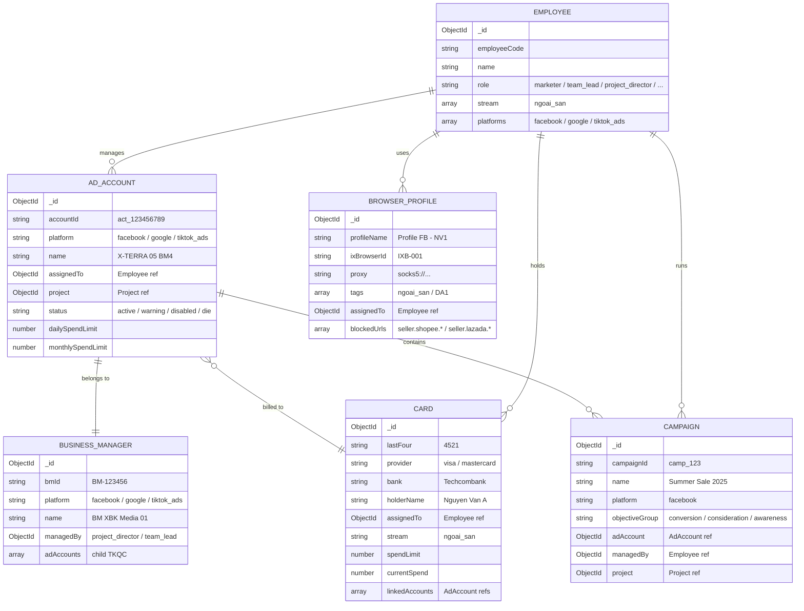
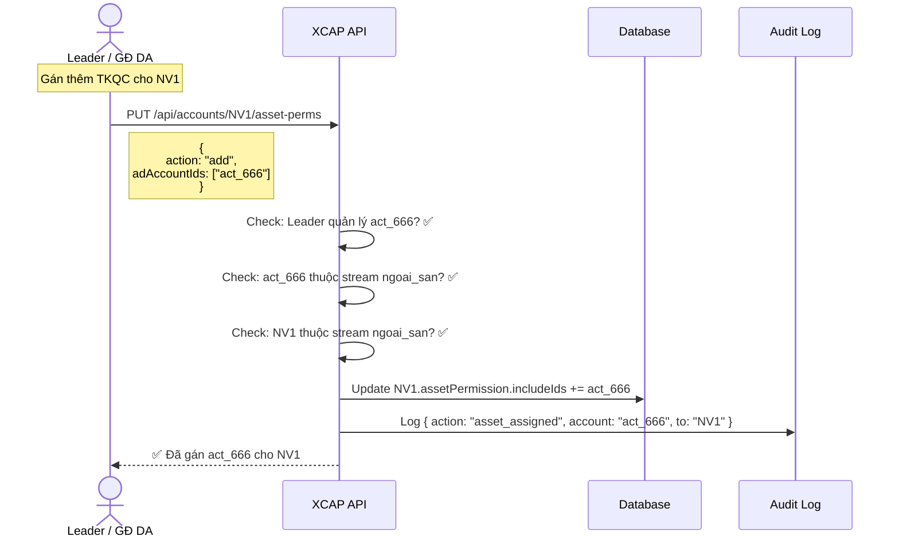
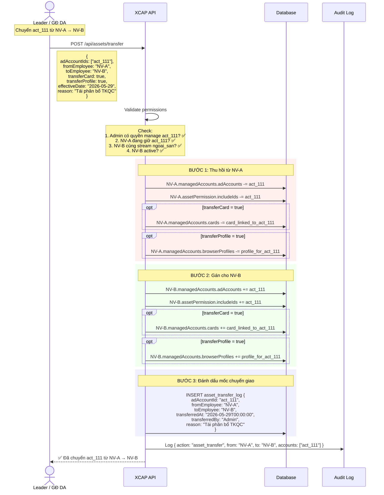
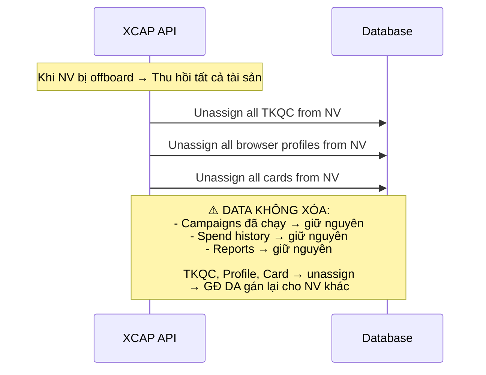

# 📦 XCAP — Asset Management: NGOẠI SÀN (Off-Platform Ads)

> **Tách từ:** `ngoai_san_account_system.md` — chỉ phần quản lý tài sản
> **Tài sản:** TKQC (Ad Accounts), BM/MCC/BC, Browser Profiles, Cards, Campaigns
> **Stream:** `ngoai_san` (Facebook Ads, Google Ads, TikTok Ads)

---

## 1. ENTITY MODEL — Tài sản Ngoại sàn

### 1.1 Tổng quan quan hệ



### 1.2 Schema chi tiết từng Entity

#### AD_ACCOUNT (TKQC)

```javascript
{
  _id: ObjectId,
  accountId: "act_123456789",        // ID trên platform
  platform: "facebook",              // facebook | google | tiktok_ads
  name: "X-TERRA 05 BM4",
  
  // Ownership
  assignedTo: ObjectId,              // ref → Employee (NV đang quản lý)
  project: ObjectId,                 // ref → Project (DA thuộc)
  businessManager: ObjectId,         // ref → BM chứa TKQC này
  stream: "ngoai_san",              // LOCKED
  
  // Limits
  dailySpendLimit: 5000000,          // 5tr VND/ngày
  monthlySpendLimit: 100000000,      // 100tr VND/tháng
  
  // Status
  status: "active",                  // active | warning | disabled | die
  statusHistory: [
    { status: "active", changedAt: Date, changedBy: ObjectId, reason: "" }
  ],
  
  // Card
  linkedCard: ObjectId,              // ref → Card đang gắn
  
  // Tags (dùng cho asset permission mode: "tag")
  tags: ["DA1", "brand_A", "facebook"],
  
  // Metadata
  createdAt: Date,
  updatedAt: Date,
  lastSyncAt: Date                   // Lần sync cuối từ platform API
}
```

#### BROWSER_PROFILE

```javascript
{
  _id: ObjectId,
  profileName: "Profile FB - NV1",
  ixBrowserId: "IXB-001",           // ID trong IX Browser
  
  // Network
  proxy: "socks5://user:pass@ip:port",
  userAgent: "Mozilla/5.0 ...",
  
  // Assignment
  assignedTo: ObjectId,              // ref → Employee
  tags: ["ngoai_san", "DA1", "facebook"],
  
  // Security
  blockedUrls: [                     // Chặn truy cập nội sàn
    "seller.shopee.*",
    "seller.lazada.*"
  ],
  
  // Status
  status: "active",                  // active | suspended | archived
  lastUsedAt: Date,
  
  createdAt: Date,
  updatedAt: Date
}
```

#### CARD (Thẻ thanh toán)

```javascript
{
  _id: ObjectId,
  lastFour: "4521",
  provider: "visa",                  // visa | mastercard
  bank: "Techcombank",
  holderName: "Nguyen Van A",
  
  // Assignment
  assignedTo: ObjectId,              // ref → Employee đang giữ
  stream: "ngoai_san",              // LOCKED — không dùng cho nội sàn
  
  // Limits — CHỈ TGĐ + Kế toán được sửa
  spendLimit: 50000000,              // 50tr VND
  currentSpend: 32000000,
  resetDate: "monthly",             // daily | weekly | monthly
  
  // Linked
  linkedAccounts: [ObjectId],        // ref → AdAccount đang gắn
  
  // Status
  status: "active",                  // active | frozen | expired | cancelled
  
  createdAt: Date,
  updatedAt: Date
}
```

#### BUSINESS_MANAGER (BM / MCC / BC)

```javascript
{
  _id: ObjectId,
  bmId: "BM-123456",
  platform: "facebook",              // facebook → BM, google → MCC, tiktok → BC
  name: "BM XBK Media 01",
  
  // Management
  managedBy: ObjectId,               // ref → project_director / team_lead
  adAccounts: [ObjectId],            // ref → child TKQC
  
  // Status
  status: "active",                  // active | restricted | disabled
  maxAccounts: 10,                   // Giới hạn TKQC trong BM
  currentAccountCount: 7,
  
  createdAt: Date,
  updatedAt: Date
}
```

---

## 2. ASSET PERMISSION — Ai thấy tài sản nào?

### 2.1 Permission Modes

| Mode | Mô tả | Dùng cho |
|---|---|---|
| `all` | Thấy toàn bộ tài sản trong stream ngoai_san | TGĐ |
| `exclude` | Tất cả **trừ** list cụ thể | project_director (trừ TKQC nhạy cảm) |
| `list` | Chỉ tài sản trong danh sách | NVQC (3-5 TKQC cụ thể) |
| `tag` | Theo tag: `DA1`, `brand_A`, `facebook` | Gán theo dự án hoặc platform |

### 2.2 Ví dụ gán

```javascript
// NVQC — chỉ quản 3 TKQC cụ thể
{
  employee: "NV1",
  assetPermission: {
    mode: "list",
    includeIds: ["act_111", "act_222", "act_333"],
    streams: ["ngoai_san"]
  }
}

// GĐ DA Brand A — tất cả TKQC tag DA1
{
  employee: "GD_DA1",
  assetPermission: {
    mode: "tag",
    tags: ["DA1", "brand_A"],
    streams: ["ngoai_san"]
  }
}

// TGĐ — thấy tất cả
{
  employee: "TGD",
  assetPermission: {
    mode: "all",
    streams: ["ngoai_san"]
  }
}
```

### 2.3 Card Permission — Quy tắc đặc biệt

> [!IMPORTANT]
> Giới hạn chi tiêu (spendLimit) trên Card **CHỈ** được sửa bởi `company_admin` (TGĐ) và `accountant` (Kế toán).
> `project_director` có quyền manage card (-limit): gán thẻ, xem, liên kết TKQC, nhưng **KHÔNG** được mở/sửa giới hạn chi tiêu.

| Role | Card | Sửa spendLimit |
|---|---|---|
| `company_admin` | ✅ manage | ✅ Được |
| `accountant` | ✅ manage | ✅ Được |
| `project_director` | ✅ manage (-limit) | 🔒 Không |
| `team_lead` | 👁️ view | 🔒 Không |
| `marketer` | 👁️ view (assigned) | 🔒 Không |

### 2.4 Asset Scope theo Role

```
┌─────────────────────────────────────────────────────────────────────┐
│  Asset Scope — Ai thấy tài sản nào?                                 │
│                                                                     │
│  company_admin (TGĐ)                                               │
│  └── ALL TKQC, ALL BM, ALL Cards, ALL Profiles                      │
│                                                                     │
│  project_director (GĐ DA Brand A)                                  │
│  └── TKQC thuộc DA, BM thuộc DA, Cards trong DA, Profiles DA       │
│                                                                     │
│  team_lead (Leader 1)                                               │
│  └── TKQC của team members, Profiles team, Cards team               │
│                                                                     │
│  marketer (NVQC)                                                    │
│  └── CHỈ TKQC được gán (act_111, act_222, act_333)                 │
│      CHỈ profile MÌNH dùng                                         │
│      CHỈ card được gán                                              │
│                                                                     │
│  accountant (Kế toán)                                               │
│  └── ALL Cards (manage), finance data                               │
│      KHÔNG thấy campaign details                                    │
└─────────────────────────────────────────────────────────────────────┘
```

---

## 3. STREAM ISOLATION — Cách ly tài sản

| Rule | Enforcement | Ví dụ |
|---|---|---|
| **TKQC Lock** | `adAccount.stream = "ngoai_san"` | TKQC FB/GG/TT KHÔNG hiện trong module Nội sàn |
| **Browser Profile** | `profile.tags includes "ngoai_san"` | Profile ngoại sàn BLOCK URL: `seller.shopee.*`, `seller.lazada.*` |
| **Card Isolation** | `card.stream = "ngoai_san"` | Card ads KHÔNG dùng cho e-com top-up |
| **BM Scope** | `bm.stream = "ngoai_san"` | BM chỉ chứa TKQC ngoại sàn |

---

## 4. FLOWS — Lifecycle Tài sản

### 4.1 Gán/Thu hồi TKQC



### 4.2 Chuyển TKQC từ NV-A → NV-B

#### Khi nào xảy ra?
- NV-A nghỉ phép / offboard → cần người khác chạy tiếp
- NV-A quản lý kém → chuyển TKQC cho NV giỏi hơn
- Tái cấu trúc team → phân bổ lại tài sản

#### Flow chi tiết



#### Quy tắc Data Ownership sau chuyển giao

```
┌──────────────────────────────────────────────────────────────────────────┐
│  TKQC: act_111 — Chuyển từ NV-A → NV-B ngày 29/05/2026                 │
│                                                                          │
│  ══════ DATA CỦA NV-A (giữ nguyên, không mất) ═══════                  │
│                                                                          │
│  │ Thời gian       │ Campaigns      │ Spend      │ Conv │ Thuộc về │    │
│  │─────────────────│────────────────│────────────│──────│──────────│    │
│  │ 01/05 → 28/05   │ Camp-01, 02, 03│ 50,000,000 │  120 │ NV-A     │    │
│  │                 │                │            │      │          │    │
│  │  → Reports NV-A vẫn hiện data này                              │    │
│  │  → Dashboard NV-A vẫn tính spend/conv này vào KPI              │    │
│  │  → Campaigns cũ vẫn gắn managedBy = NV-A                      │    │
│  │                                                                │    │
│  ══════ DATA CỦA NV-B (từ ngày chuyển giao) ═════════              │    │
│                                                                          │
│  │ 29/05 → ...     │ Camp mới       │ Spend mới  │ Conv │ NV-B     │    │
│  │                 │                │            │      │          │    │
│  │  → Campaigns mới tạo trên act_111 gắn managedBy = NV-B        │    │
│  │  → Spend từ 29/05 tính vào KPI NV-B                           │    │
│  │  → Campaigns cũ (Camp-01,02,03) NV-B có thể THẤY nhưng       │    │
│  │    data KHÔNG tính vào KPI của NV-B                            │    │
│                                                                          │
│  ══════ MỐC CHUYỂN GIAO (asset_transfer_log) ═════════                 │
│                                                                          │
│  transferredAt: 2026-05-29T00:00:00                                     │
│  → Mọi query dashboard dùng mốc này để phân tách data                  │
│                                                                          │
└──────────────────────────────────────────────────────────────────────────┘
```

#### SQL phân tách data theo mốc chuyển giao

```sql
-- KPI cho NV-B: CHỈ tính data từ ngày nhận TKQC
SELECT
  SUM(cr.spend) AS total_spend,
  SUM(cr.conversions) AS total_conv
FROM campaign_results cr
JOIN campaigns c ON cr.campaign_id = c.id
WHERE c.ad_account_id = 'act_111'
  AND c.managed_by = 'NV-B'
  AND cr.date >= '2026-05-29';

-- KPI cho NV-A: CHỈ tính data TRƯỚC ngày chuyển
SELECT
  SUM(cr.spend) AS total_spend,
  SUM(cr.conversions) AS total_conv
FROM campaign_results cr
JOIN campaigns c ON cr.campaign_id = c.id
WHERE c.ad_account_id = 'act_111'
  AND c.managed_by = 'NV-A'
  AND cr.date < '2026-05-29';

-- Campaigns cũ vẫn chạy (NV-A tạo nhưng NV-B tiếp quản)
-- → Spend sau 29/05 tính cho NV-B
SELECT
  SUM(cr.spend) AS inherited_spend
FROM campaign_results cr
JOIN campaigns c ON cr.campaign_id = c.id
JOIN asset_transfer_log atl ON c.ad_account_id = atl.ad_account_id
WHERE c.ad_account_id = 'act_111'
  AND c.managed_by = 'NV-A'
  AND cr.date >= atl.transferred_at;
```

#### Options khi chuyển

| Option | Default | Mô tả |
|---|---|---|
| `transferCard` | `true` | Chuyển luôn thẻ thanh toán đang gắn với TKQC |
| `transferProfile` | `true` | Chuyển luôn browser profile đang dùng cho TKQC |
| `pauseCampaigns` | `false` | Tạm dừng tất cả campaigns đang chạy trên TKQC |
| `effectiveDate` | `now` | Ngày hiệu lực chuyển giao (có thể set tương lai) |
| `notifyEmployees` | `true` | Gửi notification cho cả NV-A và NV-B |

#### Edge Cases

| Case | Xử lý |
|---|---|
| NV-A đang offboarded | Vẫn chuyển được — TKQC cần người quản lý mới |
| NV-B đã có TKQC đầy (>5) | Warning cho Admin, cho phép override |
| TKQC đang có campaigns chạy | Warning: "3 campaigns đang active", Admin chọn pause hoặc giữ chạy |
| Chuyển TKQC khác DA | Cần GĐ DA đích đồng ý (hoặc TGĐ approve) |
| Chuyển hàng loạt | Batch API: `POST /api/assets/transfer/bulk` — chuyển nhiều TKQC cùng lúc |
| NV-B khác platform | ❌ Block — NV chỉ chạy FB không nhận TKQC Google |

### 4.3 Thu hồi tài sản khi Offboard



---

## 5. API ENDPOINTS — Asset Management

```
┌─────────────────────────────────────────────────────────────────────┐
│              ASSET MANAGEMENT APIs — Ngoại sàn                       │
├─────────────────────────────────────────────────────────────────────┤
│                                                                     │
│  📦 TKQC (Ad Accounts)                                              │
│  ├── GET    /api/ad-accounts                    List (filtered)     │
│  ├── GET    /api/ad-accounts/:id                Detail               │
│  ├── POST   /api/ad-accounts                    Create (from BM)    │
│  ├── PUT    /api/ad-accounts/:id                Update status/info  │
│  ├── PUT    /api/ad-accounts/:id/assign         Gán cho NV          │
│  │          body: { employeeId: "NV1" }                             │
│  ├── PUT    /api/ad-accounts/:id/unassign       Thu hồi              │
│  └── PUT    /api/ad-accounts/:id/limits         Sửa spend limits   │
│             body: { dailyLimit: 5000000, monthlyLimit: 100000000 }  │
│                                                                     │
│  🏢 BM / MCC / BC                                                   │
│  ├── GET    /api/business-managers               List                │
│  ├── GET    /api/business-managers/:id            Detail              │
│  ├── POST   /api/business-managers                Create              │
│  └── PUT    /api/business-managers/:id            Update              │
│                                                                     │
│  🌐 Browser Profiles                                                │
│  ├── GET    /api/browser-profiles                List (filtered)     │
│  ├── POST   /api/browser-profiles                Create              │
│  ├── PUT    /api/browser-profiles/:id/assign     Gán cho NV          │
│  ├── PUT    /api/browser-profiles/:id/unassign   Thu hồi              │
│  └── PUT    /api/browser-profiles/:id/blocked-urls  Update blocks   │
│                                                                     │
│  💳 Cards                                                            │
│  ├── GET    /api/cards                           List (filtered)     │
│  ├── POST   /api/cards                           Create              │
│  ├── PUT    /api/cards/:id/assign                Gán cho NV          │
│  ├── PUT    /api/cards/:id/unassign              Thu hồi              │
│  ├── PUT    /api/cards/:id/link-account          Liên kết TKQC       │
│  │          body: { adAccountId: "act_111" }                        │
│  └── PUT    /api/cards/:id/limits                Sửa spendLimit     │
│             ⚠️ CHỈ company_admin + accountant                       │
│             body: { spendLimit: 50000000 }                          │
│                                                                     │
│  🔄 Asset Transfer                                                   │
│  ├── POST   /api/assets/transfer                 Chuyển NV-A → NV-B │
│  │          body: { adAccountIds, fromEmployee, toEmployee,         │
│  │                  transferCard, transferProfile, effectiveDate }   │
│  ├── POST   /api/assets/transfer/bulk            Chuyển hàng loạt   │
│  └── GET    /api/assets/transfer-log             Lịch sử chuyển     │
│             query: { adAccountId, employeeId, dateFrom, dateTo }    │
│                                                                     │
│  📦 Bulk Assignment                                                  │
│  ├── PUT    /api/accounts/:id/assign-tkqc        Gán nhiều TKQC     │
│  │          body: { adAccountIds: ["act_111", "act_222"] }          │
│  ├── PUT    /api/accounts/:id/assign-profile     Gán browser profile│
│  │          body: { profileIds: ["prof_001"] }                      │
│  ├── PUT    /api/accounts/:id/assign-card        Gán card            │
│  │          body: { cardIds: ["card_001"] }                         │
│  └── DELETE /api/accounts/:id/revoke-assets      Thu hồi tài sản    │
│             body: { adAccountIds, profileIds, cardIds }             │
│                                                                     │
└─────────────────────────────────────────────────────────────────────┘
```

---

## 6. MIDDLEWARE — Asset Scope Filter

### 6.1 Stream Guard

```javascript
// Middleware kiểm tra stream ngoai_san trước mọi thao tác asset

const streamGuard = (requiredStream = 'ngoai_san') => {
  return (req, res, next) => {
    const user = req.user; // từ JWT
    
    // super_admin và company_admin bypass stream check
    if (['super_admin', 'company_admin'].includes(user.role)) {
      return next();
    }
    
    // Check NV có thuộc stream yêu cầu không
    if (!user.stream.includes(requiredStream)) {
      return res.status(403).json({
        error: 'STREAM_VIOLATION',
        message: `Bạn không có quyền truy cập stream: ${requiredStream}`,
        yourStream: user.stream,
        requiredStream
      });
    }
    
    // Inject stream filter vào query
    req.streamFilter = { stream: requiredStream };
    next();
  };
};
```

### 6.2 Asset Scope Filter

```javascript
// Filter tài sản theo quyền của NV

const assetScopeFilter = (req, res, next) => {
  const user = req.user;
  const perm = user.assetPermission;
  
  switch (perm.mode) {
    case 'all':
      req.assetFilter = { stream: 'ngoai_san' };
      break;
      
    case 'exclude':
      req.assetFilter = { 
        stream: 'ngoai_san',
        _id: { $nin: perm.excludeIds }
      };
      break;
      
    case 'list':
      req.assetFilter = {
        stream: 'ngoai_san', 
        _id: { $in: perm.includeIds }
      };
      break;
      
    case 'tag':
      req.assetFilter = {
        stream: 'ngoai_san',
        tags: { $in: perm.tags }
      };
      break;
  }
  
  next();
};
```

### 6.3 Card Limit Guard

```javascript
// Middleware chặn sửa spendLimit — chỉ TGĐ và Kế toán

const cardLimitGuard = (req, res, next) => {
  const user = req.user;
  
  // Chỉ cho phép sửa limit nếu là company_admin hoặc accountant
  if (req.body.spendLimit !== undefined) {
    if (!['super_admin', 'company_admin', 'accountant'].includes(user.role)) {
      return res.status(403).json({
        error: 'CARD_LIMIT_LOCKED',
        message: 'Chỉ TGĐ và Kế toán được sửa giới hạn chi tiêu',
        yourRole: user.role,
        requiredRoles: ['company_admin', 'accountant']
      });
    }
  }
  
  next();
};

// Usage
router.put('/api/cards/:id/limits',
  streamGuard('ngoai_san'),
  cardLimitGuard,                    // ← Block GĐ DA trở xuống
  cardController.updateLimits
);
```

### 6.4 Usage — Kết hợp middlewares

```javascript
// Ad Accounts — filtered by asset scope
router.get('/api/ad-accounts', 
  streamGuard('ngoai_san'),
  assetScopeFilter,
  adAccountController.list
);

// Cards — filtered + limit guard
router.put('/api/cards/:id', 
  streamGuard('ngoai_san'),
  assetScopeFilter,
  cardLimitGuard,
  cardController.update
);

// Asset Transfer
router.post('/api/assets/transfer',
  streamGuard('ngoai_san'),
  requireRole(['project_director', 'team_lead', 'company_admin']),
  assetTransferController.transfer
);
```

---

## 7. SUMMARY — Quy mô tài sản Ngoại sàn (500 NV)

| Asset | Số lượng | Ghi chú |
|---|---|---|
| **TKQC (Ad Accounts)** | ~630 | ~3.5 TKQC / NVQC |
| **BM/MCC/BC** | ~70 | ~9 TKQC / BM |
| **Browser Profiles** | ~500 | ~1 profile / NV (có thể nhiều hơn) |
| **Cards (ads)** | ~315 | ~2 TKQC / card |
| **Fanpages** | ~24 | Dùng cho FB ads |
| **Projects** | ~16 | ~2 DA / GĐ DA |

> [!NOTE]
> File account & permission đầy đủ: [ngoai_san_account_system.md](./ngoai_san_account_system.md)
