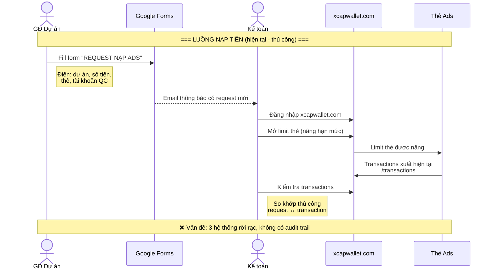
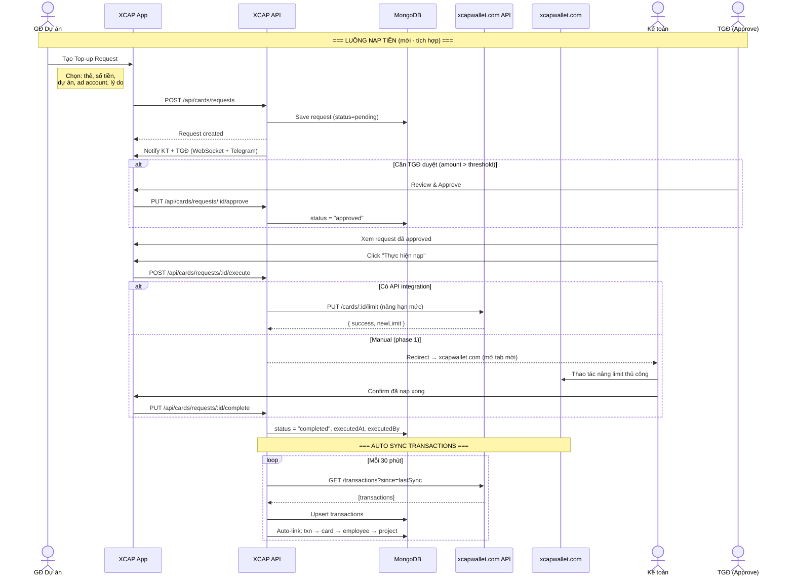
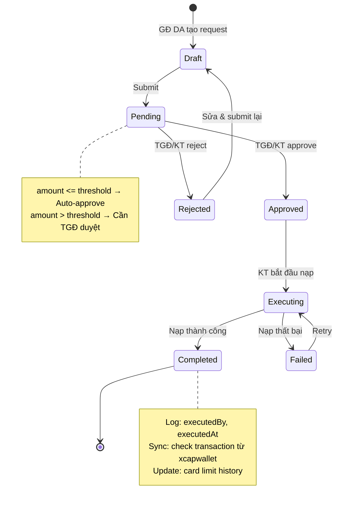
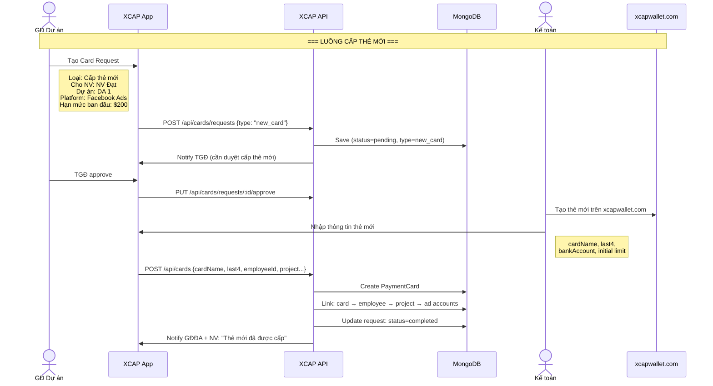
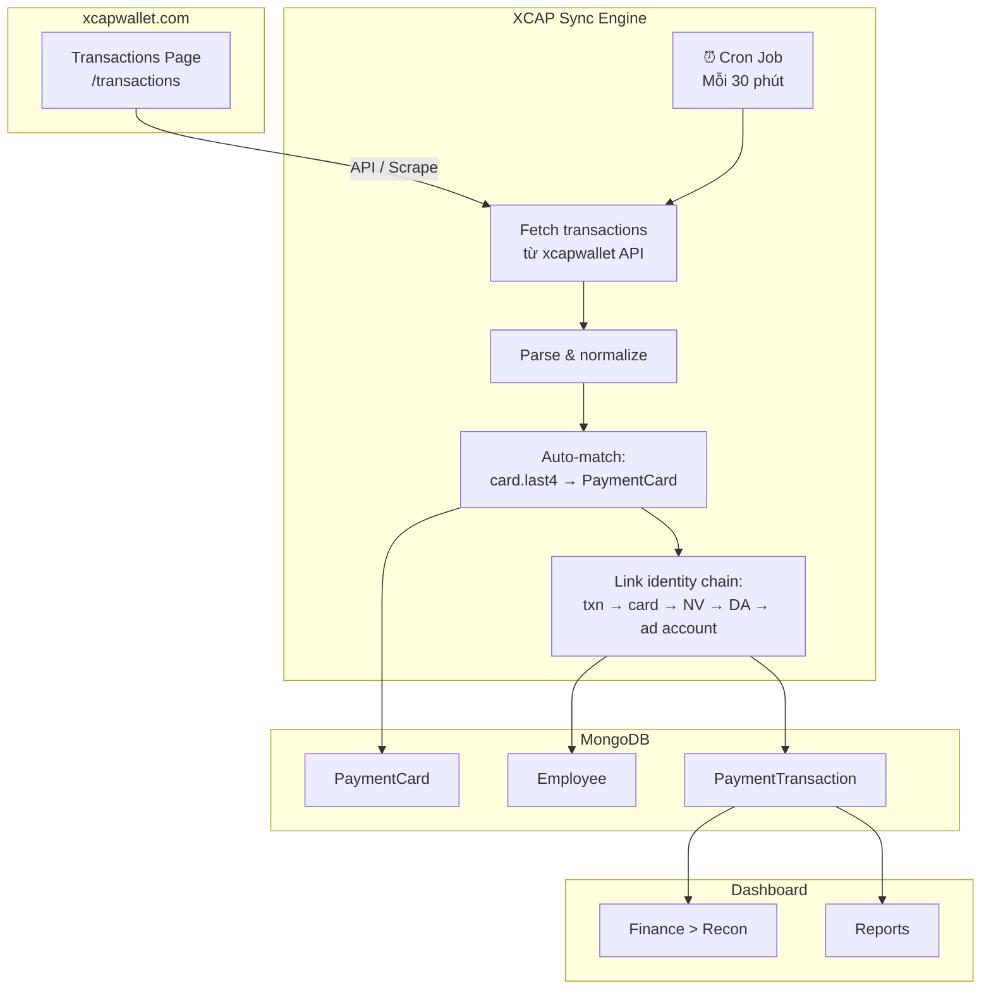
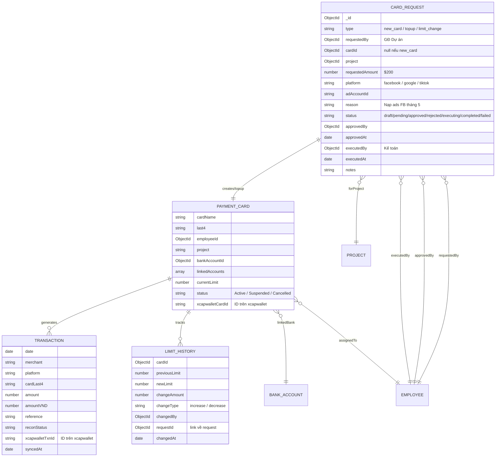
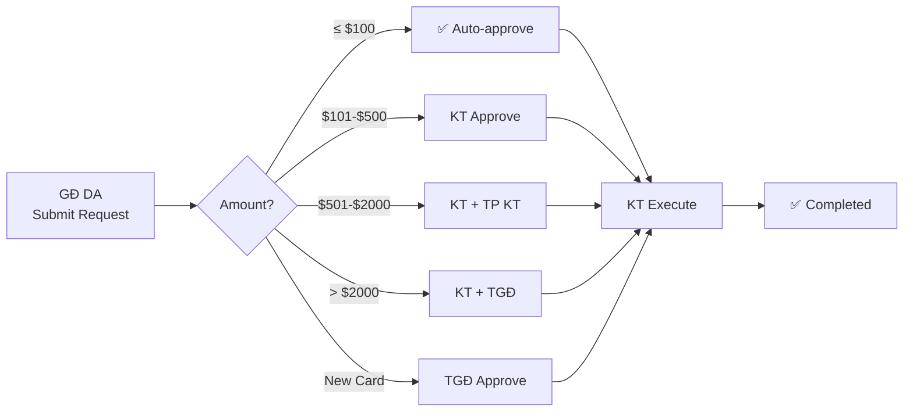

# 💳 XCAP — Card Management & Top-up Request System Diagram

> **Luồng hiện tại:** Google Forms → Kế toán → xcapwallet.com (thủ công)
> **Mục tiêu:** Tích hợp luồng request + quản lý thẻ + sync transaction vào XCAP app
> **External system:** https://app.xcapwallet.com (VNB — Ads Agency Management Platform)

---

## 1. LUỒNG HIỆN TẠI (AS-IS) — Thủ công



### Vấn đề hiện tại

| # | Vấn đề | Hậu quả |
|---|---|---|
| 1 | Google Forms tách rời | Không track trạng thái request |
| 2 | Xcapwallet thao tác thủ công | Dễ sai, không có log |
| 3 | Transaction check thủ công | Mất thời gian, không realtime |
| 4 | Không có approval workflow | GĐĐA request → KT làm ngay, thiếu kiểm soát |
| 5 | Không liên kết identity | Không biết card → NV → dự án → ad account |

---

## 2. LUỒNG MỚI (TO-BE) — Tích hợp vào XCAP



---

## 3. REQUEST LIFECYCLE (State Machine)



---

## 4. CARD ISSUANCE FLOW (Cấp thẻ mới)



---

## 5. TRANSACTION SYNC (Đồng bộ giao dịch)



### Sync Strategy

| Method | Mô tả | Ưu tiên |
|---|---|---|
| **API (nếu có)** | `GET /api/transactions?since=lastSync` | ⭐ Tốt nhất |
| **Webhook** | xcapwallet push event khi có txn mới | ⭐⭐ Realtime |
| **CSV Export** | KT export CSV từ /transactions → import | Backup |
| **Extension Scrape** | Extension đọc DOM /transactions | Phase 1 |

---

## 6. ENTITY RELATIONSHIP



---

## 7. MULTI-LEVEL APPROVAL

```
                    ┌─────────────────────────────────────────┐
                    │        APPROVAL MATRIX                   │
                    ├─────────────────────────────────────────┤
                    │                                         │
                    │  Request Amount     Approval Required    │
                    │  ─────────────     ─────────────────    │
                    │  ≤ $100            Auto-approve          │
                    │  $101 - $500       KT approve            │
                    │  $501 - $2,000     KT + TP KT approve    │
                    │  > $2,000          KT + TGĐ approve      │
                    │  New Card          TGĐ approve           │
                    │                                         │
                    └─────────────────────────────────────────┘
```



---

## 8. XCAPWALLET INTEGRATION ARCHITECTURE

```
┌──────────────────────────────────────────────────────────────────┐
│                    XCAP MANAGEMENT PLATFORM                       │
│                                                                  │
│  ┌────────────────────────────────────────────────────────┐      │
│  │ Card Management Module (NEW)                            │      │
│  │                                                         │      │
│  │  ┌──────────┐ ┌──────────┐ ┌──────────┐ ┌──────────┐  │      │
│  │  │ Card     │ │ Top-up   │ │ Limit    │ │ Txn      │  │      │
│  │  │ Registry │ │ Requests │ │ History  │ │ Sync     │  │      │
│  │  └────┬─────┘ └────┬─────┘ └────┬─────┘ └────┬─────┘  │      │
│  │       │             │            │             │        │      │
│  │       └─────────────┼────────────┼─────────────┘        │      │
│  │                     │            │                      │      │
│  └─────────────────────┼────────────┼──────────────────────┘      │
│                        │            │                              │
│  ═══════════════ XCAPWALLET ADAPTER ══════════════════════        │
│                        │            │                              │
│  ┌─────────────────────┼────────────┼──────────────────────┐      │
│  │ XcapwalletService   │            │                      │      │
│  │                     │            │                      │      │
│  │  syncTransactions() ─── fetchCards() ─── updateLimit()  │      │
│  │  getBalance()       ─── getCardDetails()                │      │
│  └─────────────────────┼────────────┼──────────────────────┘      │
│                        │            │                              │
└────────────────────────┼────────────┼──────────────────────────────┘
                         │            │
                         ▼            ▼
              ┌──────────────────────────────┐
              │    https://app.xcapwallet.com │
              │    (VNB Ads Agency Platform)  │
              │                              │
              │    /dashboard                │
              │    /cards                    │
              │    /transactions             │
              │    /api/* (nếu có)           │
              └──────────────────────────────┘
```

---

## 9. DASHBOARD KPIs

```
┌──────────────────────────────────────────────────────────────┐
│               FINANCE > CARD MANAGEMENT                       │
├──────────────────────────────────────────────────────────────┤
│                                                              │
│  ┌────────────┐ ┌────────────┐ ┌────────────┐ ┌──────────┐ │
│  │ Active     │ │ Total      │ │ Pending    │ │ Today    │ │
│  │ Cards      │ │ Limit      │ │ Requests   │ │ Spend    │ │
│  │    25      │ │ $45,200    │ │     3      │ │ $1,250   │ │
│  └────────────┘ └────────────┘ └────────────┘ └──────────┘ │
│                                                              │
│  ┌─────────────────────────────────────────────────────┐    │
│  │ Recent Requests                                      │    │
│  │                                                      │    │
│  │  🟡 NV Đạt — Top-up $500 (DA 1, FB) — Pending       │    │
│  │  ✅ NV Linh — Top-up $200 (DA 2, GG) — Completed    │    │
│  │  🔴 NV Hùng — New Card (DA 3) — Rejected            │    │
│  └─────────────────────────────────────────────────────┘    │
│                                                              │
│  ┌─────────────────────────────────────────────────────┐    │
│  │ Cards by Project                                     │    │
│  │  DA 1: 8 cards │ $15,200 limit │ $4,500 spent       │    │
│  │  DA 2: 5 cards │ $10,000 limit │ $2,800 spent       │    │
│  │  DA 3: 3 cards │ $5,000 limit  │ $1,200 spent       │    │
│  └─────────────────────────────────────────────────────┘    │
└──────────────────────────────────────────────────────────────┘
```

---

## 10. API ENDPOINTS

```
┌─────────────────────────────────────────────────────────────────┐
│              CARD MANAGEMENT APIs (NEW)                          │
├─────────────────────────────────────────────────────────────────┤
│                                                                 │
│  📋 CARD REQUESTS                                                │
│  ├── GET    /api/cards/requests              List (scoped)      │
│  ├── POST   /api/cards/requests              Create request     │
│  ├── PUT    /api/cards/requests/:id          Update draft       │
│  ├── PUT    /api/cards/requests/:id/approve  Approve            │
│  ├── PUT    /api/cards/requests/:id/reject   Reject             │
│  ├── POST   /api/cards/requests/:id/execute  Start execution    │
│  └── PUT    /api/cards/requests/:id/complete Mark completed     │
│                                                                 │
│  💳 CARDS (enhanced)                                             │
│  ├── GET    /api/cards                       List all cards     │
│  ├── POST   /api/cards                       Register card      │
│  ├── PUT    /api/cards/:id                   Update card        │
│  ├── PUT    /api/cards/:id/limit             Change limit       │
│  └── GET    /api/cards/:id/history           Limit history      │
│                                                                 │
│  🔄 XCAPWALLET SYNC                                              │
│  ├── POST   /api/xcapwallet/sync             Manual sync        │
│  ├── GET    /api/xcapwallet/status           Sync status        │
│  └── POST   /api/xcapwallet/webhook          Receive webhook    │
│                                                                 │
└─────────────────────────────────────────────────────────────────┘
```

---

## 11. FILES TO CREATE/MODIFY

```
server/
├── modules/finance/
│   ├── card-requests/                    [NEW]
│   │   ├── card-request.model.js         Request schema
│   │   ├── card-request.routes.js        CRUD + approve/reject/execute
│   │   └── approval.service.js           Multi-level approval logic
│   │
│   ├── cards/
│   │   ├── card.model.js                 [MODIFY] +currentLimit, +xcapwalletCardId
│   │   ├── card.routes.js                [MODIFY] +limit change, +history
│   │   └── limit-history.model.js        [NEW] Track limit changes
│   │
│   ├── xcapwallet/                       [NEW]
│   │   ├── xcapwallet.service.js         API adapter
│   │   └── xcapwallet.sync.js            Transaction sync job
│   │
│   ├── models.js                         [MODIFY] +CardRequest, +LimitHistory
│   └── index.js                          [MODIFY] Register new routes
│
├── jobs/
│   └── sync-xcapwallet.js                [NEW] Cron job (30 min)
│
└── dashboard/src/modules/finance/
    ├── CardRequestPage.jsx               [NEW] Request form
    ├── CardRequestList.jsx               [NEW] Pending approvals
    └── CardManagement.jsx                [NEW] Cards overview
```
