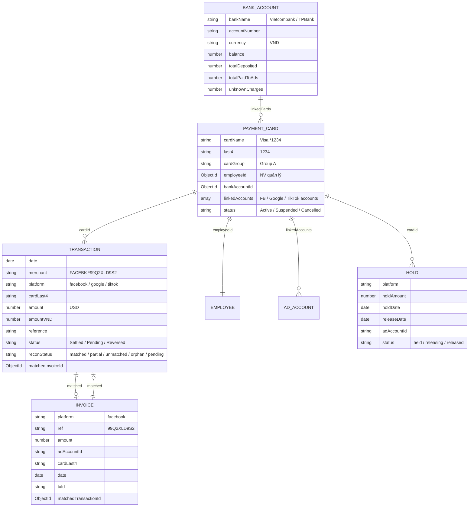
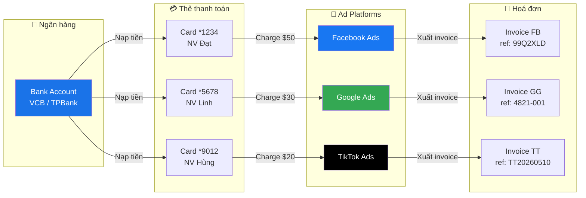
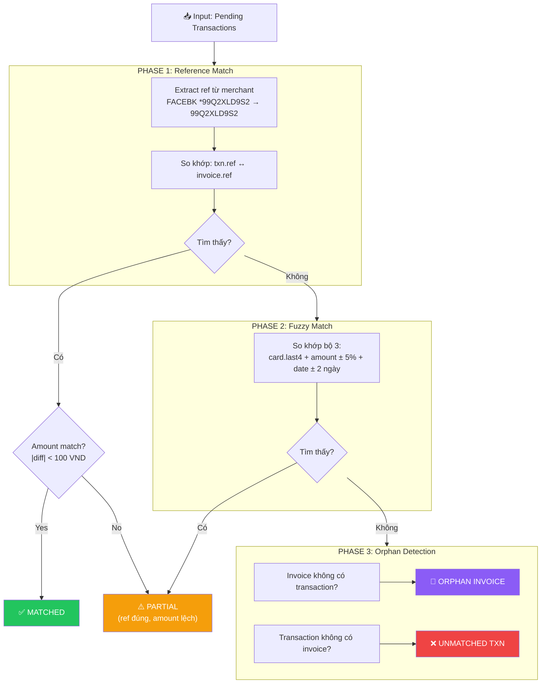
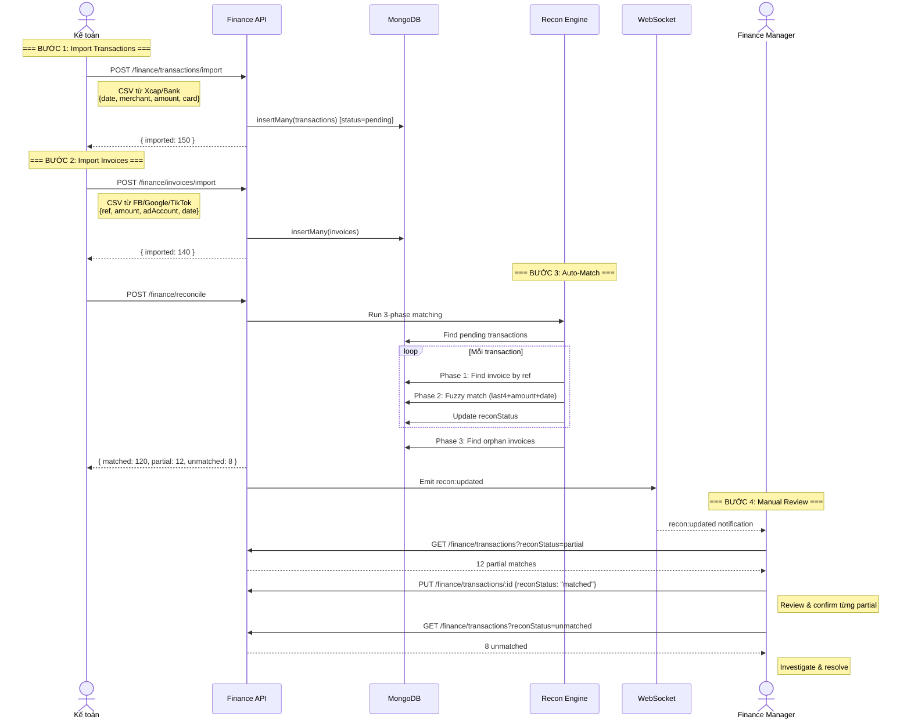
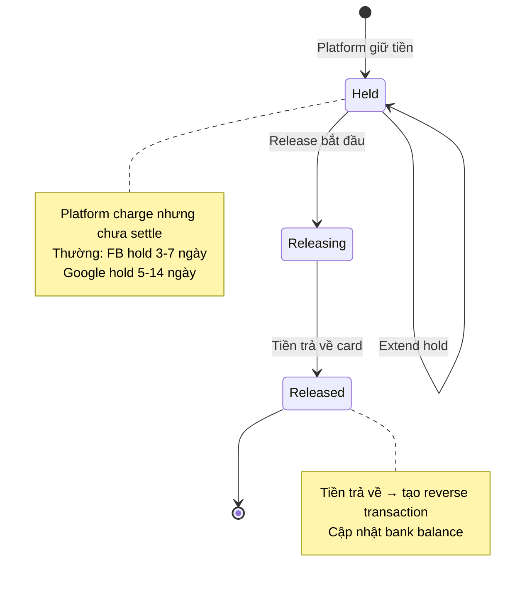

# 💰 XCAP — Invoice Reconciliation System Diagram

> **Dựa trên:** Finance Module v2 hiện tại + 6 platforms
> **5 entities:** BankAccount → PaymentCard → Transaction → Invoice → HoldTracking

---

## 1. ENTITY RELATIONSHIP



---

## 2. MONEY FLOW (Luồng tiền)



### Identity Chain (Chuỗi liên kết)

```
Bank Account (VCB)
  └── Card *1234
        ├── Employee: NV Đạt (marketer)
        ├── Project: DA 1
        └── Ad Accounts:
              ├── FB: act_1162586225600942
              ├── Google: 228-148-2529
              └── TikTok: AnhDTN
```

---

## 3. RECONCILIATION ENGINE (3 phases)



### Match Rules

| Phase | Logic | Kết quả |
|---|---|---|
| **Phase 1** | `txn.ref === invoice.ref` AND `|amount diff| < 100` | ✅ Matched |
| **Phase 1b** | `txn.ref === invoice.ref` AND `amount diff > 100` | ⚠️ Partial |
| **Phase 2** | `card.last4 + amount ±5% + date ±2d` | ⚠️ Partial |
| **Phase 3** | No match found | ❌ Unmatched / 👻 Orphan |

---

## 4. IMPORT → MATCH → REVIEW FLOW



---

## 5. HOLD TRACKING LIFECYCLE



### Hold Data Flow

```
Platform charge → Card bị hold
    │
    ├── holdAmount = $50
    ├── holdDate = 2026-05-10
    ├── Estimate releaseDate = 2026-05-17
    │
    ├── Kế toán track trên Dashboard
    │   ├── Tab "Held" → 15 holds, $1,200 total
    │   ├── Tab "Releasing" → 3 holds, $180
    │   └── Tab "Released" → 45 holds, $3,500
    │
    └── Khi released:
        ├── status = "released"
        ├── releaseDate = actual date
        └── Bank balance += holdAmount
```

---

## 6. DASHBOARD KPIs

```
┌──────────────────────────────────────────────────────────────┐
│                  FINANCE > RECONCILIATION                     │
├──────────────────────────────────────────────────────────────┤
│                                                              │
│  ┌────────────┐ ┌────────────┐ ┌────────────┐ ┌──────────┐ │
│  │ Total Txns │ │ Total Amt  │ │ Match Rate │ │  Holds   │ │
│  │    150     │ │ ₫45.2M     │ │   85.3%    │ │ 15 active│ │
│  │            │ │            │ │            │ │ ₫3.6M    │ │
│  └────────────┘ └────────────┘ └────────────┘ └──────────┘ │
│                                                              │
│  ┌─────────────────────────────────────────────────────┐    │
│  │ Reconciliation Status                                │    │
│  │                                                      │    │
│  │  ✅ Matched:    120 (80%)  ████████████████░░░░     │    │
│  │  ⚠️ Partial:     12 (8%)   ██░░░░░░░░░░░░░░░░░░    │    │
│  │  ❌ Unmatched:    8 (5%)   █░░░░░░░░░░░░░░░░░░░    │    │
│  │  👻 Orphan:       3 (2%)   ░░░░░░░░░░░░░░░░░░░░    │    │
│  │  ⏳ Pending:      7 (5%)   █░░░░░░░░░░░░░░░░░░░    │    │
│  └─────────────────────────────────────────────────────┘    │
│                                                              │
│  ┌─────────────────────────────────────────────────────┐    │
│  │ By Platform                                          │    │
│  │  Facebook:  85 txns  │ ₫28.5M │ 88% matched        │    │
│  │  Google:    35 txns  │ ₫10.2M │ 82% matched        │    │
│  │  TikTok:    30 txns  │ ₫6.5M  │ 80% matched        │    │
│  └─────────────────────────────────────────────────────┘    │
└──────────────────────────────────────────────────────────────┘
```

---

## 7. API ENDPOINTS

```
┌─────────────────────────────────────────────────────────────┐
│                FINANCE MODULE APIs                           │
├─────────────────────────────────────────────────────────────┤
│                                                             │
│  📊 DASHBOARD                                               │
│  └── GET  /api/finance/dashboard          KPI summary       │
│                                                             │
│  💳 CARDS                                                    │
│  ├── GET  /api/finance/cards              List cards        │
│  ├── POST /api/finance/cards              Create card       │
│  └── PUT  /api/finance/cards/:id          Update card       │
│                                                             │
│  📄 TRANSACTIONS                                             │
│  ├── GET  /api/finance/transactions       List (filtered)   │
│  ├── POST /api/finance/transactions/import  Bulk import CSV │
│  └── PUT  /api/finance/transactions/:id     Manual update   │
│                                                             │
│  🧾 INVOICES                                                 │
│  ├── GET  /api/finance/invoices           List (filtered)   │
│  └── POST /api/finance/invoices/import    Bulk import CSV   │
│                                                             │
│  🔄 RECONCILIATION                                           │
│  └── POST /api/finance/reconcile          Run auto-match    │
│                                                             │
│  🔒 HOLDS                                                    │
│  ├── GET  /api/finance/holds              List (by status)  │
│  ├── POST /api/finance/holds              Create hold       │
│  └── PUT  /api/finance/holds/:id          Update status     │
│                                                             │
│  🏦 BANK ACCOUNTS                                            │
│  └── GET  /api/finance/banks              List banks        │
│                                                             │
└─────────────────────────────────────────────────────────────┘
```

---

## 8. FULL PIPELINE

```
  CSV/Bank Export          Platform Invoices         Extension Auto-Collect
  (Xcap, VCB)             (FB, Google, TikTok)      (spend data realtime)
       │                        │                          │
       ▼                        ▼                          ▼
  ┌─────────┐             ┌─────────┐              ┌─────────────┐
  │ Import  │             │ Import  │              │ Daily       │
  │ Txns    │             │ Invoices│              │ Metrics     │
  └────┬────┘             └────┬────┘              └──────┬──────┘
       │                       │                          │
       └───────────┬───────────┘                          │
                   ▼                                      │
            ┌─────────────┐                               │
            │ RECON       │                               │
            │ ENGINE      │◄──────────────────────────────┘
            │ (3 phases)  │     Cross-validate spend
            └──────┬──────┘
                   │
        ┌──────────┼──────────┬──────────┐
        ▼          ▼          ▼          ▼
    ✅ Match   ⚠️ Partial  ❌ Unmatch  👻 Orphan
        │          │          │          │
        └──────────┼──────────┘          │
                   ▼                     │
            ┌─────────────┐              │
            │ MANUAL      │              │
            │ REVIEW      │◄─────────────┘
            │ (by FM)     │
            └──────┬──────┘
                   ▼
            ┌─────────────┐
            │ DASHBOARD   │
            │ KPIs +      │
            │ Reports     │
            └─────────────┘
```
