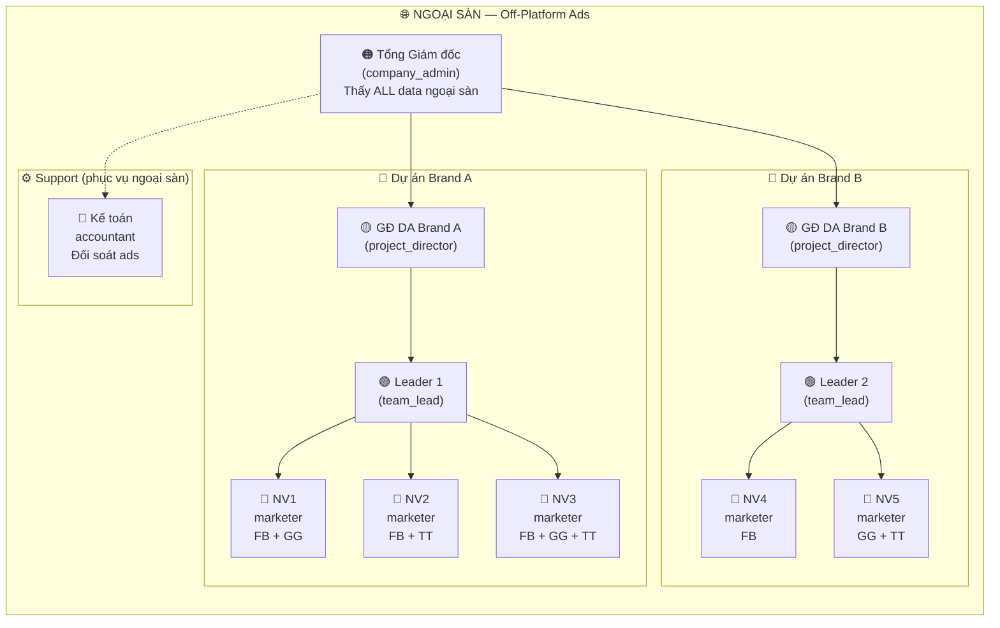
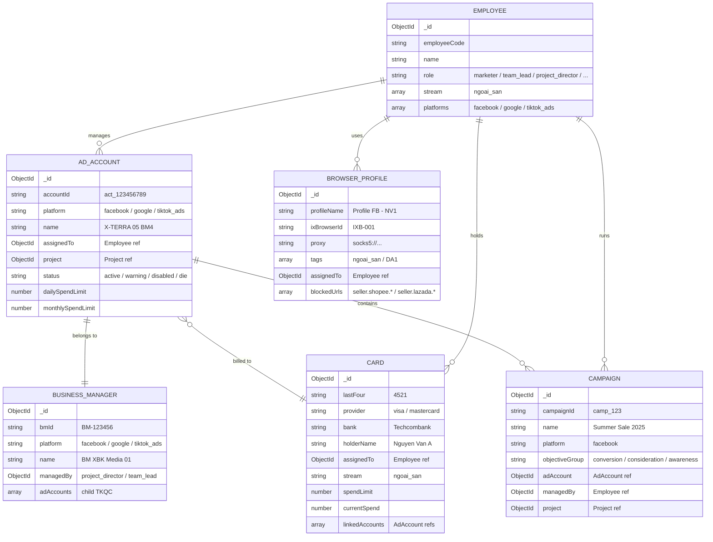
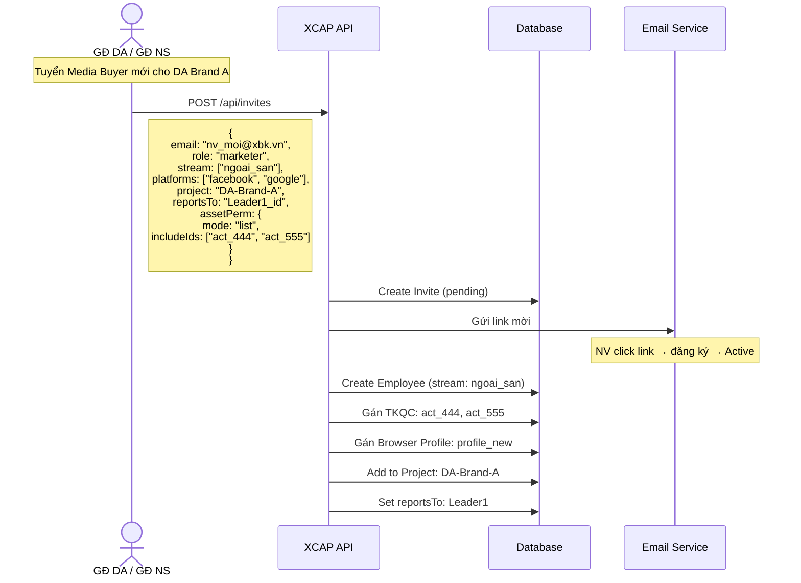
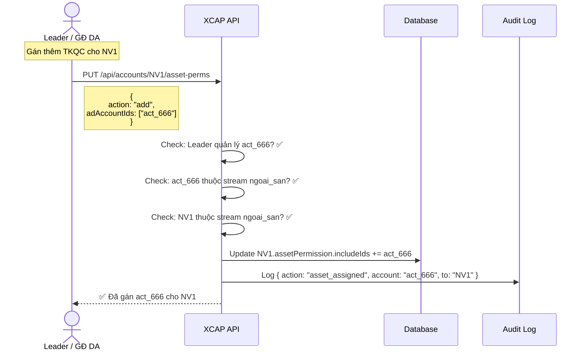
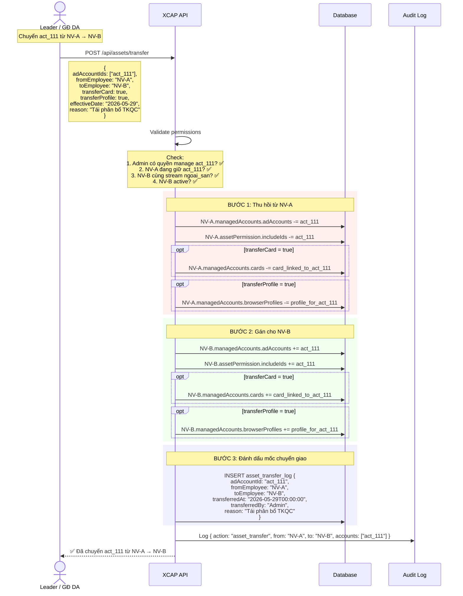
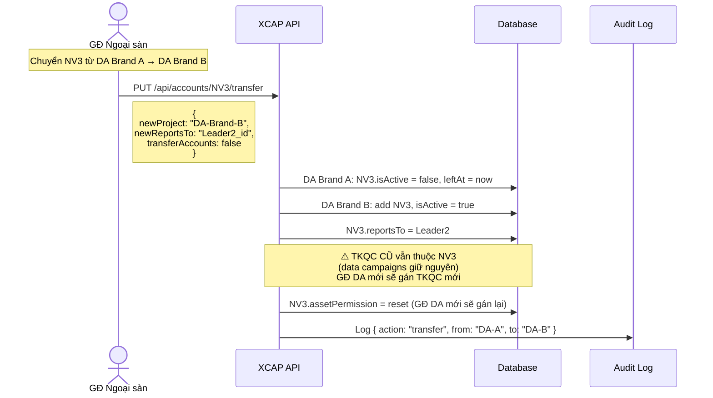
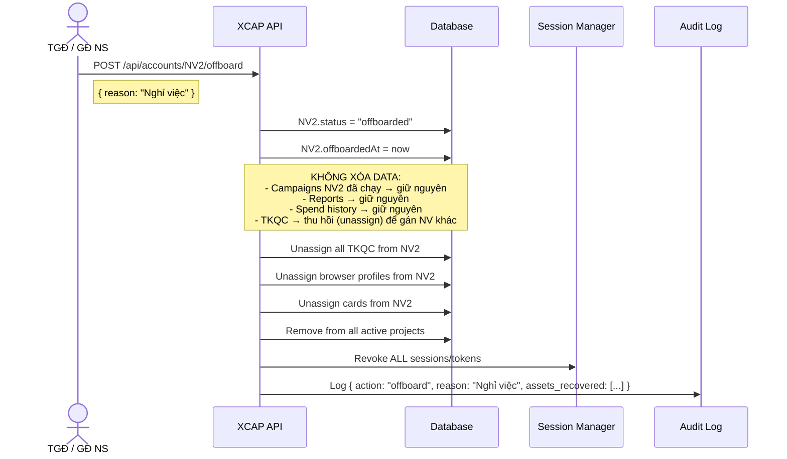

# 🌐 XCAP — Account & Permission System: NGOẠI SÀN (Off-Platform Ads)

> **Tách từ:** `account_system_diagram.md` — chỉ phần liên quan đến hệ thống Ngoại sàn
> **Stream:** `ngoai_san` (Facebook Ads, Google Ads, TikTok Ads)
> **Platforms:** Facebook, Google, TikTok Ads

---

## 1. TỔ CHỨC NHÂN SỰ NGOẠI SÀN



### Vai trò trong Ngoại sàn

| Role | Vị trí | Số lượng (quy mô 500NV) | Chức năng chính |
|---|---|---|---|
| `company_admin` | Tổng GĐ | 1 | Toàn quyền, phê duyệt budget lớn |
| `project_director` | GĐ Dự án | 8 | Quản lý 1-3 dự án, phân bổ TKQC, quản NV trong DA |
| `team_lead` | Leader | 24 | Quản lý nhóm 5-8 NVQC |
| `marketer` | Nhân viên quảng cáo (NVQC) | 180 | Chạy QC, quản lý TKQC được gán |
| `accountant` | Kế toán | 15 | Đối soát chi phí ads, invoices |

---

## 2. ENTITY MODEL — Ngoại sàn

### 2.1 Employee (Ngoại sàn specific fields)

```javascript
// Employee schema — fields relevant to ngoai_san
{
  _id: ObjectId,
  employeeCode: "XBK-001",
  name: "Trần Minh Tân",
  email: "tan@xbk.vn",
  
  company: ObjectId,               // ref → Company
  department: ObjectId,            // ref → Department (Phòng Ngoại sàn)
  
  role: "marketer",                // super_admin | company_admin | project_director | team_lead | marketer | accountant
  position: "Nhân viên quảng cáo", // Vị trí thực tế
  
  stream: ["ngoai_san"],           // ← LOCKED: chỉ ngoại sàn
  platforms: ["facebook", "google", "tiktok_ads"],  // Platforms NV làm việc
  
  reportsTo: ObjectId,             // ref → Employee (Leader/GĐ DA)
  status: "active",               // active | suspended | offboarded
  
  // Ngoại sàn specific
  managedAccounts: {
    adAccounts: [ObjectId],         // ref → AdAccount (TKQC được gán)
    browserProfiles: [ObjectId],    // ref → BrowserProfile
    cards: [ObjectId],              // ref → Card (thẻ QC được gán)
  }
}
```

### 2.2 Tài sản Ngoại sàn được quản lý per-NV



---

## 3. PERMISSION MATRIX — Ngoại sàn

### 3.1 Feature Permissions (Chỉ features liên quan ngoại sàn)

| Feature | company_admin | project_director (GĐ DA) | team_lead | marketer | accountant |
|---|:---:|:---:|:---:|:---:|:---:|
| **Dashboard** | ✅ All data | ✅ Project data | ✅ Team data | 👁️ Self data | 👁️ Finance |
| **TKQC Management** | ✅ manage | ✅ manage | ✅ edit | edit (assigned) | ❌ |
| **BM/MCC/BC** | ✅ manage | ✅ manage | 👁️ view | ❌ | ❌ |
| **Browser Profiles** | ✅ manage | ✅ manage | edit | edit (assigned) | ❌ |
| **Campaign CRUD** | ✅ | ✅ | ✅ | ✅ (assigned TKQC) | ❌ |
| **Card Management** | ✅ manage | 👁️ view | 👁️ view | 👁️ view (assigned) | ✅ manage |
| **Finance / Đối soát** | ✅ | ✅ full (assigned) | ✅ full (assigned) | ✅ full (assigned) | ✅ edit |
| **Top-up Request** | ✅ approve | ✅ approve (project) | ✅ request | ✅ request | ✅ process |
| **Reports / Export** | ✅ export | ✅ export | 👁️ view | 👁️ view (self) | 👁️ view |
| **HR / NV** | ✅ manage | ✅ project | ❌ | ❌ | ❌ |
| **Settings** | ✅ edit | ❌ | ❌ | ❌ | ❌ |
| **Audit Log** | ✅ | 👁️ project | ❌ | ❌ | ❌ |

### 3.2 Asset Permission — Gán TKQC cho NV

| Mode | Mô tả | Dùng cho |
|---|---|---|
| `all` | Thấy toàn bộ TKQC trong stream ngoai_san | TGĐ, GĐ Ngoại sàn |
| `exclude` | Tất cả **trừ** list cụ thể | project_director (trừ TKQC nhạy cảm) |
| `list` | Chỉ TKQC trong danh sách | Media Buyer (3-5 TKQC cụ thể) |
| `tag` | Theo tag: `DA1`, `brand_A`, `facebook` | Gán theo dự án hoặc platform |

**Ví dụ gán cho Media Buyer:**

```javascript
// NV1 — chỉ quản 3 TKQC cụ thể
{
  employee: "NV1",
  assetPermission: {
    mode: "list",
    includeIds: ["act_111", "act_222", "act_333"],
    streams: ["ngoai_san"]
  }
}

// GĐ DA Brand A — tất cả TKQC tag DA1
{
  employee: "GD_DA1",
  assetPermission: {
    mode: "tag",
    tags: ["DA1", "brand_A"],
    streams: ["ngoai_san"]
  }
}
```

### 3.3 Data Scope — Ai thấy gì?

```
┌─────────────────────────────────────────────────────────────────────┐
│  Data Scope trong Ngoại sàn                                         │
│                                                                     │
│  company_admin (TGĐ)                                               │
│  └── ALL TKQC, ALL campaigns, ALL NV, ALL finance                   │
│                                                                     │
│  project_director (GĐ DA Brand A)                                  │
│  └── TKQC thuộc DA Brand A, campaigns DA, NV trong DA              │
│                                                                     │
│  team_lead (Leader 1)                                               │
│  └── TKQC của team members, campaigns team, NV trong team          │
│                                                                     │
│  marketer (NVQC)                                                    │
│  └── CHỈ TKQC được gán (act_111, act_222, act_333)                 │
│      CHỈ campaigns mình tạo/quản lý                                │
│      CHỈ data/reports CỦA MÌNH                                     │
│                                                                     │
│  accountant (Kế toán)                                               │
│  └── Finance data (invoices, cards, đối soát)                       │
│      KHÔNG thấy campaign details                                    │
└─────────────────────────────────────────────────────────────────────┘
```

---

## 4. STREAM ISOLATION RULES — Ngoại sàn

### 4.1 Cách ly với Nội sàn

| Rule | Enforcement | Ví dụ |
|---|---|---|
| **NV Lock** | `employee.stream = ["ngoai_san"]` | NV ngoại sàn KHÔNG thể được gán Shop Shopee |
| **TKQC Lock** | `adAccount.stream = "ngoai_san"` | TKQC FB/GG/TT KHÔNG hiện trong module Nội sàn |
| **Browser Profile** | `profile.tags includes "ngoai_san"` | Profile ngoại sàn BLOCK URL: `seller.shopee.*`, `seller.lazada.*` |
| **Card Isolation** | `card.stream = "ngoai_san"` | Card ads KHÔNG dùng cho e-com top-up |
| **Dashboard Filter** | `WHERE stream = "ngoai_san"` | Dashboard chỉ hiện metrics ngoại sàn |
| **Report Scope** | Filtered by stream | Export chỉ có data ngoại sàn |

### 4.2 Cross-stream Exceptions

```
┌─────────────────────────────────────────────────────────┐
│  Ai có thể thấy data CẢ 2 stream?                      │
│                                                         │
│  ✅ super_admin          → Toàn hệ thống                │
│  ✅ company_admin (TGĐ)  → Toàn company                 │
│  ⚠️ project_director    → Chỉ trong DA đó               │
│     (nếu quản DA cả 2 stream)                           │
│  ✅ Kế toán tổng         → Finance data cả 2 stream     │
│                                                         │
│  ❌ team_lead             → CHỈ stream mình              │
│  ❌ marketer              → CHỈ ngoại sàn                │
└─────────────────────────────────────────────────────────┘
```

---

## 5. FLOWS — Lifecycle NV Ngoại sàn

### 5.1 Onboard Media Buyer mới



### 5.2 Gán/Thu hồi TKQC



### 5.3 Chuyển TKQC từ NV A → NV B

#### Khi nào xảy ra?
- NV A nghỉ phép / offboard → cần người khác chạy tiếp
- NV A quản lý kém → chuyển TKQC cho NV giỏi hơn
- Tái cấu trúc team → phân bổ lại tài sản

#### Flow chi tiết



#### Quy tắc Data Ownership sau chuyển giao

```
┌──────────────────────────────────────────────────────────────────────────┐
│  TKQC: act_111 — Chuyển từ NV-A → NV-B ngày 29/05/2026                 │
│                                                                          │
│  ══════ DATA CỦA NV-A (giữ nguyên, không mất) ═══════                  │
│                                                                          │
│  │ Thời gian       │ Campaigns      │ Spend      │ Conv │ Thuộc về │    │
│  │─────────────────│────────────────│────────────│──────│──────────│    │
│  │ 01/05 → 28/05   │ Camp-01, 02, 03│ 50,000,000 │  120 │ NV-A     │    │
│  │                 │                │            │      │          │    │
│  │  → Reports NV-A vẫn hiện data này                              │    │
│  │  → Dashboard NV-A vẫn tính spend/conv này vào KPI              │    │
│  │  → Campaigns cũ vẫn gắn managedBy = NV-A                      │    │
│  │                                                                │    │
│  ══════ DATA CỦA NV-B (từ ngày chuyển giao) ═════════              │    │
│                                                                          │
│  │ 29/05 → ...     │ Camp mới       │ Spend mới  │ Conv │ NV-B     │    │
│  │                 │                │            │      │          │    │
│  │  → Campaigns mới tạo trên act_111 gắn managedBy = NV-B        │    │
│  │  → Spend từ 29/05 tính vào KPI NV-B                           │    │
│  │  → Campaigns cũ (Camp-01,02,03) NV-B có thể THẤY nhưng       │    │
│  │    data KHÔNG tính vào KPI của NV-B                            │    │
│                                                                          │
│  ══════ MỐC CHUYỂN GIAO (asset_transfer_log) ═════════                 │
│                                                                          │
│  transferredAt: 2026-05-29T00:00:00                                     │
│  → Mọi query dashboard dùng mốc này để phân tách data                  │
│                                                                          │
└──────────────────────────────────────────────────────────────────────────┘
```

#### SQL phân tách data theo mốc chuyển giao

```sql
-- KPI cho NV-B: CHỈ tính data từ ngày nhận TKQC
SELECT
  SUM(cr.spend) AS total_spend,
  SUM(cr.conversions) AS total_conv
FROM campaign_results cr
JOIN campaigns c ON cr.campaign_id = c.id
WHERE c.ad_account_id = 'act_111'
  AND c.managed_by = 'NV-B'                          -- Campaigns NV-B tạo
  AND cr.date >= '2026-05-29';                        -- Từ ngày nhận

-- KPI cho NV-A: CHỈ tính data TRƯỚC ngày chuyển
SELECT
  SUM(cr.spend) AS total_spend,
  SUM(cr.conversions) AS total_conv
FROM campaign_results cr
JOIN campaigns c ON cr.campaign_id = c.id
WHERE c.ad_account_id = 'act_111'
  AND c.managed_by = 'NV-A'                          -- Campaigns NV-A tạo
  AND cr.date < '2026-05-29';                         -- Trước ngày chuyển

-- Campaigns cũ vẫn chạy (NV-A tạo nhưng NV-B tiếp quản)
-- → Spend sau 29/05 tính cho NV-B
SELECT
  SUM(cr.spend) AS inherited_spend
FROM campaign_results cr
JOIN campaigns c ON cr.campaign_id = c.id
JOIN asset_transfer_log atl ON c.ad_account_id = atl.ad_account_id
WHERE c.ad_account_id = 'act_111'
  AND c.managed_by = 'NV-A'                          -- Campaign NV-A tạo
  AND cr.date >= atl.transferred_at                   -- Nhưng spend sau chuyển giao
  -- → Tính cho NV-B (người hiện đang quản lý TKQC)
```

#### Options khi chuyển

| Option | Default | Mô tả |
|---|---|---|
| `transferCard` | `true` | Chuyển luôn thẻ thanh toán đang gắn với TKQC |
| `transferProfile` | `true` | Chuyển luôn browser profile đang dùng cho TKQC |
| `pauseCampaigns` | `false` | Tạm dừng tất cả campaigns đang chạy trên TKQC |
| `effectiveDate` | `now` | Ngày hiệu lực chuyển giao (có thể set tương lai) |
| `notifyEmployees` | `true` | Gửi notification cho cả NV-A và NV-B |

#### Edge Cases

| Case | Xử lý |
|---|---|
| NV-A đang offboarded | Vẫn chuyển được — TKQC cần người quản lý mới |
| NV-B đã có TKQC đầy (>5) | Warning cho Admin, cho phép override |
| TKQC đang có campaigns chạy | Warning: "3 campaigns đang active", Admin chọn pause hoặc giữ chạy |
| Chuyển TKQC khác DA | Cần GĐ DA đích đồng ý (hoặc TGĐ approve) |
| Chuyển hàng loạt | Batch API: `POST /api/assets/transfer/bulk` — chuyển nhiều TKQC cùng lúc |
| NV-B khác platform | ❌ Block — NV chỉ chạy FB không nhận TKQC Google |

### 5.4 Chuyển NV giữa các DA (trong ngoại sàn)



### 5.5 Offboard NV Ngoại sàn



---

## 6. CUSTOM ROLES — Ngoại sàn

### Các Custom Role phổ biến

| Custom Role | Base Role | Feature Override | Asset Override | Use case |
|---|---|---|---|---|
| **Senior NVQC** | `marketer` | +reports(export), +assetMgmt(manage) | Tag: [DA1, DA2] | NVQC kinh nghiệm, quản nhiều TKQC |
| **Junior NVQC** | `marketer` | campaign(view+edit), -create | List: [act_001] | NVQC mới, chỉ chạy 1 TKQC |
| **Campaign Manager** | `team_lead` | +finance(view), +reports(export) | Tag: [all_project] | Leader có quyền xem finance |
| **Ads Accountant** | `accountant` | finance(full), +assetMgmt(view) | Stream: ngoai_san | KT chuyên đối soát ads |

### Tạo Custom Role — Wireframe

```
┌──────────────────────────────────────────────────────────────┐
│                TẠO CUSTOM ROLE — Ngoại sàn                    │
├──────────────────────────────────────────────────────────────┤
│                                                              │
│  Tên role:    [ Senior Media Buyer               ]           │
│  Base role:   [ marketer ▼ ]                                 │
│  Stream:      [🌐 Ngoại sàn ✓] [🏪 Nội sàn ✗]              │
│                                                              │
│  ── Feature Permissions ──────────────────────────           │
│  [✅] Dashboard               (view self data)               │
│  [✅] Quản lý TKQC            (view / edit / manage ●)       │
│  [✅] Quản lý QC / Campaigns  (view / edit / create)         │
│  [✅] Browser Profiles        (view / edit)                   │
│  [  ] Card Management         (không truy cập)               │
│  [  ] Tài chính / Đối soát    (không truy cập)               │
│  [✅] Báo cáo                 (view / export ●)              │
│  [  ] Nhân sự                 (không truy cập)               │
│  [  ] Audit Log               (không truy cập)               │
│                                                              │
│  ── Asset Permissions ────────────────────────────           │
│  (○) Toàn bộ TKQC ngoại sàn                                 │
│  (○) Toàn bộ trừ: [___]                                     │
│  (○) Chọn theo danh sách: [___]                              │
│  (●) Chọn theo tag: [ DA1 ✓ ] [ DA2 ✓ ] [ DA3 ]            │
│                                                              │
│  [ Hủy ]                              [ Lưu Custom Role ]   │
└──────────────────────────────────────────────────────────────┘
```

---

## 7. API ENDPOINTS — Ngoại sàn Account Management

```
┌─────────────────────────────────────────────────────────────────────┐
│              ACCOUNT MANAGEMENT APIs — Ngoại sàn                     │
├─────────────────────────────────────────────────────────────────────┤
│                                                                     │
│  👤 NV MANAGEMENT                                                   │
│  ├── POST   /api/invites                      Mời NV mới           │
│  │          body: { role, stream:["ngoai_san"], platforms, project } │
│  ├── POST   /api/accounts/bulk-import         Import CSV            │
│  ├── PUT    /api/accounts/:id/role            Đổi role              │
│  ├── PUT    /api/accounts/:id/transfer        Chuyển DA             │
│  ├── POST   /api/accounts/:id/suspend         Tạm khóa             │
│  ├── POST   /api/accounts/:id/reactivate      Kích hoạt lại        │
│  └── POST   /api/accounts/:id/offboard        Offboard             │
│                                                                     │
│  🔐 PERMISSIONS                                                     │
│  ├── GET    /api/accounts/:id/feature-perms    Xem feature perms    │
│  ├── PUT    /api/accounts/:id/feature-perms    Cập nhật features    │
│  ├── GET    /api/accounts/:id/asset-perms      Xem TKQC được gán   │
│  └── PUT    /api/accounts/:id/asset-perms      Gán/thu hồi TKQC    │
│             body: { mode:"list", includeIds:["act_xxx"] }           │
│                                                                     │
│  📦 ASSET ASSIGNMENT (Ngoại sàn specific)                            │
│  ├── PUT    /api/accounts/:id/assign-tkqc      Gán TKQC cho NV     │
│  │          body: { adAccountIds: ["act_111"] }                     │
│  ├── PUT    /api/accounts/:id/assign-profile   Gán browser profile  │
│  │          body: { profileIds: ["prof_001"] }                      │
│  ├── PUT    /api/accounts/:id/assign-card      Gán card             │
│  │          body: { cardIds: ["card_001"] }                         │
│  └── DELETE /api/accounts/:id/revoke-assets    Thu hồi tài sản     │
│             body: { adAccountIds, profileIds, cardIds }             │
│                                                                     │
│  🎭 CUSTOM ROLES                                                    │
│  ├── GET    /api/custom-roles?stream=ngoai_san  List roles          │
│  ├── POST   /api/custom-roles                   Create              │
│  ├── PUT    /api/custom-roles/:id               Update              │
│  └── DELETE /api/custom-roles/:id               Delete              │
│                                                                     │
│  📋 AUDIT                                                           │
│  ├── GET    /api/audit?stream=ngoai_san         Logs (filtered)     │
│  └── GET    /api/audit/:employeeId              Logs of 1 NV        │
│                                                                     │
└─────────────────────────────────────────────────────────────────────┘
```

---

## 8. MIDDLEWARE — Stream Guard

```javascript
// Middleware kiểm tra stream ngoai_san trước mọi thao tác

const streamGuard = (requiredStream = 'ngoai_san') => {
  return (req, res, next) => {
    const user = req.user; // từ JWT
    
    // super_admin và company_admin bypass stream check
    if (['super_admin', 'company_admin'].includes(user.role)) {
      return next();
    }
    
    // Check NV có thuộc stream yêu cầu không
    if (!user.stream.includes(requiredStream)) {
      return res.status(403).json({
        error: 'STREAM_VIOLATION',
        message: `Bạn không có quyền truy cập stream: ${requiredStream}`,
        yourStream: user.stream,
        requiredStream
      });
    }
    
    // Inject stream filter vào query
    req.streamFilter = { stream: requiredStream };
    next();
  };
};

// Usage
router.get('/api/ad-accounts', 
  streamGuard('ngoai_san'),     // ← Chỉ NV ngoại sàn mới access
  assetScopeFilter,             // ← Filter theo TKQC được gán
  adAccountController.list
);
```

### Asset Scope Filter

```javascript
// Filter TKQC theo quyền của NV

const assetScopeFilter = (req, res, next) => {
  const user = req.user;
  const perm = user.assetPermission;
  
  switch (perm.mode) {
    case 'all':
      // Không filter — thấy tất cả TKQC ngoại sàn
      req.assetFilter = { stream: 'ngoai_san' };
      break;
      
    case 'exclude':
      // Tất cả trừ blacklist
      req.assetFilter = { 
        stream: 'ngoai_san',
        _id: { $nin: perm.excludeIds }
      };
      break;
      
    case 'list':
      // Chỉ whitelist
      req.assetFilter = {
        stream: 'ngoai_san', 
        _id: { $in: perm.includeIds }
      };
      break;
      
    case 'tag':
      // Theo tags
      req.assetFilter = {
        stream: 'ngoai_san',
        tags: { $in: perm.tags }
      };
      break;
  }
  
  next();
};
```

---

## 9. SUMMARY — Quy mô Ngoại sàn (500 NV)

| Metric | Giá trị |
|---|---|
| **Tổng NV ngoại sàn** | ~228 |
| **NVQC (Nhân viên quảng cáo)** | 180 |
| **Leaders** | 24 |
| **GĐ Dự án** | 8 |
| **Kế toán (ads)** | 15 |
| **TKQC (Ad Accounts)** | ~630 |
| **BM/MCC/BC** | ~70 |
| **Browser Profiles** | ~500 |
| **Cards (ads)** | ~315 |
| **Fanpages** | ~24 |
| **Projects** | ~16 |

> [!NOTE]
> File gốc đầy đủ (cả ngoại sàn + nội sàn + shared): [account_system_diagram.md](./account_system_diagram.md)
