# 🎯 XCAP UI Improvement Plan — Side-by-Side Comparison
## ads.byscom.net (DEV) ↔ ui-tab-structure (MOCKUP)

> **Mục tiêu:** Dev nhìn vào biết ngay cần chỉnh gì, ở đâu, thay đổi thế nào
> **Login:** `ADM001` / `Smit@2024!`

---

## 🏗️ THAY ĐỔI LỚN NHẤT: Kiến trúc Navigation

### DEV hiện tại:
Sidebar phẳng **~25 nav items** chia 4 nhóm (Core, Nhân sự, Tài chính, Hệ thống)

### MOCKUP target:
**8 modules** trong sidebar gọn + mỗi module có **horizontal TAB bar** phía trên content


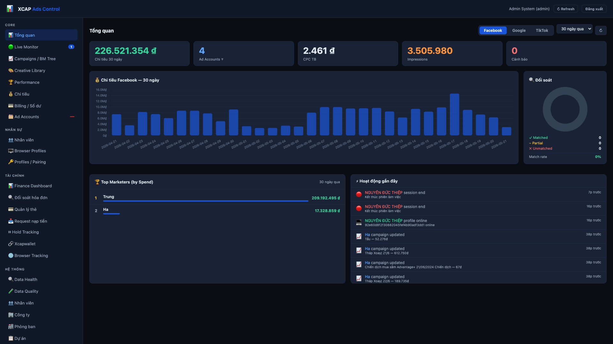

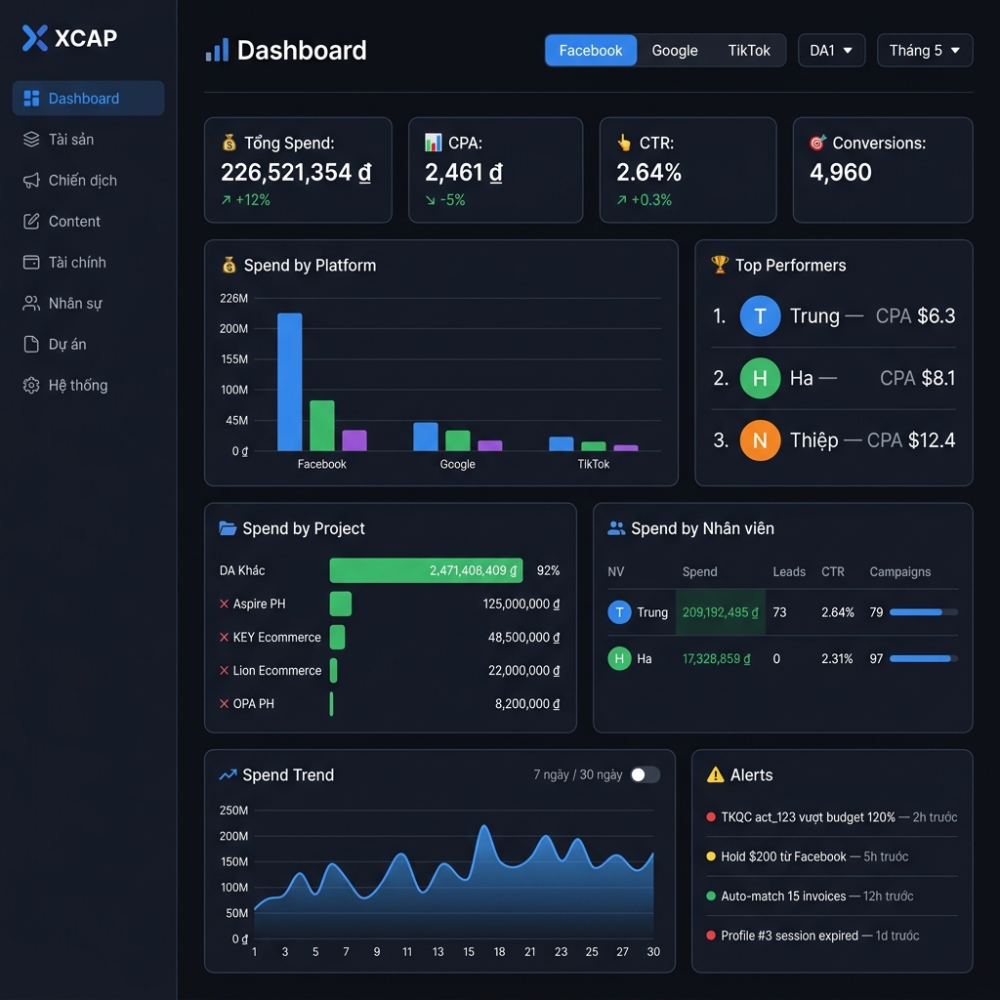

### Navigation Mapping:

| Module Sidebar | Sub-tabs (horizontal) | Dev views gộp vào |
|---|---|---|
| 📊 **Dashboard** | *(không có sub-tab)* | `view-overview` |
| 📦 **Tài sản** | Overview · Browser Profiles · TKQC · BM/MCC/BC · Fanpages | `view-browsers` + `view-accounts` + `view-profiles` + `view-tree` (BM part) |
| 📢 **Chiến dịch** | Overview · Tài khoản · Chiến dịch · Nhóm QC · QC · Bài viết · Performance | `view-campaigns` + `view-tree` (campaign part) + `view-creative-library` + `view-perf-ranking` |
| 🎨 **Content** | Overview · Media Library | `view-creative-library` (tách) |
| 💰 **Tài chính** | Overview · Cards · Top-up · Invoices · Reconciliation · Holds | `view-finance-dashboard` + `view-cards` + `view-card-requests` + `view-recon` + `view-holds` + `view-billing` |
| 👥 **Nhân sự** | Overview · Employees · Invites · Custom Roles | `view-employees` |
| 📁 **Dự án** | Projects Overview | `view-org-projects` |
| ⚙️ **Hệ thống** | Notifications · Data Sync · Approvals | `view-health` + `view-data-quality` + `view-config` |

> [!CAUTION]
> Đây là thay đổi kiến trúc lớn nhất. Cần refactor toàn bộ `navigateTo()` function và sidebar HTML.

---

## 📊 Module 1: DASHBOARD


#### Layout Dashboard mới (4 rows):

```
┌─────────────────────────────────────────────────────────────────┐
│ ROW 1: 4 KPI CARDS                                              │
│ [Tổng Spend 226M đ +12%] [CPA 2,461đ -5%] [CTR 2.64%] [Conv 4,960] │
├────────────────────────────────────┬────────────────────────────┤
│ ROW 2: Spend by Platform           │ Top Performers             │
│ ▓▓▓ FB 226M                       │ 1. (T) Trung — CPA $6.3   │
│ ▓▓ GG 45M                         │ 2. (H) Ha — CPA $8.1      │
│ ▓ TT 12M                          │ 3. (N) Thiệp — CPA $12.4  │
├────────────────────────────────────┬────────────────────────────┤
│ ROW 3: 📁 Spend by Project         │ 👥 Spend by Nhân viên      │
│ DA Khác     ████████████ 2,471M đ │ NV    │Spend  │Leads│CTR│CD│
│ X Aspire    ███ 125M đ            │ Trung │209M đ│ 73 │2.6│79│
│ X KEY Ecom  ██ 48M đ              │ Ha    │17M đ │  0 │2.3│97│
│ X Lion      █ 22M đ               │                            │
│ X OPA PH    ▎ 8M đ                │                            │
├────────────────────────────────────┬────────────────────────────┤
│ ROW 4: Spend Trend (30 ngày)       │ ⚠️ Alerts                  │
│ ──╱──╱──╲──╱── area chart         │ 🔴 TKQC vượt budget 120%   │
│ 7 ngày / 30 ngày toggle           │ 🟡 Hold $200 từ FB         │
│                                    │ 🟢 Auto-match 15 invoices  │
└────────────────────────────────────┴────────────────────────────┘
```

| # | Phần tử | DEV hiện tại | MOCKUP v2 (mới) | Priority |
|---|---|---|---|---|
| 1.1 | **Filters** | Platform toggle (FB/GG/TT) + "30 ngày qua" | `[Facebook] [Google] [TikTok]` toggle + `[DA1 ▼]` + `[Tháng 5 ▼]` | 🔴 |
| 1.2 | **KPI Cards** | 5 cards: Chi tiêu / Ad Accounts / CPC TB / Impressions / Cảnh báo | **4 cards**: Tổng Spend `226M đ (+12%)` · CPA `2,461 đ (-5%)` · CTR `2.64% (+0.3%)` · Conversions `4,960` | 🔴 |
| 1.3 | **Spend by Platform** | Daily Spend bar chart (1 platform) | **Grouped bars**: FB 226M / GG 45M / TT 12M — so sánh 3 nền tảng | 🔴 |
| 1.4 | **Top Performers** | Đối soát donut chart | **Ranking NV**: Avatar + Tên + CPA value | 🔴 |
| 1.5 | **📁 Spend by Project** | *Trang "Chi tiêu" riêng* — horizontal bar: Khác 2,471M đ | **GỘP VÀO DASHBOARD** — horizontal bar chart: DA Khác 2,471M · X Aspire 125M · X KEY 48M · X Lion 22M · X OPA 8M | 🔴 |
| 1.6 | **👥 Spend by NV** | *Trang "Chi tiêu" riêng* — table: NV · Spend · Leads · CTR · Campaigns | **GỘP VÀO DASHBOARD** — table: Trung 209M (73 leads, 2.64%, 79 CD) · Ha 17M (0 leads, 2.31%, 97 CD) | 🔴 |
| 1.7 | **Spend Trend** | Không có trên Dashboard | **MỚI** — line/area chart 30 ngày + toggle 7/30 ngày | 🟡 |
| 1.8 | **Alerts** | "Hoạt động gần đây" timeline feed | **Alerts** — cảnh báo: TKQC vượt budget, Hold, auto-match, session expired | 🟡 |

> [!IMPORTANT]
> **CPC TB → CPA**: Đổi card thứ 2 từ "CPC TB" sang "CPA" (Chi phí/Kết quả). Công thức: `totalSpend / totalConversions`
> **Spend by Project + NV**: Gộp data từ trang "Chi tiêu" riêng vào Dashboard để có cái nhìn tổng quan ngay lập tức.

---

## 📦 Module 2: TÀI SẢN (5 tabs)

### Tab: Browser Profiles


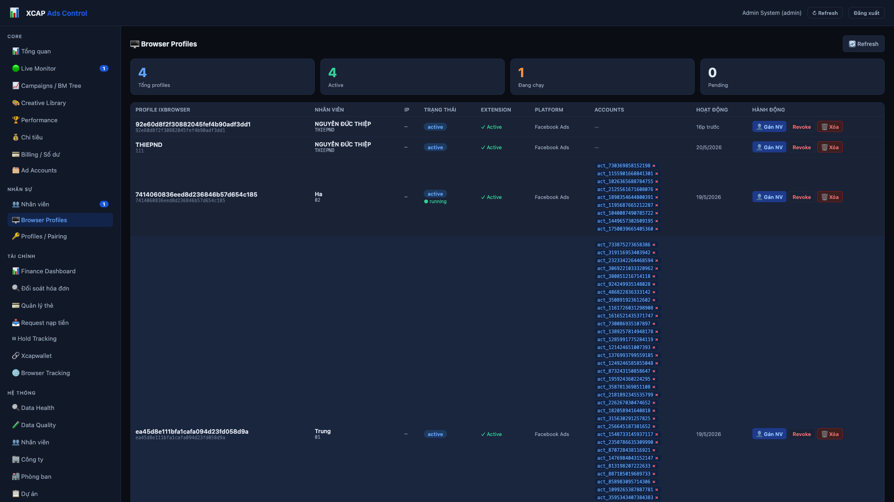

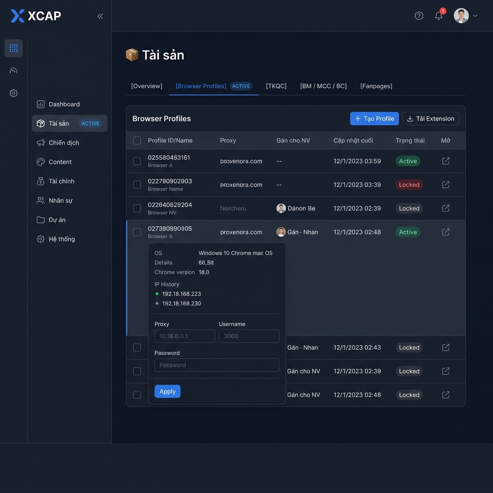

| # | DEV hiện tại | MOCKUP target | Priority |
|---|---|---|---|
| 2.1 | Profile ID dài (hash) hiện nguyên | **Profile ID/Name** rút gọn + tên riêng (vd: "Browser A") | 🔴 |
| 2.2 | Không có popup detail | **Click row → expand popup**: OS, Chrome version, IP History, Proxy config, Password, [Apply] | 🔴 |
| 2.3 | Buttons: chỉ "Refresh" | **+ Tạo Profile** + **↓ Tải Extension** | 🔴 |
| 2.4 | Cột Accounts hiện danh sách dài `act_xxx ×` | Gom lại thành count badge "47 accounts" | 🟡 |
| 2.5 | Tab bar chưa có | Thêm tabs: `[Overview] [Browser Profiles] ACTIVE [TKQC] [BM/MCC/BC] [Fanpages]` | 🔴 |

### Tab: TKQC (Tài khoản QC)


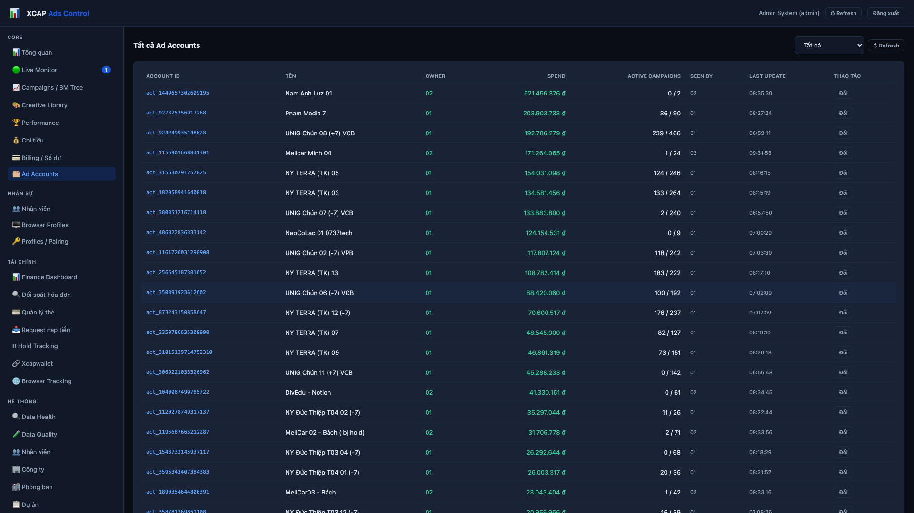

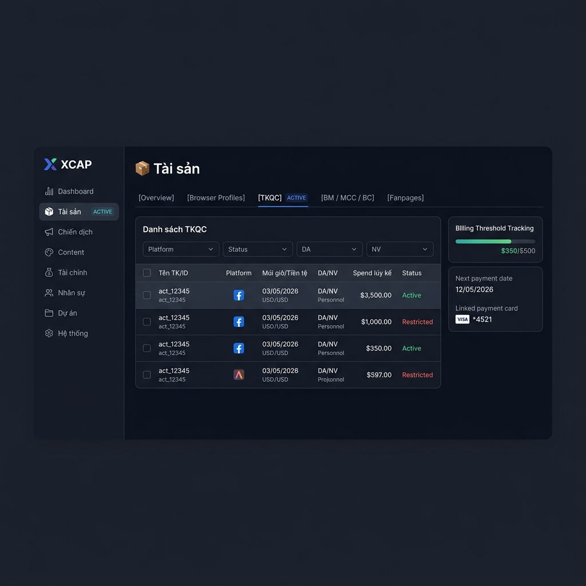

| # | DEV | MOCKUP | Priority |
|---|---|---|---|
| 2.6 | Table có: Account ID, Tên, Owner, Spend, Active Campaigns, Seen by, Last update, Thao tác | Tương tự nhưng thêm cột **BM** và **Trạng thái** badge | 🟡 |
| 2.7 | Chuyển từ sidebar item riêng → sub-tab trong "Tài sản" | Tab integration | 🔴 |

---

## 📢 Module 3: CHIẾN DỊCH (7 tabs)


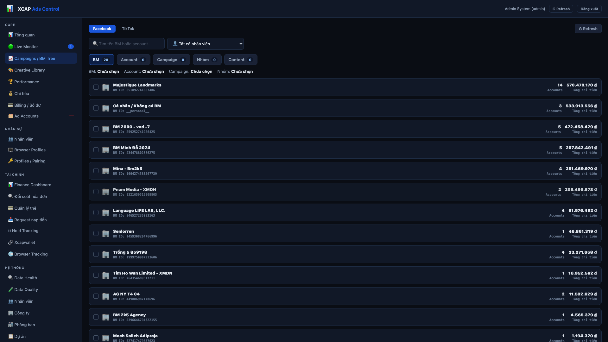

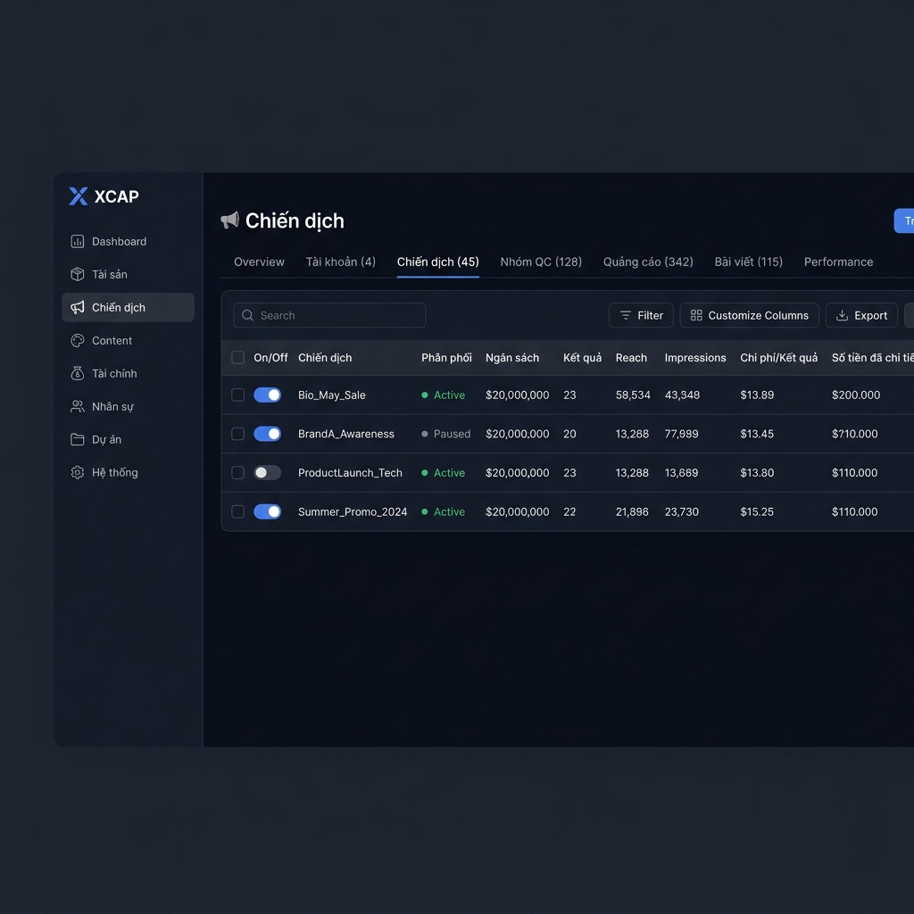

| # | DEV hiện tại | MOCKUP target | Priority |
|---|---|---|---|
| 3.1 | **BM Tree view** — accordion list BM → Accounts → Campaigns | **Tab structure**: Overview · Tài khoản (4) · Chiến dịch (45) · Nhóm QC (128) · QC (342) · Bài viết (115) · Performance | 🔴 |
| 3.2 | BM list hiện BM name + ID + count accounts + spend | Tab "Overview" — KPI cards tổng hợp: Total Spend, Active Campaigns, Avg CPA, Top Adset | 🔴 |
| 3.3 | Không có On/Off toggle per campaign | **Toggle switch** on mỗi row campaign (bật/tắt campaign) | 🔴 |
| 3.4 | Filter: search text + employee + account + status + date range | **Toolbar gọn**: Search + Filter button + Customize Columns + Export | 🔴 |
| 3.5 | Campaigns table 28 cột (rất rộng) | **Cột gọn**: On/Off · Chiến dịch · Phân phối · Ngân sách · Kết quả · Reach · Impressions · Chi phí/KQ · Số tiền đã chi tiêu | 🟡 |
| 3.6 | Bài viết (Posts) — *chưa có* | Tab "Bài viết" với post preview + engagement metrics | 🟢 |
| 3.7 | Performance page riêng | Gom vào tab "Performance" — charts + ranking | 🟡 |

---

## 💰 Module 4: TÀI CHÍNH (6 tabs)

### Tab: Overview — ✨ CẬP NHẬT: Tích hợp Balance Management


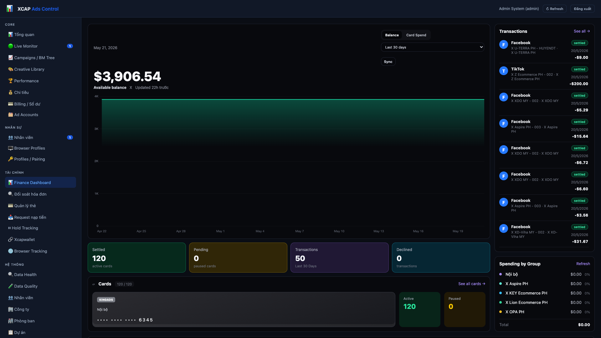

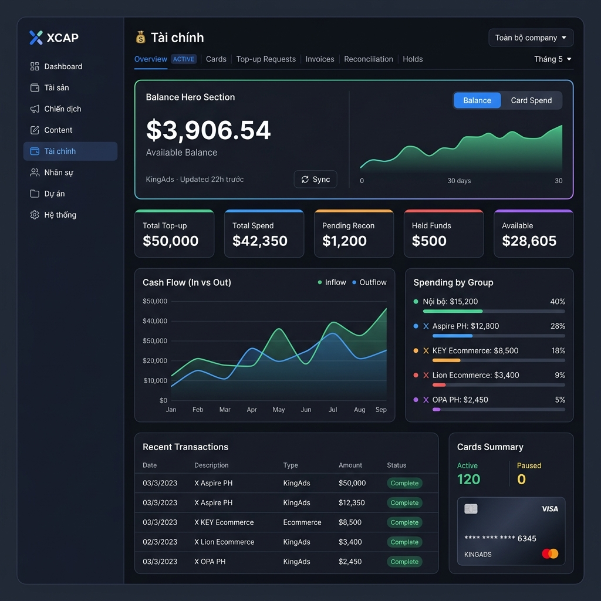

> [!IMPORTANT]
> **Mockup cũ thiếu phần Balance** — dev site hiện đã có Balance hero rất tốt ($3,906.54 + area chart + Balance/Card Spend toggle). Mockup mới v2 giữ lại và nâng cấp phần này.

#### Layout mới (từ trên xuống):

```
┌─────────────────────────────────────────────────────────────────┐
│ 💰 BALANCE HERO SECTION                                        │
│ ┌─────────────────────────────┐  ┌───────────────────────────┐ │
│ │  $3,906.54                  │  │ [Balance] [Card Spend]    │ │
│ │  Available Balance          │  │ ▁▂▃▅▇█▇▅▃▂▁ sparkline    │ │
│ │  KingAds · Updated 22h     │  │ 0 ────────────────── 30d  │ │
│ │  [⟳ Sync]                  │  │                           │ │
│ └─────────────────────────────┘  └───────────────────────────┘ │
├─────────────────────────────────────────────────────────────────┤
│ [Total Top-up] [Total Spend] [Pending Recon] [Held] [Available]│
│  $50,000        $42,350       $1,200          $500   $28,605   │
├────────────────────────────────────┬────────────────────────────┤
│ Cash Flow (In vs Out)              │ Spending by Group          │
│ ──╱──╱──╲──╱── Inflow (green)     │ ● Nội bộ    $15,200  40%  │
│ ──╲──╱──────── Outflow (blue)     │ ● Aspire PH $12,800  28%  │
│ Jan Feb Mar ... Sep                │ ● KEY Ecom  $8,500   18%  │
│                                    │ ● Lion Ecom $3,400    9%  │
│                                    │ ● OPA PH    $2,450    5%  │
├────────────────────────────────────┬────────────────────────────┤
│ Recent Transactions                │ Cards Summary              │
│ Date | Desc | Type | Amount | Stat │ Active: 120  Paused: 0    │
│ 05/09 | X Aspire | KingAds | $50k │ ┌──────────────────┐      │
│ 05/08 | X KEY    | Ecom    | $8.5k│ │ **** **** 6345   │      │
│ ...                                │ │ KINGADS     VISA │      │
│                                    │ └──────────────────┘      │
└────────────────────────────────────┴────────────────────────────┘
```

#### So sánh chi tiết:

| # | DEV hiện tại | MOCKUP v2 (mới) | Thay đổi | Priority |
|---|---|---|---|---|
| 4.1 | **Balance hero** — $3,906.54 lớn + area chart + Balance/Card Spend toggle | **GIỮ LẠI** — Balance hero section nằm đầu trang, có sparkline mini chart bên phải | Giữ nguyên layout dev, thêm border gradient | 🟢 |
| 4.2 | KPIs: Settled 120 / Pending 0 / Transactions 50 / Declined 0 | **5 KPIs**: Total Top-up / Total Spend / Pending Recon / Held Funds / **Available** (mới) | Đổi KPI labels + thêm Available card | 🔴 |
| 4.3 | Spending by Group — sidebar phải, chỉ hiện $0.00 | **Spending by Group** — card riêng với progress bars + % | Nâng cấp visual, thêm % | 🟡 |
| 4.4 | Transactions — sidebar phải, scroll list | **Recent Transactions** — table full width bên trái | Chuyển từ sidebar → table rộng hơn | 🟡 |
| 4.5 | Cards mini — hiện 1 card visual + Active/Paused counts | **Cards Summary** — giữ card visual + counts, gọn hơn | Giữ nguyên, gọn lại | 🟢 |
| 4.6 | Không có Cash Flow chart | **Cash Flow (In vs Out)** — 2 line charts (Inflow green, Outflow blue) | **MỚI** — chart so sánh thu/chi | 🔴 |
| 4.7 | Filter: Balance/Card Spend toggle + period + Sync | Filter: `[Toàn bộ company ▼]` + `[Tháng 5 ▼]` + toggle trong Balance hero | Tách filter ra topbar | 🟡 |

### Tab: Cards


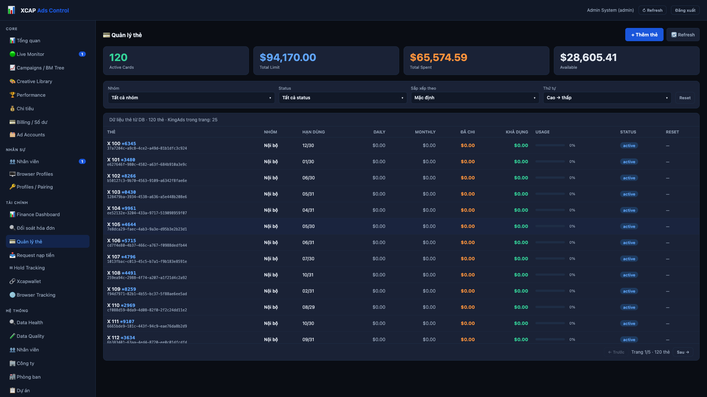

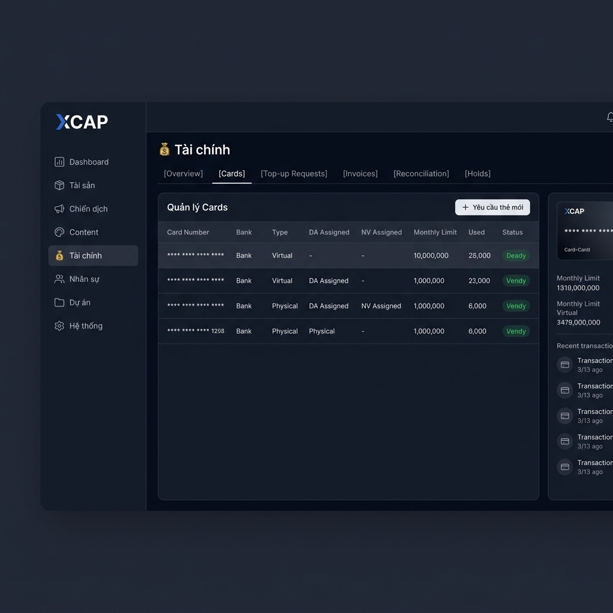

| # | DEV | MOCKUP | Priority |
|---|---|---|---|
| 4.5 | Table: Thẻ / Nhóm / Hạn dùng / Daily / Monthly / Đã chi / Khả dụng / Usage / Status / Reset | Table: Card Number · Bank · Type · DA Assigned · NV Assigned · Monthly Limit · Used · Status | 🟡 |
| 4.6 | Không có side panel | **Card preview panel** bên phải: visual card design + Monthly Limit Physical/Virtual + Recent transactions | 🔴 |
| 4.7 | KPI: 120 Active / $94k Limit / $65k Spent / $28k Available | Giữ lại nhưng gọn hơn | 🟢 |
| 4.8 | Button: "+ Thêm thẻ" | "+ Yêu cầu thẻ mới" | 🟡 |

### Tab: Reconciliation


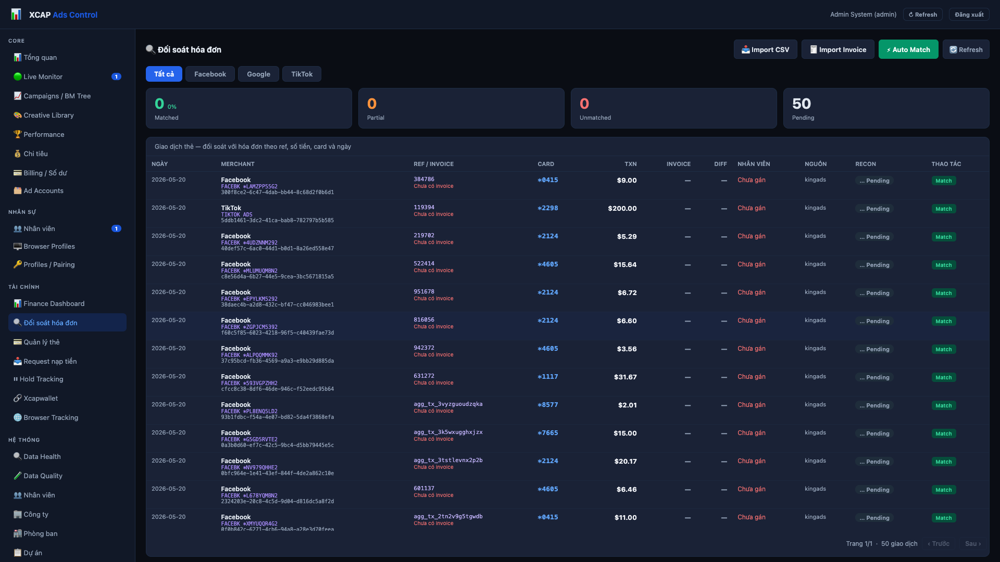

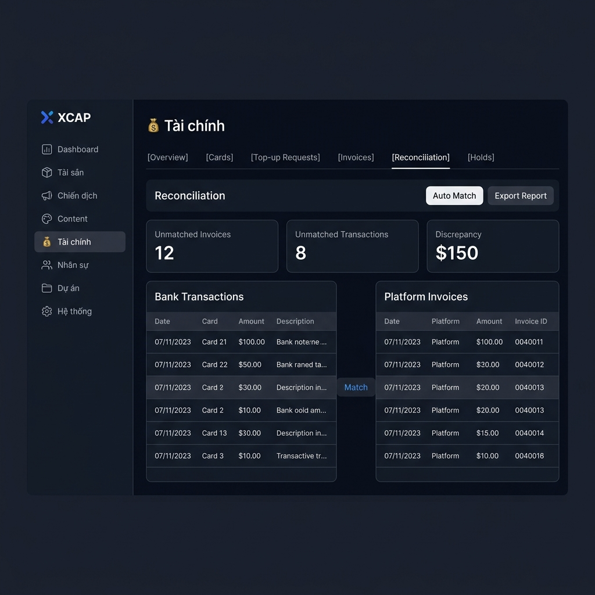

| # | DEV | MOCKUP | Priority |
|---|---|---|---|
| 4.9 | **Single table** — tất cả transactions cùng 1 bảng, cột: Ngày / Merchant / Ref / Card / TXN / Invoice / Diff / NV / Nguồn / Recon / Thao tác | **Split-view 2 bảng** cạnh nhau: Bank Transactions (Date·Card·Amount·Desc) ↔ Platform Invoices (Date·Platform·Amount·Invoice ID) | 🔴 |
| 4.10 | KPI: 0% Matched / 0 Partial / 0 Unmatched / 50 Pending | KPI: Unmatched Invoices 12 / Unmatched Transactions 8 / Discrepancy $150 | 🔴 |
| 4.11 | Buttons: Import CSV + Import Invoice + Auto Match + Refresh | Buttons: **Auto Match** + **Export Report** | 🟡 |
| 4.12 | Match button trên mỗi row | **"Match" link** nối giữa 2 bảng, highlight matching rows | 🔴 |

### Tab: Top-up & Holds


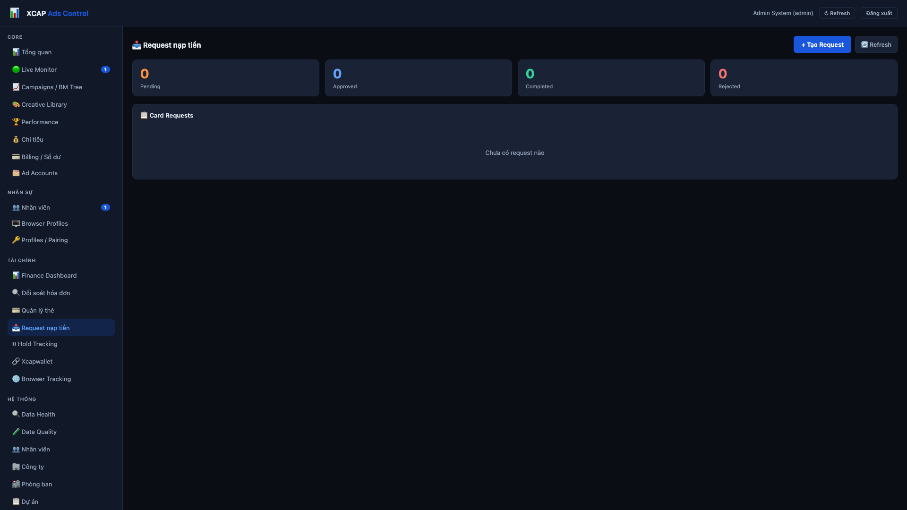

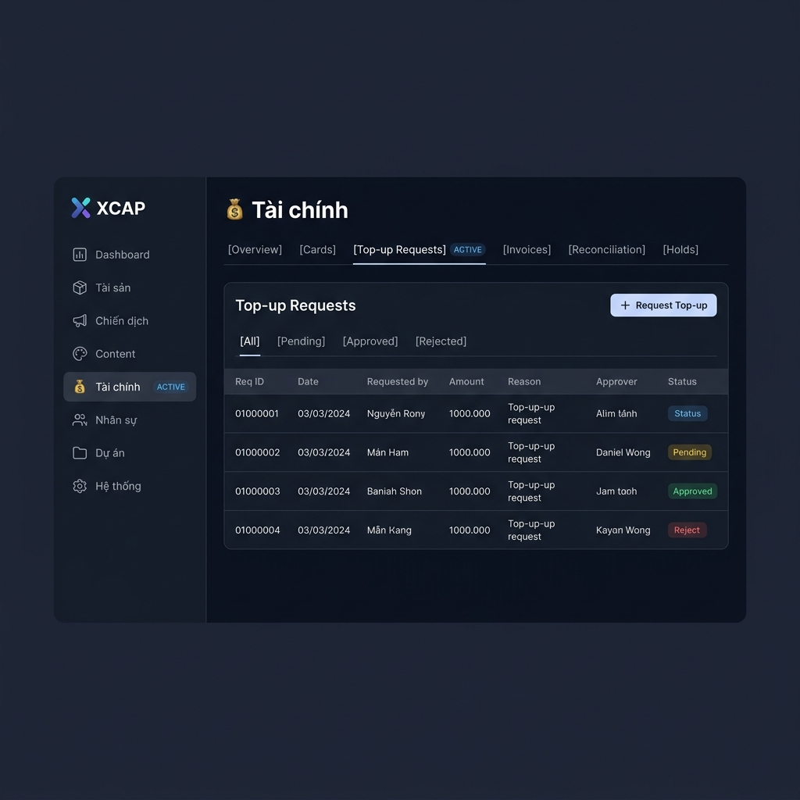
→ Gộp 2 trang riêng lẻ thành sub-tabs trong Tài chính. Layout tương tự, chỉ cần move view vào tab.

---

## 👥 Module 5: NHÂN SỰ (4 tabs)

### Tab: Employees — Danh sách


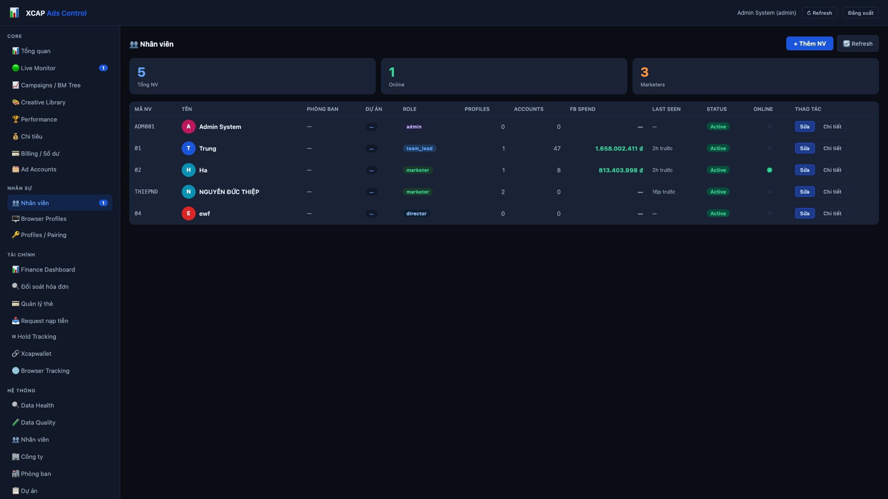

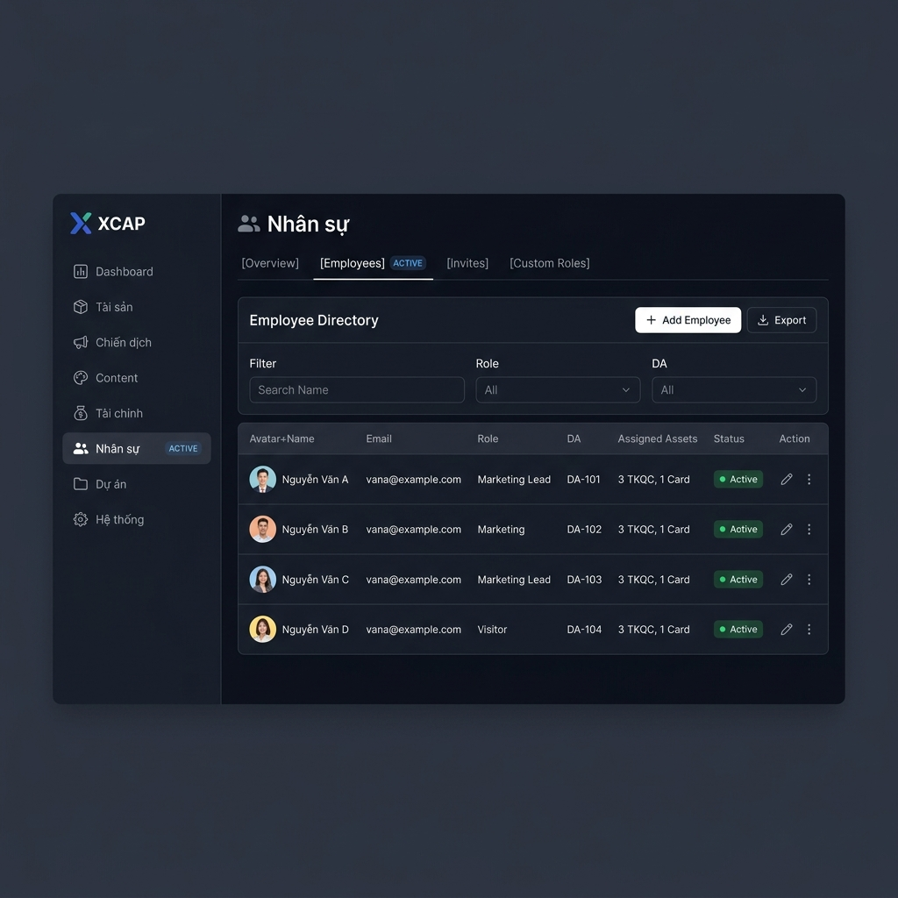

| # | DEV | MOCKUP | Priority |
|---|---|---|---|
| 5.1 | **12 cột**: Mã NV · Tên · Phòng ban · Dự án · Role · Profiles · Accounts · FB Spend · Last seen · Status · Online · Thao tác | **8 cột**: Avatar+Name · Email · Role · DA · Assigned Assets · Status · Action (edit/menu) | 🔴 |
| 5.2 | Không có filter row | **Filter bar**: Search Name + Role dropdown + DA dropdown | 🔴 |
| 5.3 | Avatar circle nhỏ (initials) | **Avatar ảnh** (hoặc initials lớn hơn) + tên bên cạnh | 🟡 |
| 5.4 | Buttons: "+ Thêm NV" + "🔄 Refresh" | **"+ Add Employee"** + **"↓ Export"** | 🟡 |
| 5.5 | Không có Email column | Thêm cột **Email** | 🔴 |
| 5.6 | Tab **Invites** — *chưa có* | Quản lý lời mời tham gia hệ thống | 🟢 |
| 5.7 | Tab **Custom Roles** — *chưa có* | Phân quyền tùy chỉnh theo role | 🟢 |

### ✨ MỚI: Employee Detail Panel — Click row → Slide-over chi tiết


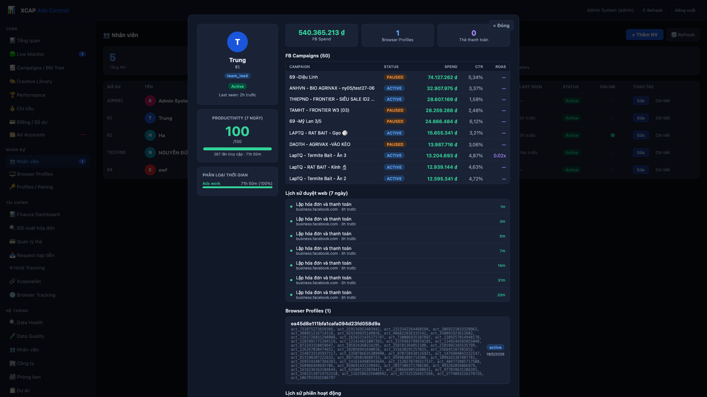

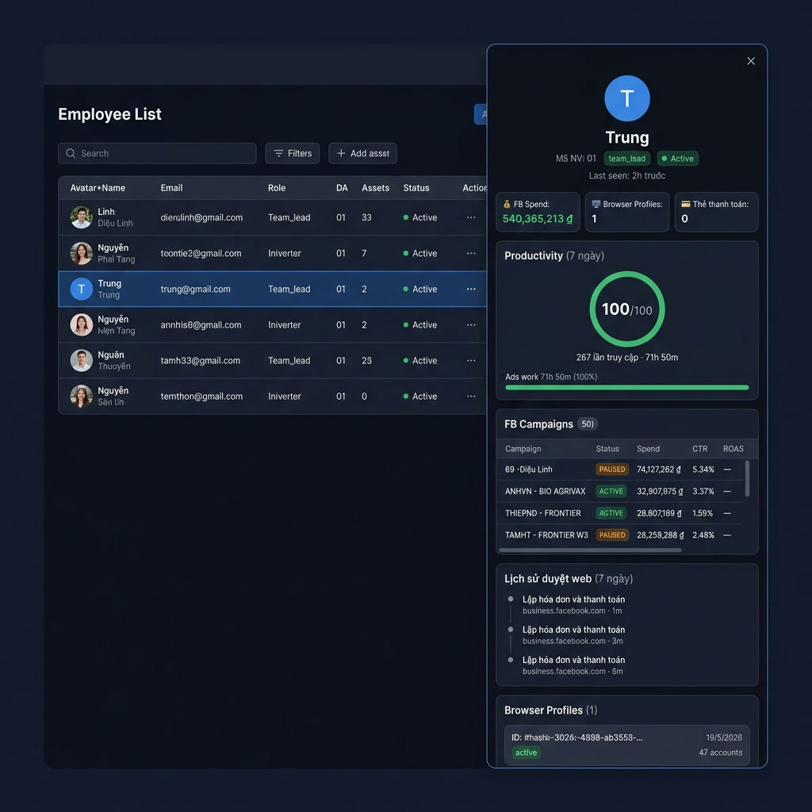

> [!IMPORTANT]
> **Tính năng mới**: Click vào row nhân viên → slide-over panel bên phải hiện toàn bộ dữ liệu chi tiêu + thông tin nhân viên đó. Giữ nguyên data đã có trên dev, nâng cấp UX thành slide-over panel.

#### Layout Panel Chi tiết NV (slide-over từ phải):

```
┌───────────────────────────────┬──────────────────────────────┐
│ EMPLOYEE TABLE (dimmed)       │ DETAIL PANEL (520px)         │
│ ┌─────────────────────────┐   │                              │
│ │ Avatar | Email | Role.. │   │  [×] Close                   │
│ │ Linh   | dieu@..| Lead  │   │                              │
│ │▸Trung  | trun@..| Lead ◀│   │   (T)  TRUNG                │
│ │ Ha     | ha@..  | Mkter │   │   MNV: 01 · team_lead        │
│ │ Thiệp  | thie@..| Mkter │   │   ● Active · Last: 2h trước │
│ └─────────────────────────┘   │                              │
│                               │ ┌──────┬──────┬──────┐       │
│                               │ │FB    │Brwsr │Thẻ   │       │
│                               │ │Spend │Prof  │TT    │       │
│                               │ │540M đ│ 1    │ 0    │       │
│                               │ └──────┴──────┴──────┘       │
│                               │                              │
│                               │ PRODUCTIVITY (7 ngày)        │
│                               │ ┌──────────────────┐         │
│                               │ │   ◉ 100/100      │         │
│                               │ │ 267 lần · 71h50m │         │
│                               │ │ ████████████ 100% │         │
│                               │ └──────────────────┘         │
│                               │                              │
│                               │ FB CAMPAIGNS (50)            │
│                               │ Campaign│Status│Spend│CTR    │
│                               │ 69-Diệu │PAUSE│74M  │5.34%  │
│                               │ ANHVN   │ACTIV│32M  │3.37%  │
│                               │ THIEPND │ACTIV│28M  │1.59%  │
│                               │ TAMHT   │PAUSE│28M  │2.48%  │
│                               │                              │
│                               │ LỊCH SỬ DUYỆT WEB (7 ngày)  │
│                               │ ● Lập hóa đơn..  · 1m       │
│                               │ ● Lập hóa đơn..  · 3m       │
│                               │ ● Lập hóa đơn..  · 6m       │
│                               │                              │
│                               │ BROWSER PROFILES (1)         │
│                               │ ┌─────────────────────┐      │
│                               │ │ ID: #hash.. active  │      │
│                               │ │ 47 accounts  19/5   │      │
│                               │ └─────────────────────┘      │
└───────────────────────────────┴──────────────────────────────┘
```

#### So sánh DEV vs MOCKUP:

| # | Phần | DEV hiện tại | MOCKUP mới | Thay đổi | Priority |
|---|---|---|---|---|---|
| 5.8 | **Trigger** | Click "Chi tiết" text link → popup modal chèn ngay tại chỗ, che bảng NV | **Click row** → slide-over panel từ phải, bảng NV bên trái vẫn thấy (dimmed) | Đổi từ modal → slide-over | 🔴 |
| 5.9 | **Header** | Avatar nhỏ + Tên + MNV + Role + Status + Last seen | **GIỮ LẠI** — Avatar lớn hơn + cùng data | Tăng size avatar, layout gọn | 🟢 |
| 5.10 | **3 KPI** | FB Spend · Browser Profiles · Thẻ thanh toán | **GIỮ LẠI** — 3 mini cards với icon + số liệu | Giữ nguyên | 🟢 |
| 5.11 | **Productivity** | Circular 100/100 + lần truy cập + thời gian + progress bar "Ads work" | **GIỮ LẠI** — circular progress + breakdown | Giữ nguyên, polish visual | 🟢 |
| 5.12 | **FB Campaigns** | Table Campaign · Status · Spend · CTR · ROAS — hiện full 10 rows | **GIỮ LẠI** — table scrollable trong panel, hiện 4-6 rows + "Xem tất cả" | Gọn lại, thêm scroll | 🟡 |
| 5.13 | **Browsing History** | Timeline feed 7+ items, mỗi item URL + domain + thời gian | **GIỮ LẠI** — compact timeline, hiện 3-5 items | Gọn lại | 🟡 |
| 5.14 | **Browser Profiles** | Profile ID dài + list accounts (raw) | **GIỮ LẠI** — card gọn: ID truncated + count "47 accounts" + status badge | Gọn accounts list | 🟡 |
| 5.15 | **Session History** | "Lịch sử phiên hoạt động" table | **GIỮ LẠI** — ẩn mặc định, click "Xem thêm" mới hiện | Collapse mặc định | 🟢 |

> [!TIP]
> **Nguyên tắc**: Giữ nguyên 100% dữ liệu dev đã có (campaigns, browsing, profiles, sessions). Chỉ đổi container từ modal → slide-over panel + gọn layout cho fit 520px width.

---

## 🎨 Module 6: CONTENT (2 tabs) — ✨ CẬP NHẬT theo Creative Library dev

### Tab: Overview


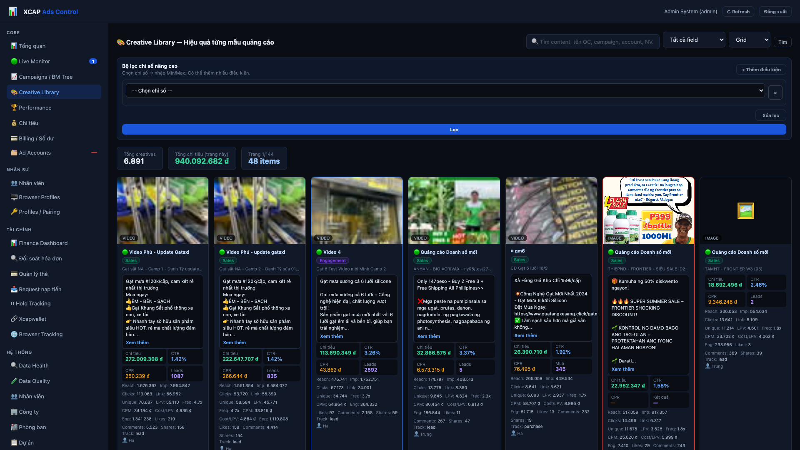

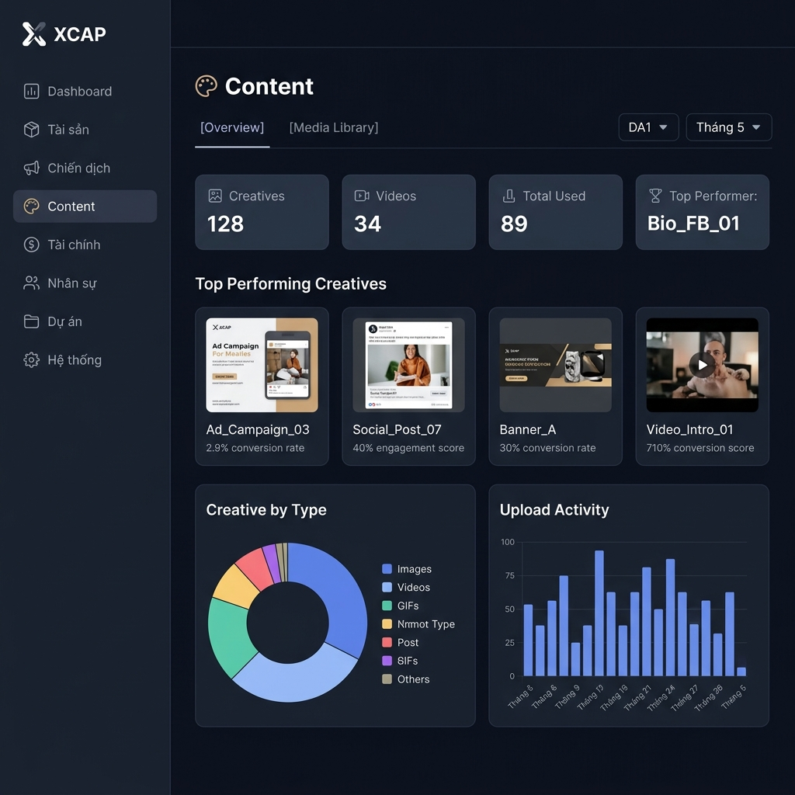

> [!IMPORTANT]
> **Mockup cũ quá generic** (128 creatives, placeholder images). Mockup mới v2 dựa trên dữ liệu thực từ dev: 6,891 creatives, 940M đ chi tiêu, metrics chi tiết.

#### Layout Overview mới:

| Row | Nội dung | Nguồn data |
|---|---|---|
| **Row 1** | 4 KPI cards: Tổng Creatives `6,891` (+234) · Videos `4,120` · Images `2,771` · Tổng chi tiêu `940,092,682 đ` | Dev: stats bar hiện 3 pills → nâng lên 4 cards |
| **Row 2 trái** | **Top Performing Creatives** — 4 cards ngang, mỗi card: thumbnail + title + Sales/Engagement badge + Chi tiêu + CTR + CPR + Leads + NV avatar | Dev: grid cards (giữ nguyên format) |
| **Row 2 phải** | **Creative by Type** — donut chart: Video 60% / Image 40% | Mới — tổng hợp từ VIDEO/IMAGE badges |
| **Row 3 trái** | **Hiệu quả theo Nhân viên** — bar chart: Trung 940M · Ha 222M... | Dev: "Spend by Nhân viên" table → chart |
| **Row 3 phải** | **Bộ lọc chỉ số nâng cao** — dropdown chọn chỉ số + Min/Max + Lọc/Xóa lọc | Dev: giữ nguyên tính năng filter |
| **Row 4** | **Recent Uploads** — table: Thumbnail · Tên · Loại · Campaign · Chi tiêu · CTR · Leads · NV | Mới — quick view gần đây |

### Tab: Creative Library (Grid/List)


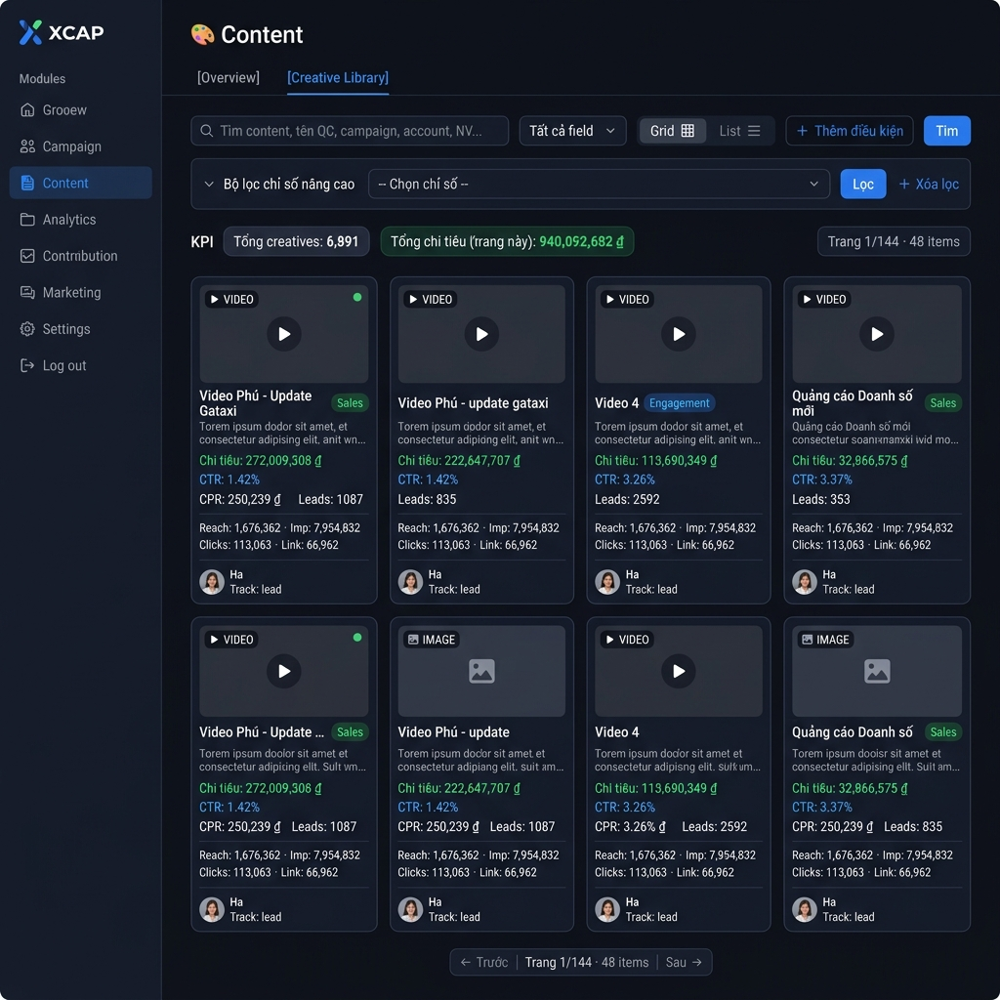

#### So sánh DEV vs MOCKUP:

| # | Phần | DEV hiện tại | MOCKUP mới | Thay đổi | Priority |
|---|---|---|---|---|---|
| 6.1 | **Module** | Sidebar item riêng "Creative Library" | Gom vào module **Content** → tab "Creative Library" | Chuyển nav | 🔴 |
| 6.2 | **Search** | Search text + dropdown "Tất cả field" + Grid/List toggle + "Tìm" button | **GIỮ NGUYÊN** — cùng toolbar: Search + Field dropdown + Grid/List + Tìm | Giữ nguyên | 🟢 |
| 6.3 | **Filter nâng cao** | "Bộ lọc chỉ số nâng cao" — dropdown chọn chỉ số + "Lọc" + "Xóa lọc" | **GIỮ NGUYÊN** — collapsible filter panel | Giữ nguyên | 🟢 |
| 6.4 | **KPI bar** | 3 stat pills: Tổng creatives 6,891 · Tổng chi tiêu 940M đ · Trang 1/144 48 items | **GIỮ NGUYÊN** — 3 pills | Giữ nguyên | 🟢 |
| 6.5 | **Grid cards** | 4 cột × N rows, mỗi card: thumbnail (VIDEO/IMAGE badge) + title + campaign tag + description + Chi tiêu + CTR + CPR + Leads + Reach + Imp + Clicks + Link + avatar NV + Track | **GIỮ NGUYÊN** — giữ toàn bộ metrics, polish spacing + font | Giữ data, polish CSS | 🟡 |
| 6.6 | **Pagination** | Trang 1/144 · 48 items + "Xem thêm" | **GIỮ NGUYÊN** — ← Trước / Trang X/Y · N items / Sau → | Giữ nguyên | 🟢 |
| 6.7 | **Tab Overview** | *Chưa có* | **MỚI** — KPIs + Top Performers + Creative by Type chart + Hiệu quả NV chart | Tạo mới | 🟡 |

> [!TIP]
> **Nguyên tắc Module 6**: Creative Library dev đã rất tốt — giữ nguyên 95% layout + data, chỉ: (1) chuyển vào module Content, (2) thêm tab Overview tổng quan, (3) polish CSS cho đồng bộ design system.

---

## 📁 Module 7: DỰ ÁN — Upgrade

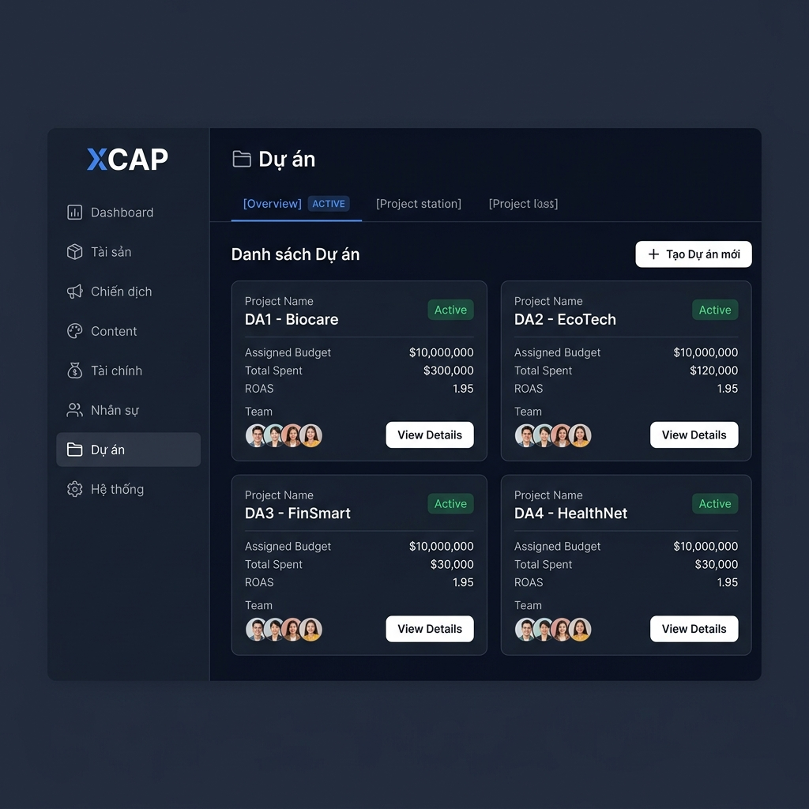

**DEV hiện tại:** `view-org-projects` — table cơ bản (Code, Tên, Company, Head, Status)
**MOCKUP:** Card-based layout với KPIs per project (Spend, CPA, Conversions, Active Campaigns)

---

## ⚙️ Module 8: HỆ THỐNG (3 tabs)


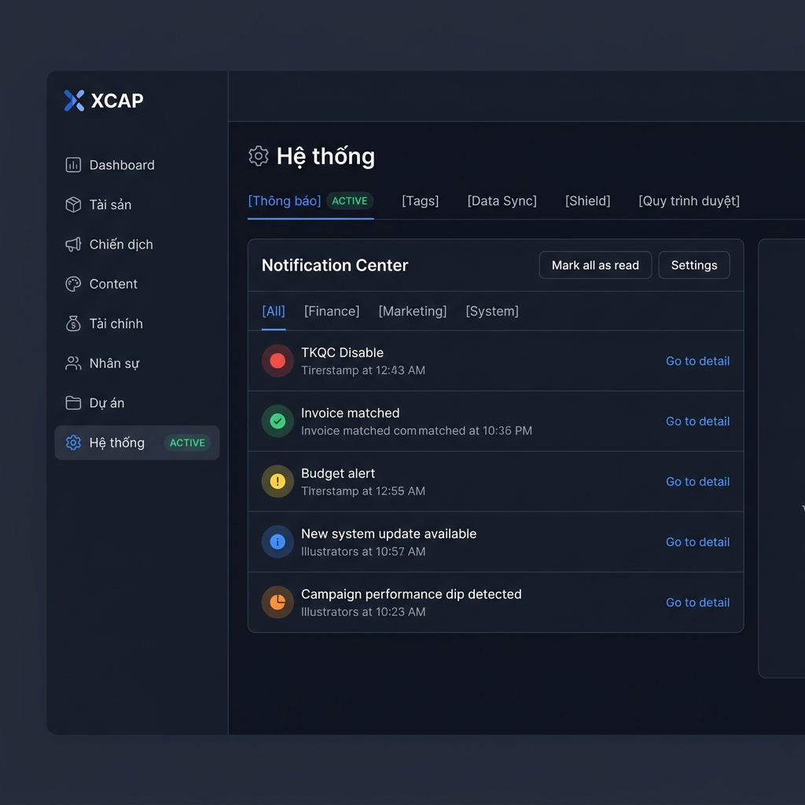

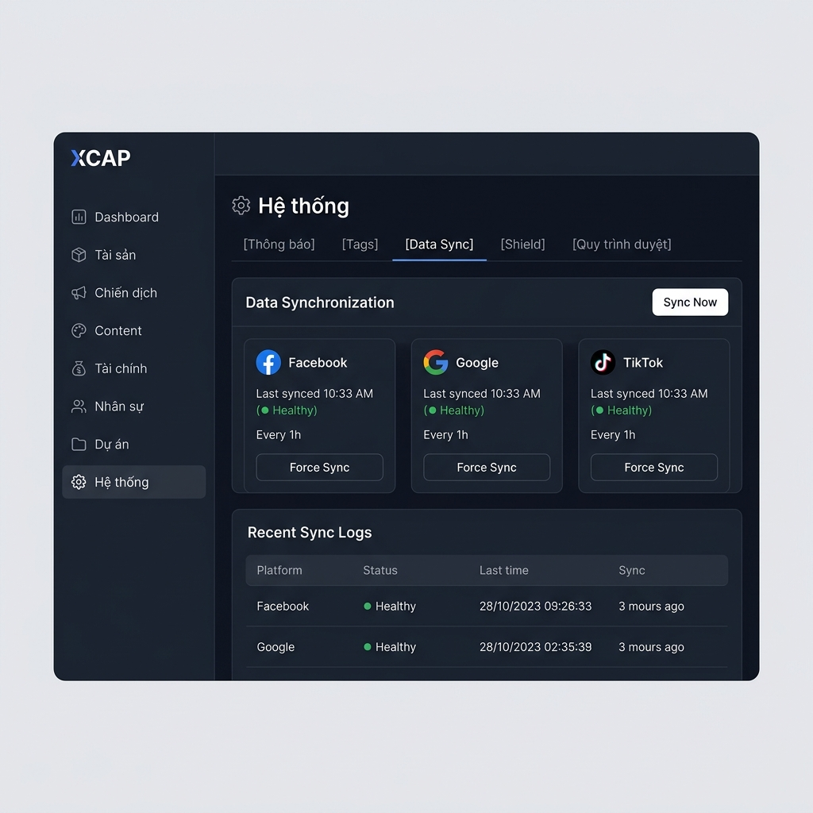

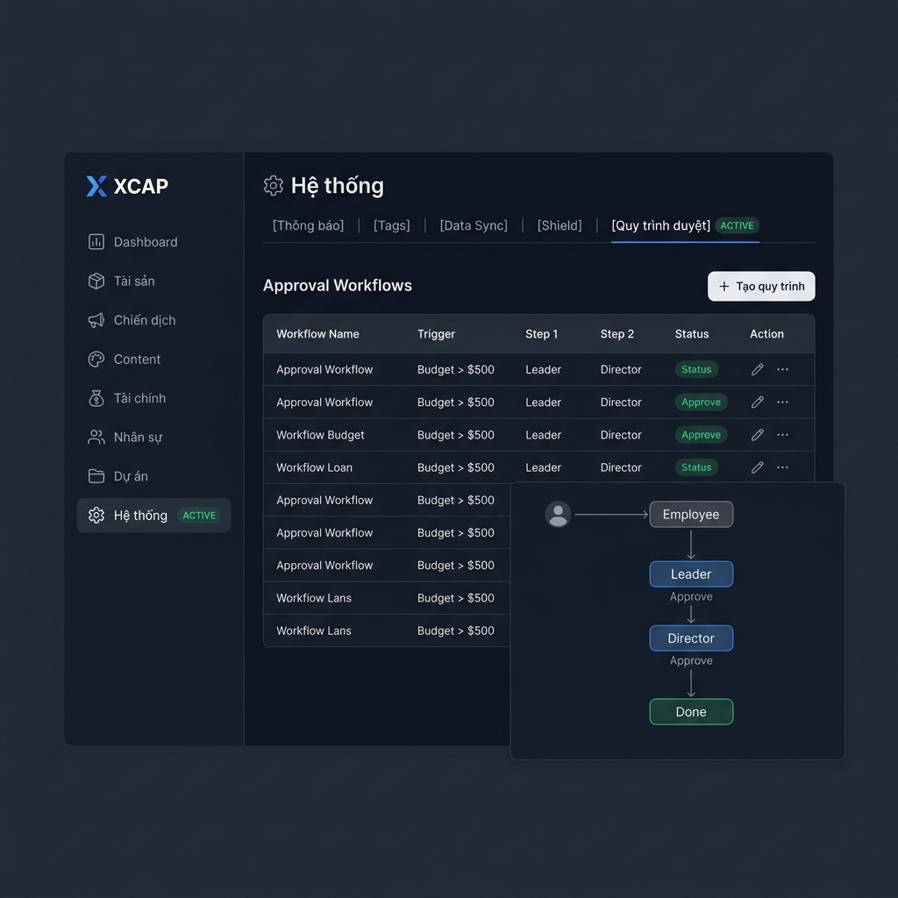
| Tab | DEV views merge | Thay đổi | Priority |
|---|---|---|---|
| Notifications | `view-live` (Live Monitor) | Timeline feed + filter by type | 🟡 |
| Data Sync | `view-health` + `view-data-quality` | Merge 2 views + sync status per platform | 🟡 |
| Approval Settings | `view-config` | Workflow rules + approval chain config | 🟢 |

---

## 🎨 TOPBAR — Global Changes

| # | DEV hiện tại | MOCKUP | Priority |
|---|---|---|---|
| T.1 | Logo: `📊 XCAP Ads Control` | **✕ XCAP** (stylized X logo) + `«` collapse button | 🟡 |
| T.2 | Right: "Admin System (admin)" + "↻ Refresh" + "Đăng xuất" | **❓ Help** + **🔔 Notifications** (với badge đỏ) + **Avatar dropdown** | 🔴 |
| T.3 | Không có breadcrumb | `🌐 Ngoại sàn > [Module Name]` | 🟡 |

---

## 📋 Priority Roadmap

### 🔴 Sprint 1 — Architecture Refactor (8h)
- [ ] Sidebar: 25 flat items → 8 module items
- [ ] Horizontal tab bar component
- [ ] Route mapping: `navigateTo(module, tab)`
- [ ] Topbar: Logo + Help + Notifications + Avatar

### 🔴 Sprint 2 — Dashboard + Campaigns (6h)
- [ ] Dashboard: 4 KPI cards (Spend/CPA/CTR/Conv) + Platform spend chart + Top performers
- [ ] Campaigns: 7 tabs + On/Off toggle + Toolbar
- [ ] Campaigns table: gọn cột, thêm Customize Columns

### 🔴 Sprint 3 — Finance Module (6h)
- [ ] Finance Overview: KPIs đổi sang Top-up/Spend/Recon/Held + Cash Flow chart
- [ ] Cards: Side panel card preview
- [ ] Reconciliation: Split-view Bank ↔ Platform
- [ ] Gộp Top-up + Holds + Invoices vào sub-tabs

### 🟡 Sprint 4 — Assets + HR (5h)
- [ ] Browser Profiles: Expandable detail popup (OS, IP, proxy editor)
- [ ] Employees: Avatar + Email + Filter bar
- [ ] TKQC + BM/MCC/BC: move vào Tài sản tabs

### 🟢 Sprint 5 — Content + System + Polish (4h)
- [ ] Content module: Overview + Media Library
- [ ] System: Notifications + Data Sync + Approvals
- [ ] Projects: Card layout + KPIs per project

> **Tổng estimate: ~29h** across 5 sprints

